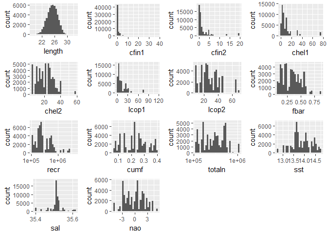
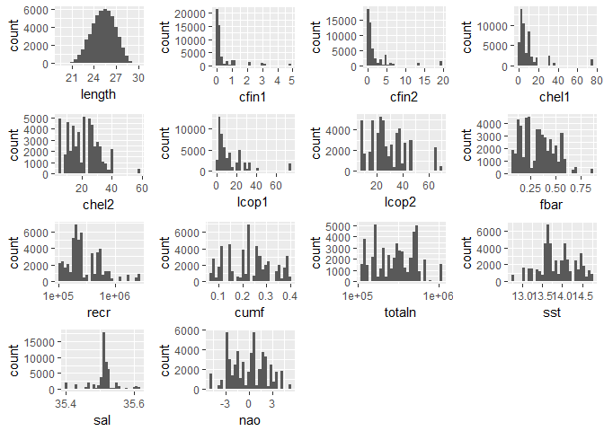
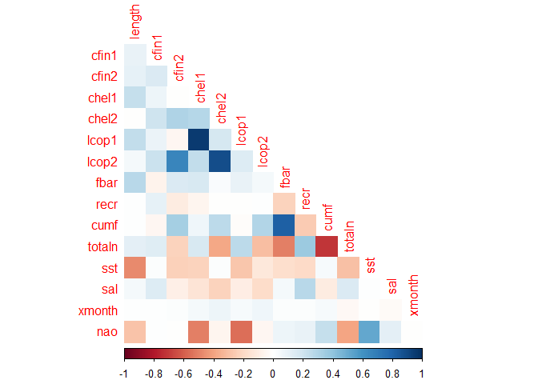
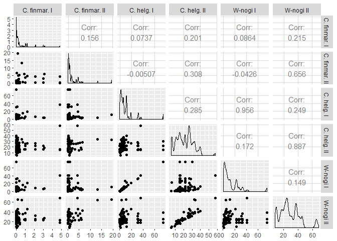
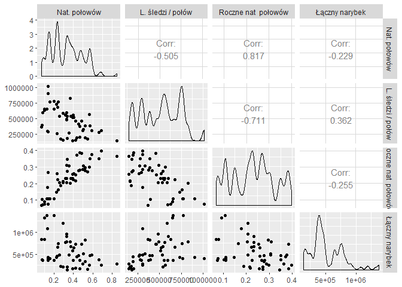
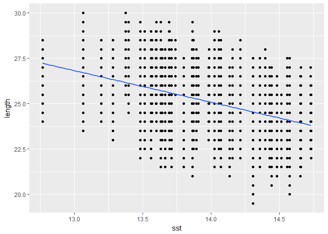
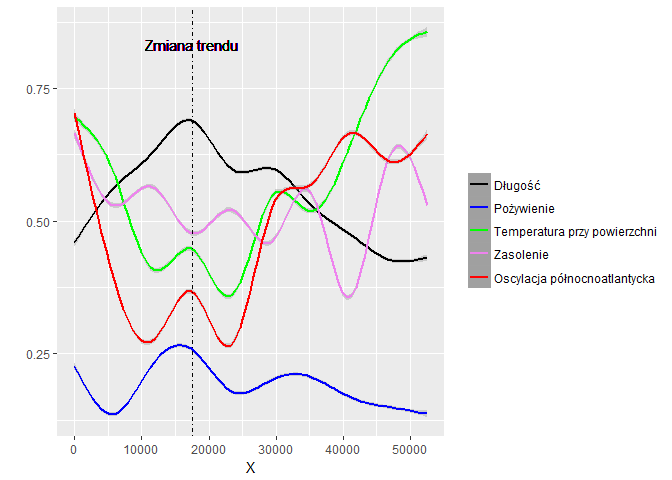
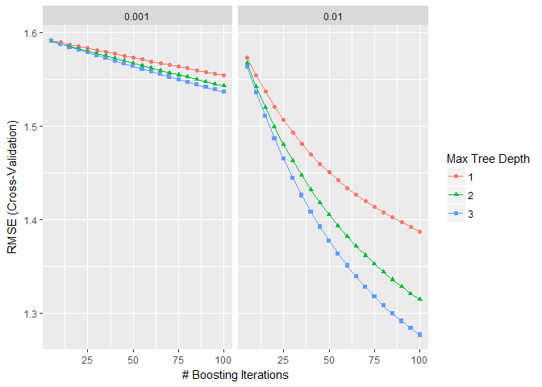
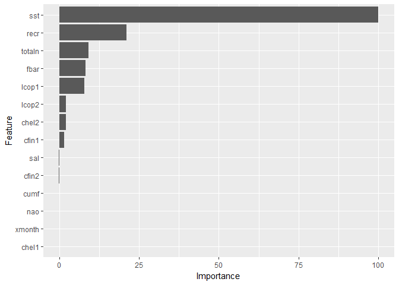

# Analiza połowu śledzi


Zaawansowana Eksploracja Danych - projekt zaliczeniowy, semestr ziomowy 2016/17, Politechnika Poznańska.
2017-03-15 08:43:27

### Streszczenie

Przedmiotem poniższej analizy było zbadanie zjawiska zmniejszania się śledzi na przestrzeni ostatnich kilkudziesięciu lat. Badane parametry obejmowały warunki środowiskowe takie jak temperatura wody czy też dostępność pożywienia, a także zależne te od człowieka - natężenie połowów lub wielkość połowów. 

Zbiór wymagał wstępnego przetwarzania - w jego ramach zostały uzupełnione wartości puste oraz wyeliminowane wartości odstające. Przedstawione zostały także podstawowe charakterystyki poszczególnych zmiennych. Została przeprowadzona także analiza korelacji, w wyniku której można było zauważyć zależności pomiędzy wielkością śledzia, dostępnością planktonu a czynnikami środowiskowymi w postaci zmiany temperatury wody oraz oscylacji północnoatlantyckiej. Przedstawione zostało jak zmieniał się rozmiar śledzi na przestrzeni czasu i w którym momencie nastąpił stoponiowy jego spadek. Zbudowany został także model regresyjny pozwalający na przewidywanie wielkości śledzia na podstawie pozostałych parametrów.  

### Wykorzystane biblioteki


```r
library('caret')
library('plotly')
library('pander')
library('dplyr')
library('ggplot2')
library('gridExtra')
library('corrplot')
library('GGally')
```

### Zbiór danych
Zbiór zawiera dane komercyjnych połowów śledzi z ostatnich 60 lat. Z każdego połowu wybierano próbkę od 50 do 100 sztuk trzyletnich śledzi i badano ich długość. Zbudowano w ten sposób zbiór ponad 50 tysięcy pomiarów.

#### Opis atrybutów

|Atrybut      |   Opis                                                                       |
|------------:|:----------------------------------------------------------------------------:|
|length       |  długość złowionego śledzia [cm]                                             |
|cfin1        |  dostępność planktonu [zagęszczenie Calanus finmarchicus gat. 1]             |
|cfin2        |  dostępność planktonu [zagęszczenie Calanus finmarchicus gat. 2]             |
|chel1        |  dostępność planktonu [zagęszczenie Calanus helgolandicus gat. 1]            |
|chel2        |  dostępność planktonu [zagęszczenie Calanus helgolandicus gat. 2]            |
|lcop1        |  dostępność planktonu [zagęszczenie widłonogów gat. 1]                       |
|lcop2        |  dostępność planktonu [zagęszczenie widłonogów gat. 2]                       |
|fbar         |  natężenie połowów w regionie [ułamek pozostawionego narybku]                |
|recr         | roczny narybek [liczba śledzi]                                               |
|cumf         | łączne roczne natężenie połowów w regionie [ułamek pozostawionego narybku];  |
|totaln       |  łączna liczba ryb złowionych w ramach połowu [liczba śledzi];               |
|sst          | temperatura przy powierzchni wody [°C];                                      |
|sal          | poziom zasolenia wody [Knudsen ppt];                                         |
|xmonth       | miesiąc połowu [numer miesiąca];                                             |
|nao          | oscylacja północnoatlantycka [mb].                                           |


#### Wczytanie zbioru danych i podstawowe charakterystyki


```r
data <- read.csv('sledzie.csv',na.strings = '?')
summary(data)
```


-------------------------------------------------------------------------
      X          length         cfin1           cfin2          chel1     
------------- ------------ --------------- --------------- --------------
  Min.  : 0   Min.  :19.0  Min.  : 0.0000  Min.  : 0.0000  Min.  : 0.000 

1st Qu.:13145 1st Qu.:24.0 1st Qu.: 0.0000 1st Qu.: 0.2778 1st Qu.: 2.469

Median :26291 Median :25.5 Median : 0.1111 Median : 0.7012 Median : 5.750

 Mean :26291   Mean :25.3   Mean : 0.4458   Mean : 2.0248   Mean :10.006 

3rd Qu.:39436 3rd Qu.:26.5 3rd Qu.: 0.3333 3rd Qu.: 1.7936 3rd Qu.:11.500

Max.  :52581  Max.  :32.5  Max.  :37.6667  Max.  :19.3958  Max.  :75.000 

     NA            NA        NA's :1581      NA's :1536      NA's :1555  
-------------------------------------------------------------------------

 
-----------------------------------------------------------------------------
    chel2           lcop1           lcop2           fbar           recr      
-------------- ---------------- -------------- -------------- ---------------
Min.  : 5.238   Min.  : 0.3074  Min.  : 7.849  Min.  :0.0680  Min.  : 140515 

1st Qu.:13.427 1st Qu.: 2.5479  1st Qu.:17.808 1st Qu.:0.2270 1st Qu.: 360061

Median :21.673 Median : 7.0000  Median :24.859 Median :0.3320 Median : 421391

 Mean :21.221   Mean : 12.8108   Mean :28.419   Mean :0.3304   Mean : 520367 

3rd Qu.:27.193 3rd Qu.: 21.2315 3rd Qu.:37.232 3rd Qu.:0.4560 3rd Qu.: 724151

Max.  :57.706  Max.  :115.5833  Max.  :68.736  Max.  :0.8490  Max.  :1565890 

  NA's :1556      NA's :1653      NA's :1591         NA             NA       
-----------------------------------------------------------------------------

 
--------------------------------------------------------------------------
     cumf           totaln           sst           sal          xmonth    
--------------- --------------- ------------- ------------- --------------
Min.  :0.06833  Min.  : 144137  Min.  :12.77  Min.  :35.40  Min.  : 1.000 

1st Qu.:0.14809 1st Qu.: 306068 1st Qu.:13.60 1st Qu.:35.51 1st Qu.: 5.000

Median :0.23191 Median : 539558 Median :13.86 Median :35.51 Median : 8.000

 Mean :0.22981   Mean : 514973   Mean :13.87   Mean :35.51   Mean : 7.258 

3rd Qu.:0.29803 3rd Qu.: 730351 3rd Qu.:14.16 3rd Qu.:35.52 3rd Qu.: 9.000

Max.  :0.39801  Max.  :1015595  Max.  :14.73  Max.  :35.61  Max.  :12.000 

      NA              NA         NA's :1584        NA             NA      
--------------------------------------------------------------------------

 
----------------
      nao       
----------------
Min.  :-4.89000 

1st Qu.:-1.89000

Median : 0.20000

 Mean :-0.09236 

3rd Qu.: 1.63000

Max.  : 5.08000 

       NA       
----------------


### Wstępne przetwarzanie 

#### Analiza wartości pustych
W tej części zostanie dokonane uzupełnienie wartości pustych. Jak można zauważyć, wartości puste występują tylko w siedmiu kolumnach a w ich ramach rozkład jest niemal równomierny.


```r
sapply(data,function(y) sum (length(which(is.na(y)))))
```

```
##      X length  cfin1  cfin2  chel1  chel2  lcop1  lcop2   fbar   recr 
##      0      0   1581   1536   1555   1556   1653   1591      0      0 
##   cumf totaln    sst    sal xmonth    nao 
##      0      0   1584      0      0      0
```

Zbiór zawiera najprawdopodobniej zdenormalizowane dane z pojedynczych połowów oraz corocznych statystyk. Powoduje to, że większość danych się powtarza w obrębie sąsiednich obserwacji. Poniżej przedstawiony został przykładowy wycinek zbioru. Jak można zauważyć, wartości puste mogą zostać uzupełnione przy wykorzystaniu podobnych obserwacji. 

 

```r
data[1:10,3:8]
```

```
##      cfin1   cfin2   chel1    chel2   lcop1    lcop2
## 1  0.02778 0.27785 2.46875       NA 2.54787 26.35881
## 2  0.02778 0.27785 2.46875 21.43548 2.54787 26.35881
## 3  0.02778 0.27785 2.46875 21.43548 2.54787 26.35881
## 4  0.02778 0.27785 2.46875 21.43548 2.54787 26.35881
## 5  0.02778 0.27785 2.46875 21.43548 2.54787 26.35881
## 6  0.02778 0.27785 2.46875 21.43548 2.54787       NA
## 7  0.02778 0.27785 2.46875 21.43548 2.54787 26.35881
## 8  0.02778 0.27785 2.46875 21.43548 2.54787 26.35881
## 9  0.02778 0.27785 2.46875 21.43548 2.54787 26.35881
## 10 0.02778 0.27785 2.46875 21.43548 2.54787 26.35881
```

Ustalenie grup podobnych obserwacji:


```r
removed.na<-data[complete.cases(data),]
unique.groups <- unique(removed.na[,3:14])
head(unique.groups)
```

```
##       cfin1   cfin2   chel1    chel2    lcop1    lcop2  fbar   recr
## 2   0.02778 0.27785 2.46875 21.43548  2.54787 26.35881 0.356 482831
## 222 0.36032 5.36402 4.32674 27.16006  5.08099 36.68770 0.434 441827
## 291 2.14333 4.45882 6.38667 26.17187  9.01000 32.19090 0.327 783337
## 782 0.18940 0.85684 0.60308  9.43208  0.82803 10.72889 0.571 465638
## 865 1.02508 3.66319 6.42127 25.51806 10.92857 37.39201 0.485 724151
## 976 2.14333 0.29600 6.38667 21.67333  9.01000 24.85867 0.158 392084
##          cumf   totaln      sst      sal
## 2   0.3059879 267380.8 14.30693 35.51234
## 222 0.3726272 191976.2 14.47960 35.50777
## 291 0.3096315 492519.0 13.98133 35.61240
## 782 0.3500081 383913.5 13.86200 35.51779
## 865 0.3838187 457143.9 13.71160 35.51169
## 976 0.1100757 766077.6 14.06933 35.51526
```

```r
nrow(unique.groups)
```

```
## [1] 99
```

Poniższa funkcja jako argumenty przyjmuje pojedynczą obserwację oraz zbiór unikalnych obserwacji, a jej rezultatem jest wiersz z uzupełnionymi wartościami pustymi. Poszukiwana jest taka obserwacja ze zbioru, która posiada najmniejszą odległość Hamminga pomiędzy nią a źródłową obserwacją z wartościami pustymi - to ona stanowi podstawę dla uzupełnienia danych. 


```r
imputeNA <- function (r,groups,columns) {
  
  if (sum(is.na(r))>0) {
    row<-r[columns]
    nns<-apply(groups,1,function(x,y) {
      sum(y[!is.na(y)]!=x[!is.na(y)])
    },y = row)
    
    nn <- unique.groups[names(sort(nns)[1]),]
    
    row[is.na(row)]<-unlist(nn[is.na(row)])
    r[columns]<-row
  }
  r
}
```

Zastosowanie stworzonej funkcji:


```r
data<-as.data.frame(t(apply(data,1,imputeNA,groups=unique.groups,columns=3:14)))
sapply(data,function(y) sum (length(which(is.na(y)))))
```

```
##      X length  cfin1  cfin2  chel1  chel2  lcop1  lcop2   fbar   recr 
##      0      0      0      0      0      0      0      0      0      0 
##   cumf totaln    sst    sal xmonth    nao 
##      0      0      0      0      0      0
```

Jak widać, z całego zbioru zostały usunięte wartości puste. Osiągnięcie podobnego efektu możliwe byłoby również poprzez zastosowanie np. funkcji `kNN` z pakietu VIM, jednak wiązałoby się to ze znacznym nakładem czasowym (dla każdej obserwacji z wartościami pustymi obliczana by była odległość pomiędzy nią a pozostałymi). Niedogodność ta została ograniczona w proponowanym rozwiązaniu poprzez wykorzystanie grup podobnych obserwacji.

#### Poprawa wartości zmiennej `length`

Można zauważyć, że w zdecydowanej większości przypadków zmienna `lenght` przyjmuje wartości będące wielokrotnością liczby `0.5`. Tak nie dzieje jednak we wszystkich przypadkach: 


```r
data %>% filter (length%%0.5 != 0) %>% summarise(n())
```

```
##   n()
## 1  72
```

Stanowi to około 0.1% obserwacji. Można więc założyć, że jest to związane z błędem podczas zbierania danych, co w procesie ich czyszczenia warto naprawić.


```r
data<-data %>% mutate( length = round(length*2)/2)
data %>% filter (length%%0.5 != 0) %>% summarise(n())
```

```
##   n()
## 1   0
```


#### Usuwanie wartości odstających
Na poniższym zestawieniu histogramów można zauważyć, że zwłaszcza zmienne `cfin1` i `lcop1` mogą zawierać wartości odstające.

<!-- -->

W opracowaniu użyta została odległość Cooka jako miara wpływu, jaki ma obserwacja na model regresji. Jeśli pominięcie danej obserwacji powoduje stosunkowo dużą zmianę współczynników, jest ona potencjalnie odstająca. 


```r
data.scaled<-data %>% mutate_each(funs(scale(.) %>% as.vector),  vars=c(-1,-15))

mod <- lm(length ~ ., data=data.scaled[c(-1,-15)])
cooksd <- cooks.distance(mod)

influential <- as.numeric(names(cooksd)[(cooksd > 4*mean(cooksd))]) 

data<-data[-influential,]
length(influential)
```

```
## [1] 1261
```

Poniższy wykres przedstawia zestawienie histogramów po usunięciu 1261 obserwacji.

<!-- -->

Zgodnie z przypuszeniami zakres został ograniczony najbardziej dla zmiennych `cfin1` i `lcop` oznaczających dostępność planktonu określnego rodzaju, w mniejszym stopniu zmienną `cumf`, czyli roczne natężenie połowów.

### Analiza danych

#### Korelacja zmiennych

Na poniższym wykresie została przedstawiona macierz korelacji:


```r
c <- cor(data %>% select(-X))
corrplot(c, type="lower", method="color",diag=FALSE)
```

<!-- -->

Wykres prezentujący korelację pomiędzy występowaniem różnego rodzaju planktonu. Można zauważyć bardzo duże skorelowanie dostępności planktonu *Calanus finmarchicus* oraz *Calanus finmarchicus* (gatunek 1 i 2), a także ujemną korelację łącznego rocznego natężenia połowów

<!-- -->


<!-- -->

W kontekście długości złowionych śledzi największą (ujemną) korelację widzimy dla temperatury przy powierzchni wody.

<!-- -->

#### Analiza zmiany długości śledzi w czasie

Żeby zaprezentować zmianę rozmiaru złowionych śledzi w czasie w odniesieniu do czynników, które mogły mieć na to wpływ, należy dokonać normalizacji zmiennych. Poniższa funkcja realizuje normalizację min-max:


```r
normalize <- function (df,cols) {
  
z<-as.data.frame(df[,cols])

  z<- apply(z, 2, function(x) {
    ranx <- range(x)
    (x - ranx[1]) / diff(ranx)
  })
  
df[,cols]<-z
df
}

data.normalized<-normalize(data,c(2:14,16))
```

Dodatkowo, uśredniona została ilość pożywienia, którą dysponowały śledzie w danym czasie:


```r
data.normalized <- data.normalized %>% mutate( avg.food = rowMeans(.[,3:8]))
```

Na poniższym wykresie zaprezentowano jak zmieniały się czynniki wpływające na wielkość śledzi. Widać wyraźnie zależność pomiędzy ilością pożywienia a długością ryb. Dodatkowo można zauważyć jak wpłyneła zmiana temperatury wody oraz występowanie zjawiska oscylacji północnoatlantyckiej, która może być bezpośrednią przyczyną zmiany ilości planktonu, a tym samym efektywności połowów. Widoczny jest też dokładny moment zmiany trendu.

<!-- -->

#### Interaktywny wykres

<!--html_preserve--><div id="htmlwidget-1dad62c470a8d912ff7e" style="width:672px;height:480px;" class="plotly html-widget"></div>
<script type="application/json" data-for="htmlwidget-1dad62c470a8d912ff7e">{"x":{"data":[{"x":[20,685.050632911392,1350.10126582278,2015.15189873418,2680.20253164557,3345.25316455696,4010.30379746835,4675.35443037975,5340.40506329114,6005.45569620253,6670.50632911392,7335.55696202532,8000.60759493671,8665.6582278481,9330.70886075949,9995.75949367089,10660.8101265823,11325.8607594937,11990.9113924051,12655.9620253165,13321.0126582278,13986.0632911392,14651.1139240506,15316.164556962,15981.2151898734,16646.2658227848,17311.3164556962,17976.3670886076,18641.417721519,19306.4683544304,19971.5189873418,20636.5696202532,21301.6202531646,21966.6708860759,22631.7215189873,23296.7721518987,23961.8227848101,24626.8734177215,25291.9240506329,25956.9746835443,26622.0253164557,27287.0759493671,27952.1265822785,28617.1772151899,29282.2278481013,29947.2784810127,30612.3291139241,31277.3797468354,31942.4303797468,32607.4810126582,33272.5316455696,33937.582278481,34602.6329113924,35267.6835443038,35932.7341772152,36597.7848101266,37262.835443038,37927.8860759494,38592.9367088608,39257.9873417722,39923.0379746835,40588.0886075949,41253.1392405063,41918.1898734177,42583.2405063291,43248.2911392405,43913.3417721519,44578.3924050633,45243.4430379747,45908.4936708861,46573.5443037975,47238.5949367089,47903.6455696203,48568.6962025316,49233.746835443,49898.7974683544,50563.8481012658,51228.8987341772,51893.9493670886,52559],"y":[0.454240777729895,0.469180217340371,0.483995949248319,0.498564265751213,0.512761459146525,0.526463821731728,0.539547645804294,0.551889223661696,0.563364847601407,0.573850809920899,0.583250488173323,0.591663176522649,0.599274339717907,0.606269815042974,0.612835439781726,0.619157051218039,0.625420486635788,0.63181158331885,0.638516178551102,0.64568035967111,0.653093341438932,0.660355861817526,0.667066954434643,0.672825652918031,0.67723099089544,0.679882001994621,0.680377719843321,0.67831717806929,0.673458840053149,0.666238327586398,0.657271014135533,0.647172274521733,0.636557483566178,0.626042016090045,0.616241246914514,0.607770550860764,0.601245301602929,0.597082560441696,0.594948450067022,0.594331377760799,0.594719750804922,0.595601976481285,0.596466462071781,0.596801614858305,0.596095842122751,0.593837551147012,0.589594085434197,0.583475824065588,0.575821596787327,0.566971026898543,0.557263737698365,0.547039352485921,0.536637494560339,0.526397787158172,0.516604871837347,0.507330314785939,0.498594073151401,0.490416104081185,0.482816364722743,0.475814812223527,0.469431403730991,0.463686096392587,0.458598027084618,0.454139793788535,0.450213357966194,0.446714776676956,0.443540106980185,0.440585405935241,0.437746730601487,0.434920138038285,0.432001685304996,0.428898763194332,0.425600141729807,0.422130152874242,0.418513277683498,0.414773997213438,0.410936792519926,0.407026144658825,0.403066534685998,0.399082443657308],"text":["length: 0.45<br>Długość: Długość<br>X: 20","length: 0.47<br>Długość: Długość<br>X: 685.05","length: 0.48<br>Długość: Długość<br>X: 1350.1","length: 0.5<br>Długość: Długość<br>X: 2015.15","length: 0.51<br>Długość: Długość<br>X: 2680.2","length: 0.53<br>Długość: Długość<br>X: 3345.25","length: 0.54<br>Długość: Długość<br>X: 4010.3","length: 0.55<br>Długość: Długość<br>X: 4675.35","length: 0.56<br>Długość: Długość<br>X: 5340.41","length: 0.57<br>Długość: Długość<br>X: 6005.46","length: 0.58<br>Długość: Długość<br>X: 6670.51","length: 0.59<br>Długość: Długość<br>X: 7335.56","length: 0.6<br>Długość: Długość<br>X: 8000.61","length: 0.61<br>Długość: Długość<br>X: 8665.66","length: 0.61<br>Długość: Długość<br>X: 9330.71","length: 0.62<br>Długość: Długość<br>X: 9995.76","length: 0.63<br>Długość: Długość<br>X: 10660.81","length: 0.63<br>Długość: Długość<br>X: 11325.86","length: 0.64<br>Długość: Długość<br>X: 11990.91","length: 0.65<br>Długość: Długość<br>X: 12655.96","length: 0.65<br>Długość: Długość<br>X: 13321.01","length: 0.66<br>Długość: Długość<br>X: 13986.06","length: 0.67<br>Długość: Długość<br>X: 14651.11","length: 0.67<br>Długość: Długość<br>X: 15316.16","length: 0.68<br>Długość: Długość<br>X: 15981.22","length: 0.68<br>Długość: Długość<br>X: 16646.27","length: 0.68<br>Długość: Długość<br>X: 17311.32","length: 0.68<br>Długość: Długość<br>X: 17976.37","length: 0.67<br>Długość: Długość<br>X: 18641.42","length: 0.67<br>Długość: Długość<br>X: 19306.47","length: 0.66<br>Długość: Długość<br>X: 19971.52","length: 0.65<br>Długość: Długość<br>X: 20636.57","length: 0.64<br>Długość: Długość<br>X: 21301.62","length: 0.63<br>Długość: Długość<br>X: 21966.67","length: 0.62<br>Długość: Długość<br>X: 22631.72","length: 0.61<br>Długość: Długość<br>X: 23296.77","length: 0.6<br>Długość: Długość<br>X: 23961.82","length: 0.6<br>Długość: Długość<br>X: 24626.87","length: 0.59<br>Długość: Długość<br>X: 25291.92","length: 0.59<br>Długość: Długość<br>X: 25956.97","length: 0.59<br>Długość: Długość<br>X: 26622.03","length: 0.6<br>Długość: Długość<br>X: 27287.08","length: 0.6<br>Długość: Długość<br>X: 27952.13","length: 0.6<br>Długość: Długość<br>X: 28617.18","length: 0.6<br>Długość: Długość<br>X: 29282.23","length: 0.59<br>Długość: Długość<br>X: 29947.28","length: 0.59<br>Długość: Długość<br>X: 30612.33","length: 0.58<br>Długość: Długość<br>X: 31277.38","length: 0.58<br>Długość: Długość<br>X: 31942.43","length: 0.57<br>Długość: Długość<br>X: 32607.48","length: 0.56<br>Długość: Długość<br>X: 33272.53","length: 0.55<br>Długość: Długość<br>X: 33937.58","length: 0.54<br>Długość: Długość<br>X: 34602.63","length: 0.53<br>Długość: Długość<br>X: 35267.68","length: 0.52<br>Długość: Długość<br>X: 35932.73","length: 0.51<br>Długość: Długość<br>X: 36597.78","length: 0.5<br>Długość: Długość<br>X: 37262.84","length: 0.49<br>Długość: Długość<br>X: 37927.89","length: 0.48<br>Długość: Długość<br>X: 38592.94","length: 0.48<br>Długość: Długość<br>X: 39257.99","length: 0.47<br>Długość: Długość<br>X: 39923.04","length: 0.46<br>Długość: Długość<br>X: 40588.09","length: 0.46<br>Długość: Długość<br>X: 41253.14","length: 0.45<br>Długość: Długość<br>X: 41918.19","length: 0.45<br>Długość: Długość<br>X: 42583.24","length: 0.45<br>Długość: Długość<br>X: 43248.29","length: 0.44<br>Długość: Długość<br>X: 43913.34","length: 0.44<br>Długość: Długość<br>X: 44578.39","length: 0.44<br>Długość: Długość<br>X: 45243.44","length: 0.43<br>Długość: Długość<br>X: 45908.49","length: 0.43<br>Długość: Długość<br>X: 46573.54","length: 0.43<br>Długość: Długość<br>X: 47238.59","length: 0.43<br>Długość: Długość<br>X: 47903.65","length: 0.42<br>Długość: Długość<br>X: 48568.7","length: 0.42<br>Długość: Długość<br>X: 49233.75","length: 0.41<br>Długość: Długość<br>X: 49898.8","length: 0.41<br>Długość: Długość<br>X: 50563.85","length: 0.41<br>Długość: Długość<br>X: 51228.9","length: 0.4<br>Długość: Długość<br>X: 51893.95","length: 0.4<br>Długość: Długość<br>X: 52559"],"key":null,"type":"scatter","mode":"lines","name":"Długość","line":{"width":3.77952755905512,"color":"rgba(0,0,0,1)","dash":"solid"},"hoveron":"points","legendgroup":"Długość","showlegend":true,"xaxis":"x","yaxis":"y","hoverinfo":"text"},{"x":[20,685.050632911392,1350.10126582278,2015.15189873418,2680.20253164557,3345.25316455696,4010.30379746835,4675.35443037975,5340.40506329114,6005.45569620253,6670.50632911392,7335.55696202532,8000.60759493671,8665.6582278481,9330.70886075949,9995.75949367089,10660.8101265823,11325.8607594937,11990.9113924051,12655.9620253165,13321.0126582278,13986.0632911392,14651.1139240506,15316.164556962,15981.2151898734,16646.2658227848,17311.3164556962,17976.3670886076,18641.417721519,19306.4683544304,19971.5189873418,20636.5696202532,21301.6202531646,21966.6708860759,22631.7215189873,23296.7721518987,23961.8227848101,24626.8734177215,25291.9240506329,25956.9746835443,26622.0253164557,27287.0759493671,27952.1265822785,28617.1772151899,29282.2278481013,29947.2784810127,30612.3291139241,31277.3797468354,31942.4303797468,32607.4810126582,33272.5316455696,33937.582278481,34602.6329113924,35267.6835443038,35932.7341772152,36597.7848101266,37262.835443038,37927.8860759494,38592.9367088608,39257.9873417722,39923.0379746835,40588.0886075949,41253.1392405063,41918.1898734177,42583.2405063291,43248.2911392405,43913.3417721519,44578.3924050633,45243.4430379747,45908.4936708861,46573.5443037975,47238.5949367089,47903.6455696203,48568.6962025316,49233.746835443,49898.7974683544,50563.8481012658,51228.8987341772,51893.9493670886,52559,52559,52559,51893.9493670886,51228.8987341772,50563.8481012658,49898.7974683544,49233.746835443,48568.6962025316,47903.6455696203,47238.5949367089,46573.5443037975,45908.4936708861,45243.4430379747,44578.3924050633,43913.3417721519,43248.2911392405,42583.2405063291,41918.1898734177,41253.1392405063,40588.0886075949,39923.0379746835,39257.9873417722,38592.9367088608,37927.8860759494,37262.835443038,36597.7848101266,35932.7341772152,35267.6835443038,34602.6329113924,33937.582278481,33272.5316455696,32607.4810126582,31942.4303797468,31277.3797468354,30612.3291139241,29947.2784810127,29282.2278481013,28617.1772151899,27952.1265822785,27287.0759493671,26622.0253164557,25956.9746835443,25291.9240506329,24626.8734177215,23961.8227848101,23296.7721518987,22631.7215189873,21966.6708860759,21301.6202531646,20636.5696202532,19971.5189873418,19306.4683544304,18641.417721519,17976.3670886076,17311.3164556962,16646.2658227848,15981.2151898734,15316.164556962,14651.1139240506,13986.0632911392,13321.0126582278,12655.9620253165,11990.9113924051,11325.8607594937,10660.8101265823,9995.75949367089,9330.70886075949,8665.6582278481,8000.60759493671,7335.55696202532,6670.50632911392,6005.45569620253,5340.40506329114,4675.35443037975,4010.30379746835,3345.25316455696,2680.20253164557,2015.15189873418,1350.10126582278,685.050632911392,20,20],"y":[0.42697021376018,0.446315227783758,0.465053178463016,0.482771433306083,0.499044730705503,0.513608623430837,0.526563047053444,0.538288590502693,0.549162767228935,0.559412808762371,0.569106676131078,0.578204372994144,0.586588274878823,0.594115501011579,0.60073225776461,0.606602173934861,0.61212091241772,0.617799162819598,0.624140126087339,0.631504355341472,0.639570562029527,0.64762156491772,0.65490593399505,0.660759710523551,0.664746770419798,0.66668147231496,0.666503466524535,0.664140908376622,0.659531815886714,0.652930676545148,0.644616222246507,0.634859277426648,0.624062263490778,0.612880771304475,0.602194890933209,0.592969773860811,0.586142054613088,0.582295874341979,0.58090949507359,0.581141645205435,0.582133531946736,0.583128309863008,0.583603168384729,0.583278718865493,0.581990477651644,0.579555224386216,0.575727146683863,0.570405057811093,0.563505791775487,0.55496742017944,0.544953167644955,0.533974046265263,0.522770251884265,0.512107286895799,0.502522014871488,0.493909574363305,0.485931227697118,0.478225398002005,0.470560480804052,0.462984324439414,0.455804972689559,0.449428134890853,0.444213924164328,0.440210567710441,0.437039926982212,0.434220119700067,0.431300533823358,0.428028332119314,0.42444335709288,0.420784562155826,0.417326058109272,0.414255669949574,0.41151682392908,0.408827796501242,0.405716238520515,0.401600353745169,0.3960946286633,0.389262431357907,0.38145331303047,0.373040701773666,0.373040701773666,0.42512418554095,0.424679756341527,0.424789857959744,0.425778956376553,0.427947640681708,0.431310316846481,0.435432509247242,0.439683459530535,0.443541856439089,0.446677312500721,0.449055713920744,0.451050104110095,0.453142479751169,0.455779680137011,0.459209433653846,0.463386788950175,0.46806901986663,0.472982130004909,0.477944057894321,0.483057834772424,0.48864530000764,0.495072248641433,0.502606810160365,0.511256918605685,0.520751055208574,0.530687728803206,0.540688287420544,0.550504737236413,0.560104658706578,0.569574307751774,0.578974633617647,0.588137401799167,0.596546590320084,0.603461024184531,0.608119877907809,0.610201206593858,0.610324510851117,0.609329755758833,0.608075643099561,0.607305969663108,0.607521110316163,0.608987405060453,0.611869246541414,0.61634854859277,0.622571327860718,0.630287602895819,0.639203260875615,0.649052703641578,0.659485271616818,0.669925806024559,0.679545978627648,0.687385864219585,0.692493447761959,0.694251973162107,0.693082531674281,0.689715211371082,0.684891595312511,0.679227974874235,0.673090158717332,0.666616120848336,0.659856364000747,0.652892231014864,0.645824003818103,0.638720060853855,0.631711928501216,0.624938621798842,0.618424129074369,0.611960404556992,0.605121980051154,0.597394300215569,0.588288811079427,0.577566927973878,0.565489856820699,0.552532244555144,0.539319020032618,0.526478187587548,0.514357098196344,0.502938720033622,0.492045206896983,0.481511341699609,0.42697021376018],"text":["length: 0.45<br>Długość: Długość<br>X: 20","length: 0.47<br>Długość: Długość<br>X: 685.05","length: 0.48<br>Długość: Długość<br>X: 1350.1","length: 0.5<br>Długość: Długość<br>X: 2015.15","length: 0.51<br>Długość: Długość<br>X: 2680.2","length: 0.53<br>Długość: Długość<br>X: 3345.25","length: 0.54<br>Długość: Długość<br>X: 4010.3","length: 0.55<br>Długość: Długość<br>X: 4675.35","length: 0.56<br>Długość: Długość<br>X: 5340.41","length: 0.57<br>Długość: Długość<br>X: 6005.46","length: 0.58<br>Długość: Długość<br>X: 6670.51","length: 0.59<br>Długość: Długość<br>X: 7335.56","length: 0.6<br>Długość: Długość<br>X: 8000.61","length: 0.61<br>Długość: Długość<br>X: 8665.66","length: 0.61<br>Długość: Długość<br>X: 9330.71","length: 0.62<br>Długość: Długość<br>X: 9995.76","length: 0.63<br>Długość: Długość<br>X: 10660.81","length: 0.63<br>Długość: Długość<br>X: 11325.86","length: 0.64<br>Długość: Długość<br>X: 11990.91","length: 0.65<br>Długość: Długość<br>X: 12655.96","length: 0.65<br>Długość: Długość<br>X: 13321.01","length: 0.66<br>Długość: Długość<br>X: 13986.06","length: 0.67<br>Długość: Długość<br>X: 14651.11","length: 0.67<br>Długość: Długość<br>X: 15316.16","length: 0.68<br>Długość: Długość<br>X: 15981.22","length: 0.68<br>Długość: Długość<br>X: 16646.27","length: 0.68<br>Długość: Długość<br>X: 17311.32","length: 0.68<br>Długość: Długość<br>X: 17976.37","length: 0.67<br>Długość: Długość<br>X: 18641.42","length: 0.67<br>Długość: Długość<br>X: 19306.47","length: 0.66<br>Długość: Długość<br>X: 19971.52","length: 0.65<br>Długość: Długość<br>X: 20636.57","length: 0.64<br>Długość: Długość<br>X: 21301.62","length: 0.63<br>Długość: Długość<br>X: 21966.67","length: 0.62<br>Długość: Długość<br>X: 22631.72","length: 0.61<br>Długość: Długość<br>X: 23296.77","length: 0.6<br>Długość: Długość<br>X: 23961.82","length: 0.6<br>Długość: Długość<br>X: 24626.87","length: 0.59<br>Długość: Długość<br>X: 25291.92","length: 0.59<br>Długość: Długość<br>X: 25956.97","length: 0.59<br>Długość: Długość<br>X: 26622.03","length: 0.6<br>Długość: Długość<br>X: 27287.08","length: 0.6<br>Długość: Długość<br>X: 27952.13","length: 0.6<br>Długość: Długość<br>X: 28617.18","length: 0.6<br>Długość: Długość<br>X: 29282.23","length: 0.59<br>Długość: Długość<br>X: 29947.28","length: 0.59<br>Długość: Długość<br>X: 30612.33","length: 0.58<br>Długość: Długość<br>X: 31277.38","length: 0.58<br>Długość: Długość<br>X: 31942.43","length: 0.57<br>Długość: Długość<br>X: 32607.48","length: 0.56<br>Długość: Długość<br>X: 33272.53","length: 0.55<br>Długość: Długość<br>X: 33937.58","length: 0.54<br>Długość: Długość<br>X: 34602.63","length: 0.53<br>Długość: Długość<br>X: 35267.68","length: 0.52<br>Długość: Długość<br>X: 35932.73","length: 0.51<br>Długość: Długość<br>X: 36597.78","length: 0.5<br>Długość: Długość<br>X: 37262.84","length: 0.49<br>Długość: Długość<br>X: 37927.89","length: 0.48<br>Długość: Długość<br>X: 38592.94","length: 0.48<br>Długość: Długość<br>X: 39257.99","length: 0.47<br>Długość: Długość<br>X: 39923.04","length: 0.46<br>Długość: Długość<br>X: 40588.09","length: 0.46<br>Długość: Długość<br>X: 41253.14","length: 0.45<br>Długość: Długość<br>X: 41918.19","length: 0.45<br>Długość: Długość<br>X: 42583.24","length: 0.45<br>Długość: Długość<br>X: 43248.29","length: 0.44<br>Długość: Długość<br>X: 43913.34","length: 0.44<br>Długość: Długość<br>X: 44578.39","length: 0.44<br>Długość: Długość<br>X: 45243.44","length: 0.43<br>Długość: Długość<br>X: 45908.49","length: 0.43<br>Długość: Długość<br>X: 46573.54","length: 0.43<br>Długość: Długość<br>X: 47238.59","length: 0.43<br>Długość: Długość<br>X: 47903.65","length: 0.42<br>Długość: Długość<br>X: 48568.7","length: 0.42<br>Długość: Długość<br>X: 49233.75","length: 0.41<br>Długość: Długość<br>X: 49898.8","length: 0.41<br>Długość: Długość<br>X: 50563.85","length: 0.41<br>Długość: Długość<br>X: 51228.9","length: 0.4<br>Długość: Długość<br>X: 51893.95","length: 0.4<br>Długość: Długość<br>X: 52559","length: 0.4<br>Długość: Długość<br>X: 52559","length: 0.4<br>Długość: Długość<br>X: 52559","length: 0.4<br>Długość: Długość<br>X: 51893.95","length: 0.41<br>Długość: Długość<br>X: 51228.9","length: 0.41<br>Długość: Długość<br>X: 50563.85","length: 0.41<br>Długość: Długość<br>X: 49898.8","length: 0.42<br>Długość: Długość<br>X: 49233.75","length: 0.42<br>Długość: Długość<br>X: 48568.7","length: 0.43<br>Długość: Długość<br>X: 47903.65","length: 0.43<br>Długość: Długość<br>X: 47238.59","length: 0.43<br>Długość: Długość<br>X: 46573.54","length: 0.43<br>Długość: Długość<br>X: 45908.49","length: 0.44<br>Długość: Długość<br>X: 45243.44","length: 0.44<br>Długość: Długość<br>X: 44578.39","length: 0.44<br>Długość: Długość<br>X: 43913.34","length: 0.45<br>Długość: Długość<br>X: 43248.29","length: 0.45<br>Długość: Długość<br>X: 42583.24","length: 0.45<br>Długość: Długość<br>X: 41918.19","length: 0.46<br>Długość: Długość<br>X: 41253.14","length: 0.46<br>Długość: Długość<br>X: 40588.09","length: 0.47<br>Długość: Długość<br>X: 39923.04","length: 0.48<br>Długość: Długość<br>X: 39257.99","length: 0.48<br>Długość: Długość<br>X: 38592.94","length: 0.49<br>Długość: Długość<br>X: 37927.89","length: 0.5<br>Długość: Długość<br>X: 37262.84","length: 0.51<br>Długość: Długość<br>X: 36597.78","length: 0.52<br>Długość: Długość<br>X: 35932.73","length: 0.53<br>Długość: Długość<br>X: 35267.68","length: 0.54<br>Długość: Długość<br>X: 34602.63","length: 0.55<br>Długość: Długość<br>X: 33937.58","length: 0.56<br>Długość: Długość<br>X: 33272.53","length: 0.57<br>Długość: Długość<br>X: 32607.48","length: 0.58<br>Długość: Długość<br>X: 31942.43","length: 0.58<br>Długość: Długość<br>X: 31277.38","length: 0.59<br>Długość: Długość<br>X: 30612.33","length: 0.59<br>Długość: Długość<br>X: 29947.28","length: 0.6<br>Długość: Długość<br>X: 29282.23","length: 0.6<br>Długość: Długość<br>X: 28617.18","length: 0.6<br>Długość: Długość<br>X: 27952.13","length: 0.6<br>Długość: Długość<br>X: 27287.08","length: 0.59<br>Długość: Długość<br>X: 26622.03","length: 0.59<br>Długość: Długość<br>X: 25956.97","length: 0.59<br>Długość: Długość<br>X: 25291.92","length: 0.6<br>Długość: Długość<br>X: 24626.87","length: 0.6<br>Długość: Długość<br>X: 23961.82","length: 0.61<br>Długość: Długość<br>X: 23296.77","length: 0.62<br>Długość: Długość<br>X: 22631.72","length: 0.63<br>Długość: Długość<br>X: 21966.67","length: 0.64<br>Długość: Długość<br>X: 21301.62","length: 0.65<br>Długość: Długość<br>X: 20636.57","length: 0.66<br>Długość: Długość<br>X: 19971.52","length: 0.67<br>Długość: Długość<br>X: 19306.47","length: 0.67<br>Długość: Długość<br>X: 18641.42","length: 0.68<br>Długość: Długość<br>X: 17976.37","length: 0.68<br>Długość: Długość<br>X: 17311.32","length: 0.68<br>Długość: Długość<br>X: 16646.27","length: 0.68<br>Długość: Długość<br>X: 15981.22","length: 0.67<br>Długość: Długość<br>X: 15316.16","length: 0.67<br>Długość: Długość<br>X: 14651.11","length: 0.66<br>Długość: Długość<br>X: 13986.06","length: 0.65<br>Długość: Długość<br>X: 13321.01","length: 0.65<br>Długość: Długość<br>X: 12655.96","length: 0.64<br>Długość: Długość<br>X: 11990.91","length: 0.63<br>Długość: Długość<br>X: 11325.86","length: 0.63<br>Długość: Długość<br>X: 10660.81","length: 0.62<br>Długość: Długość<br>X: 9995.76","length: 0.61<br>Długość: Długość<br>X: 9330.71","length: 0.61<br>Długość: Długość<br>X: 8665.66","length: 0.6<br>Długość: Długość<br>X: 8000.61","length: 0.59<br>Długość: Długość<br>X: 7335.56","length: 0.58<br>Długość: Długość<br>X: 6670.51","length: 0.57<br>Długość: Długość<br>X: 6005.46","length: 0.56<br>Długość: Długość<br>X: 5340.41","length: 0.55<br>Długość: Długość<br>X: 4675.35","length: 0.54<br>Długość: Długość<br>X: 4010.3","length: 0.53<br>Długość: Długość<br>X: 3345.25","length: 0.51<br>Długość: Długość<br>X: 2680.2","length: 0.5<br>Długość: Długość<br>X: 2015.15","length: 0.48<br>Długość: Długość<br>X: 1350.1","length: 0.47<br>Długość: Długość<br>X: 685.05","length: 0.45<br>Długość: Długość<br>X: 20","length: 0.45<br>Długość: Długość<br>X: 20"],"key":null,"type":"scatter","mode":"lines","line":{"width":3.77952755905512,"color":"rgba(0,0,0,0.4)","dash":"solid"},"fill":"toself","fillcolor":"rgba(153,153,153,0.4)","hoveron":"points","hoverinfo":"x+y","name":"Długość","legendgroup":"Długość","showlegend":false,"xaxis":"x","yaxis":"y"},{"x":[17500,17500,17500,17500,17500,17500,17500,17500,17500,17500,17500,17500,17500,17500,17500,17500,17500,17500,17500,17500,17500,17500,17500,17500,17500,17500,17500,17500,17500,17500,17500,17500,17500,17500,17500,17500,17500,17500,17500,17500,17500,17500,17500,17500,17500,17500,17500,17500,17500,17500,17500,17500,17500,17500,17500,17500,17500,17500,17500,17500,17500,17500,17500,17500,17500,17500,17500,17500,17500,17500,17500,17500,17500,17500,17500,17500,17500,17500,17500,17500,17500,17500,17500,17500,17500,17500,17500,17500,17500,17500,17500,17500,17500,17500,17500,17500,17500,17500,17500,17500,17500,17500,17500,17500,17500,17500,17500,17500,17500,17500,17500,17500,17500,17500,17500,17500,17500,17500,17500,17500,17500,17500,17500,17500,17500,17500,17500,17500,17500,17500,17500,17500,17500,17500,17500,17500,17500,17500,17500,17500,17500,17500,17500,17500,17500,17500,17500,17500,17500,17500,17500,17500,17500,17500,17500,17500,17500,17500,17500,17500,17500,17500,17500,17500,17500,17500,17500,17500,17500,17500,17500,17500,17500,17500,17500,17500,17500,17500,17500,17500,17500,17500,17500,17500,17500,17500,17500,17500,17500,17500,17500,17500,17500,17500,17500,17500,17500,17500,17500,17500,17500,17500,17500,17500,17500,17500,17500,17500,17500,17500,17500,17500,17500,17500,17500,17500,17500,17500,17500,17500,17500,17500,17500,17500,17500,17500,17500,17500,17500,17500,17500,17500,17500,17500,17500,17500,17500,17500,17500,17500,17500,17500,17500,17500,17500,17500,17500,17500,17500,17500,17500,17500,17500,17500,17500,17500,17500,17500,17500,17500,17500,17500,17500,17500,17500,17500,17500,17500,17500,17500,17500,17500,17500,17500,17500,17500,17500,17500,17500,17500,17500,17500,17500,17500,17500,17500,17500,17500,17500,17500,17500,17500,17500,17500,17500,17500,17500,17500,17500,17500,17500,17500,17500,17500,17500,17500,17500,17500,17500,17500,17500,17500,17500,17500,17500,17500,17500,17500,17500,17500,17500,17500,17500,17500,17500,17500,17500,17500,17500,17500,17500,17500,17500,17500,17500,17500,17500,17500,17500,17500,17500,17500,17500,17500,17500,17500,17500,17500,17500,17500,17500,17500,17500,17500,17500,17500,17500,17500,17500,17500,17500,17500,17500,17500,17500,17500,17500,17500,17500,17500,17500,17500,17500,17500,17500,17500,17500,17500,17500,17500,17500,17500,17500,17500,17500,17500,17500,17500,17500,17500,17500,17500,17500,17500,17500,17500,17500,17500,17500,17500,17500,17500,17500,17500,17500,17500,17500,17500,17500,17500,17500,17500,17500,17500,17500,17500,17500,17500,17500,17500,17500,17500,17500,17500,17500,17500,17500,17500,17500,17500,17500,17500,17500,17500,17500,17500,17500,17500,17500,17500,17500,17500,17500,17500,17500,17500,17500,17500,17500,17500,17500,17500,17500,17500,17500,17500,17500,17500,17500,17500,17500,17500,17500,17500,17500,17500,17500,17500,17500,17500,17500,17500,17500,17500,17500,17500,17500,17500,17500,17500,17500,17500,17500,17500,17500,17500,17500,17500,17500,17500,17500,17500,17500,17500,17500,17500,17500,17500,17500,17500,17500,17500,17500,17500,17500,17500,17500,17500,17500,17500,17500,17500,17500,17500,17500,17500,17500,17500,17500,17500,17500,17500,17500,17500,17500,17500,17500,17500,17500,17500,17500,17500,17500,17500,17500,17500,17500,17500,17500,17500,17500,17500,17500,17500,17500,17500,17500,17500,17500,17500,17500,17500,17500,17500,17500,17500,17500,17500,17500,17500,17500,17500,17500,17500,17500,17500,17500,17500,17500,17500,17500,17500,17500,17500,17500,17500,17500,17500,17500,17500,17500,17500,17500,17500,17500,17500,17500,17500,17500,17500,17500,17500,17500,17500,17500,17500,17500,17500,17500,17500,17500,17500,17500,17500,17500,17500,17500,17500,17500,17500,17500,17500,17500,17500,17500,17500,17500,17500,17500,17500,17500,17500,17500,17500,17500,17500,17500,17500,17500,17500,17500,17500,17500,17500,17500,17500,17500,17500,17500,17500,17500,17500,17500,17500,17500,17500,17500,17500,17500,17500,17500,17500,17500,17500,17500,17500,17500,17500,17500,17500,17500,17500,17500,17500,17500,17500,17500,17500,17500,17500,17500,17500,17500,17500,17500,17500,17500,17500,17500,17500,17500,17500,17500,17500,17500,17500,17500,17500,17500,17500,17500,17500,17500,17500,17500,17500,17500,17500,17500,17500,17500,17500,17500,17500,17500,17500,17500,17500,17500,17500,17500,17500,17500,17500,17500,17500,17500,17500,17500,17500,17500,17500,17500,17500,17500,17500,17500,17500,17500,17500,17500,17500,17500,17500,17500,17500,17500,17500,17500,17500,17500,17500,17500,17500,17500,17500,17500,17500,17500,17500,17500,17500,17500,17500,17500,17500,17500,17500,17500,17500,17500,17500,17500,17500,17500,17500,17500,17500,17500,17500,17500,17500,17500,17500,17500,17500,17500,17500,17500,17500,17500,17500,17500,17500,17500,17500,17500,17500,17500,17500,17500,17500,17500,17500,17500,17500,17500,17500,17500,17500,17500,17500,17500,17500,17500,17500,17500,17500,17500,17500,17500,17500,17500,17500,17500,17500,17500,17500,17500,17500,17500,17500,17500,17500,17500,17500,17500,17500,17500,17500,17500,17500,17500,17500,17500,17500,17500,17500,17500,17500,17500,17500,17500,17500,17500,17500,17500,17500,17500,17500,17500,17500,17500,17500,17500,17500,17500,17500,17500,17500,17500,17500,17500,17500,17500,17500,17500,17500,17500,17500,17500,17500,17500,17500,17500,17500,17500,17500,17500,17500,17500,17500,17500,17500,17500,17500,17500,17500,17500,17500,17500,17500,17500,17500,17500,17500,17500,17500,17500,17500,17500,17500,17500,17500,17500,17500,17500,17500,17500,17500,17500,17500,17500,17500,17500,17500,17500,17500,17500,17500,17500,17500,17500,17500,17500,17500,17500,17500,17500,17500,17500,17500,17500,17500,17500,17500,17500,17500,17500,17500,17500,17500,17500,17500,17500,17500,17500,17500,17500,17500,17500,17500,17500,17500,17500,17500,17500,17500,17500,17500,17500,17500,17500,17500,17500,17500,17500,17500,17500,17500,17500,17500,17500,17500,17500,17500,17500,17500,17500,17500,17500,17500,17500,17500,17500,17500,17500,17500,17500,17500,17500,17500,17500,17500,17500,17500,17500,17500,17500,17500,17500,17500,17500,17500,17500,17500,17500,17500,17500,17500,17500,17500,17500,17500,17500,17500,17500,17500,17500,17500,17500,17500,17500,17500,17500,17500,17500,17500,17500,17500,17500,17500,17500,17500,17500,17500,17500,17500,17500,17500,17500,17500,17500,17500,17500,17500,17500,17500,17500,17500,17500,17500,17500,17500,17500,17500,17500,17500,17500,17500,17500,17500,17500,17500,17500,17500,17500,17500,17500,17500,17500,17500,17500,17500,17500,17500,17500,17500,17500,17500,17500,17500,17500,17500,17500,17500,17500,17500,17500,17500,17500,17500,17500,17500,17500,17500,17500,17500,17500,17500,17500,17500,17500,17500,17500,17500,17500,17500,17500,17500,17500,17500,17500,17500,17500,17500,17500,17500,17500,17500,17500,17500,17500,17500,17500,17500,17500,17500,17500,17500,17500,17500,17500,17500,17500,17500,17500,17500,17500,17500,17500,17500,17500,17500,17500,17500,17500,17500,17500,17500,17500,17500,17500,17500,17500,17500,17500,17500,17500,17500,17500,17500,17500,17500,17500,17500,17500,17500,17500,17500,17500,17500,17500,17500,17500,17500,17500,17500,17500,17500,17500,17500,17500,17500,17500,17500,17500,17500,17500,17500,17500,17500,17500,17500,17500,17500,17500,17500,17500,17500,17500,17500,17500,17500,17500,17500,17500,17500,17500,17500,17500,17500,17500,17500,17500,17500,17500,17500,17500,17500,17500,17500,17500,17500,17500,17500,17500,17500,17500,17500,17500,17500,17500,17500,17500,17500,17500,17500,17500,17500,17500,17500,17500,17500,17500,17500,17500,17500,17500,17500,17500,17500,17500,17500,17500,17500,17500,17500,17500,17500,17500,17500,17500,17500,17500,17500,17500,17500,17500,17500,17500,17500,17500,17500,17500,17500,17500,17500,17500,17500,17500,17500,17500,17500,17500,17500,17500,17500,17500,17500,17500,17500,17500,17500,17500,17500,17500,17500,17500,17500,17500,17500,17500,17500,17500,17500,17500,17500,17500,17500,17500,17500,17500,17500,17500,17500,17500,17500,17500,17500,17500,17500,17500,17500,17500,17500,17500,17500,17500,17500,17500,17500,17500,17500,17500,17500,17500,17500,17500,17500,17500,17500,17500,17500,17500,17500,17500,17500,17500,17500,17500,17500,17500,17500,17500,17500,17500,17500,17500,17500,17500,17500,17500,17500,17500,17500,17500,17500,17500,17500,17500,17500,17500,17500,17500,17500,17500,17500,17500,17500,17500,17500,17500,17500,17500,17500,17500,17500,17500,17500,17500,17500,17500,17500,17500,17500,17500,17500,17500,17500,17500,17500,17500,17500,17500,17500,17500,17500,17500,17500,17500,17500,17500,17500,17500,17500,17500,17500,17500,17500,17500,17500,17500,17500,17500,17500,17500,17500,17500,17500,17500,17500,17500,17500,17500,17500,17500,17500,17500,17500,17500,17500,17500,17500,17500,17500,17500,17500,17500,17500,17500,17500,17500,17500,17500,17500,17500,17500,17500,17500,17500,17500,17500,17500,17500,17500,17500,17500,17500,17500,17500,17500,17500,17500,17500,17500,17500,17500,17500,17500,17500,17500,17500,17500,17500,17500,17500,17500,17500,17500,17500,17500,17500,17500,17500,17500,17500,17500,17500,17500,17500,17500,17500,17500,17500,17500,17500,17500,17500,17500,17500,17500,17500,17500,17500,17500,17500,17500,17500,17500,17500,17500,17500,17500,17500,17500,17500,17500,17500,17500,17500,17500,17500,17500,17500,17500,17500,17500,17500,17500,17500,17500,17500,17500,17500,17500,17500,17500,17500,17500,17500,17500,17500,17500,17500,17500,17500,17500,17500,17500,17500,17500,17500,17500,17500,17500,17500,17500,17500,17500,17500,17500,17500,17500,17500,17500,17500,17500,17500,17500,17500,17500,17500,17500,17500,17500,17500,17500,17500,17500,17500,17500,17500,17500,17500,17500,17500,17500,17500,17500,17500,17500,17500,17500,17500,17500,17500,17500,17500,17500,17500,17500,17500,17500,17500,17500,17500,17500,17500,17500,17500,17500,17500,17500,17500,17500,17500,17500,17500,17500,17500,17500,17500,17500,17500,17500,17500,17500,17500,17500,17500,17500,17500,17500,17500,17500,17500,17500,17500,17500,17500,17500,17500,17500,17500,17500,17500,17500,17500,17500,17500,17500,17500,17500,17500,17500,17500,17500,17500,17500,17500,17500,17500,17500,17500,17500,17500,17500,17500,17500,17500,17500,17500,17500,17500,17500,17500,17500,17500,17500,17500,17500,17500,17500,17500,17500,17500,17500,17500,17500,17500,17500,17500,17500,17500,17500,17500,17500,17500,17500,17500,17500,17500,17500,17500,17500,17500,17500,17500,17500,17500,17500,17500,17500,17500,17500,17500,17500,17500,17500,17500,17500,17500,17500,17500,17500,17500,17500,17500,17500,17500,17500,17500,17500,17500,17500,17500,17500,17500,17500,17500,17500,17500,17500,17500,17500,17500,17500,17500,17500,17500,17500,17500,17500,17500,17500,17500,17500,17500,17500,17500,17500,17500,17500,17500,17500,17500,17500,17500,17500,17500,17500,17500,17500,17500,17500,17500,17500,17500,17500,17500,17500,17500,17500,17500,17500,17500,17500,17500,17500,17500,17500,17500,17500,17500,17500,17500,17500,17500,17500,17500,17500,17500,17500,17500,17500,17500,17500,17500,17500,17500,17500,17500,17500,17500,17500,17500,17500,17500,17500,17500,17500,17500,17500,17500,17500,17500,17500,17500,17500,17500,17500,17500,17500,17500,17500,17500,17500,17500,17500,17500,17500,17500,17500,17500,17500,17500,17500,17500,17500,17500,17500,17500,17500,17500,17500,17500,17500,17500,17500,17500,17500,17500,17500,17500,17500,17500,17500,17500,17500,17500,17500,17500,17500,17500,17500,17500,17500,17500,17500,17500,17500,17500,17500,17500,17500,17500,17500,17500,17500,17500,17500,17500,17500,17500,17500,17500,17500,17500,17500,17500,17500,17500,17500,17500,17500,17500,17500,17500,17500,17500,17500,17500,17500,17500,17500,17500,17500,17500,17500,17500,17500,17500,17500,17500,17500,17500,17500,17500,17500,17500,17500,17500,17500,17500,17500,17500,17500,17500,17500,17500,17500,17500,17500,17500,17500,17500,17500,17500,17500,17500,17500,17500,17500,17500,17500,17500,17500,17500,17500,17500,17500,17500,17500,17500,17500,17500,17500,17500,17500,17500,17500,17500,17500,17500,17500,17500,17500,17500,17500,17500,17500,17500,17500,17500,17500,17500,17500,17500,17500,17500,17500,17500,17500,17500,17500,17500,17500,17500,17500,17500,17500,17500,17500,17500,17500,17500,17500,17500,17500,17500,17500,17500,17500,17500,17500,17500,17500,17500,17500,17500,17500,17500,17500,17500,17500,17500,17500,17500,17500,17500,17500,17500,17500,17500,17500,17500,17500,17500,17500,17500,17500,17500,17500,17500,17500,17500,17500,17500,17500,17500,17500,17500,17500,17500,17500,17500,17500,17500,17500,17500,17500,17500,17500,17500,17500,17500,17500,17500,17500,17500,17500,17500,17500,17500,17500,17500,17500,17500,17500,17500,17500,17500,17500,17500,17500,17500,17500,17500,17500,17500,17500,17500,17500,17500,17500,17500,17500,17500,17500,17500,17500,17500,17500,17500,17500,17500,17500,17500,17500,17500,17500,17500,17500,17500,17500,17500,17500,17500,17500,17500,17500,17500,17500,17500,17500,17500,17500,17500,17500,17500,17500,17500,17500,17500,17500,17500,17500,17500,17500,17500,17500,17500,17500,17500,17500,17500,17500,17500,17500,17500,17500,17500,17500,17500,17500,17500,17500,17500,17500,17500,17500,17500,17500,17500,17500,17500,17500,17500,17500,17500,17500,17500,17500,17500,17500,17500,17500,17500,17500,17500,17500,17500,17500,17500,17500,17500,17500,17500,17500,17500,17500,17500,17500,17500,17500,17500,17500,17500,17500,17500,17500,17500,17500,17500,17500,17500,17500,17500,17500,17500,17500,17500,17500,17500,17500,17500,17500,17500,17500,17500,17500,17500,17500,17500,17500,17500,17500,17500,17500,17500,17500,17500,17500,17500,17500,17500,17500,17500,17500,17500,17500,17500,17500,17500,17500,17500,17500,17500,17500,17500,17500,17500,17500,17500,17500,17500,17500,17500,17500,17500,17500,17500,17500,17500,17500,17500,17500,17500,17500,17500,17500,17500,17500,17500,17500,17500,17500,17500,17500,17500,17500,17500,17500,17500,17500,17500,17500,17500,17500,17500,17500,17500,17500,17500,17500,17500,17500,17500,17500,17500,17500,17500,17500,17500,17500,17500,17500,17500,17500,17500,17500,17500,17500,17500,17500,17500,17500,17500,17500,17500,17500,17500,17500,17500,17500,17500,17500,17500,17500,17500,17500,17500,17500,17500,17500,17500,17500,17500,17500,17500,17500,17500,17500,17500,17500,17500,17500,17500,17500,17500,17500,17500,17500,17500,17500,17500,17500,17500,17500,17500,17500,17500,17500,17500,17500,17500,17500,17500,17500,17500,17500,17500,17500,17500,17500,17500,17500,17500,17500,17500,17500,17500,17500,17500,17500,17500,17500,17500,17500,17500,17500,17500,17500,17500,17500,17500,17500,17500,17500,17500,17500,17500,17500,17500,17500,17500,17500,17500,17500,17500,17500,17500,17500,17500,17500,17500,17500,17500,17500,17500,17500,17500,17500,17500,17500,17500,17500,17500,17500,17500,17500,17500,17500,17500,17500,17500,17500,17500,17500,17500,17500,17500,17500,17500,17500,17500,17500,17500,17500,17500,17500,17500,17500,17500,17500,17500,17500,17500,17500,17500,17500,17500,17500,17500,17500,17500,17500,17500,17500,17500,17500,17500,17500,17500,17500,17500,17500,17500,17500,17500,17500,17500,17500,17500,17500,17500,17500,17500,17500,17500,17500,17500,17500,17500,17500,17500,17500,17500,17500,17500,17500,17500,17500,17500,17500,17500,17500,17500,17500,17500,17500,17500,17500,17500,17500,17500,17500,17500,17500,17500,17500,17500,17500,17500,17500,17500,17500,17500,17500,17500,17500,17500,17500,17500,17500,17500,17500,17500,17500,17500,17500,17500,17500,17500,17500,17500,17500,17500,17500,17500,17500,17500,17500,17500,17500,17500,17500,17500,17500,17500,17500,17500,17500,17500,17500,17500,17500,17500,17500,17500,17500,17500,17500,17500,17500,17500,17500,17500,17500,17500,17500,17500,17500,17500,17500,17500,17500,17500,17500,17500,17500,17500,17500,17500,17500,17500,17500,17500,17500,17500,17500,17500,17500,17500,17500,17500,17500,17500,17500,17500,17500,17500,17500,17500,17500,17500,17500,17500,17500,17500,17500,17500,17500,17500,17500,17500,17500,17500,17500,17500,17500,17500,17500,17500,17500,17500,17500,17500,17500,17500,17500,17500,17500,17500,17500,17500,17500,17500,17500,17500,17500,17500,17500,17500,17500,17500,17500,17500,17500,17500,17500,17500,17500,17500,17500,17500,17500,17500,17500,17500,17500,17500,17500,17500,17500,17500,17500,17500,17500,17500,17500,17500,17500,17500,17500,17500,17500,17500,17500,17500,17500,17500,17500,17500,17500,17500,17500,17500,17500,17500,17500,17500,17500,17500,17500,17500,17500,17500,17500,17500,17500,17500,17500,17500,17500,17500,17500,17500,17500,17500,17500,17500,17500,17500,17500,17500,17500,17500,17500,17500,17500,17500,17500,17500,17500,17500,17500,17500,17500,17500,17500,17500,17500,17500,17500,17500,17500,17500,17500,17500,17500,17500,17500,17500,17500,17500,17500,17500,17500,17500,17500,17500,17500,17500,17500,17500,17500,17500,17500,17500,17500,17500,17500,17500,17500,17500,17500,17500,17500,17500,17500,17500,17500,17500,17500,17500,17500,17500,17500,17500,17500,17500,17500,17500,17500,17500,17500,17500,17500,17500,17500,17500,17500,17500,17500,17500,17500,17500,17500,17500,17500,17500,17500,17500,17500,17500,17500,17500,17500,17500,17500,17500,17500,17500,17500,17500,17500,17500,17500,17500,17500,17500,17500,17500,17500,17500,17500,17500,17500,17500,17500,17500,17500,17500,17500,17500,17500,17500,17500,17500,17500,17500,17500,17500,17500,17500,17500,17500,17500,17500,17500,17500,17500,17500,17500,17500,17500,17500,17500,17500,17500,17500,17500,17500,17500,17500,17500,17500,17500,17500,17500,17500,17500,17500,17500,17500,17500,17500,17500,17500,17500,17500,17500,17500,17500,17500,17500,17500,17500,17500,17500,17500,17500,17500,17500,17500,17500,17500,17500,17500,17500,17500,17500,17500,17500,17500,17500,17500,17500,17500,17500,17500,17500,17500,17500,17500,17500,17500,17500,17500,17500,17500,17500,17500,17500,17500,17500,17500,17500,17500,17500,17500,17500,17500,17500,17500,17500,17500,17500,17500,17500,17500,17500,17500,17500,17500,17500,17500,17500,17500,17500,17500,17500,17500,17500,17500,17500,17500,17500,17500,17500,17500,17500,17500,17500,17500,17500,17500,17500,17500,17500,17500,17500,17500,17500,17500,17500,17500,17500,17500,17500,17500,17500,17500,17500,17500,17500,17500,17500,17500,17500,17500,17500,17500,17500,17500,17500,17500,17500,17500,17500,17500,17500,17500,17500,17500,17500,17500,17500,17500,17500,17500,17500,17500,17500,17500,17500,17500,17500,17500,17500,17500,17500,17500,17500,17500,17500,17500,17500,17500,17500,17500,17500,17500,17500,17500,17500,17500,17500,17500,17500,17500,17500,17500,17500,17500,17500,17500,17500,17500,17500,17500,17500,17500,17500,17500,17500,17500,17500,17500,17500,17500,17500,17500,17500,17500,17500,17500,17500,17500,17500,17500,17500,17500,17500,17500,17500,17500,17500,17500,17500,17500,17500,17500,17500,17500,17500,17500,17500,17500,17500,17500,17500,17500,17500,17500,17500,17500,17500,17500,17500,17500,17500,17500,17500,17500,17500,17500,17500,17500,17500,17500,17500,17500,17500,17500,17500,17500,17500,17500,17500,17500,17500,17500,17500,17500,17500,17500,17500,17500,17500,17500,17500,17500,17500,17500,17500,17500,17500,17500,17500,17500,17500,17500,17500,17500,17500,17500,17500,17500,17500,17500,17500,17500,17500,17500,17500,17500,17500,17500,17500,17500,17500,17500,17500,17500,17500,17500,17500,17500,17500,17500,17500,17500,17500,17500,17500,17500,17500,17500,17500,17500,17500,17500,17500,17500,17500,17500,17500,17500,17500,17500,17500,17500,17500,17500,17500,17500,17500,17500,17500,17500,17500,17500,17500,17500,17500,17500,17500,17500,17500,17500,17500,17500,17500,17500,17500,17500,17500,17500,17500,17500,17500,17500,17500,17500,17500,17500,17500,17500,17500,17500,17500,17500,17500,17500,17500,17500,17500,17500,17500,17500,17500,17500,17500,17500,17500,17500,17500,17500,17500,17500,17500,17500,17500,17500,17500,17500,17500,17500,17500,17500,17500,17500,17500,17500,17500,17500,17500,17500,17500,17500,17500,17500,17500,17500,17500,17500,17500,17500,17500,17500,17500,17500,17500,17500,17500,17500,17500,17500,17500,17500,17500,17500,17500,17500,17500,17500,17500,17500,17500,17500,17500,17500,17500,17500,17500,17500,17500,17500,17500,17500,17500,17500,17500,17500,17500,17500,17500,17500,17500,17500,17500,17500,17500,17500,17500,17500,17500,17500,17500,17500,17500,17500,17500,17500,17500,17500,17500,17500,17500,17500,17500,17500,17500,17500,17500,17500,17500,17500,17500,17500,17500,17500,17500,17500,17500,17500,17500,17500,17500,17500,17500,17500,17500,17500,17500,17500,17500,17500,17500,17500,17500,17500,17500,17500,17500,17500,17500,17500,17500,17500,17500,17500,17500,17500,17500,17500,17500,17500,17500,17500,17500,17500,17500,17500,17500,17500,17500,17500,17500,17500,17500,17500,17500,17500,17500,17500,17500,17500,17500,17500,17500,17500,17500,17500,17500,17500,17500,17500,17500,17500,17500,17500,17500,17500,17500,17500,17500,17500,17500,17500,17500,17500,17500,17500,17500,17500,17500,17500,17500,17500,17500,17500,17500,17500,17500,17500,17500,17500,17500,17500,17500,17500,17500,17500,17500,17500,17500,17500,17500,17500,17500,17500,17500,17500,17500,17500,17500,17500,17500,17500,17500,17500,17500,17500,17500,17500,17500,17500,17500,17500,17500,17500,17500,17500,17500,17500,17500,17500,17500,17500,17500,17500,17500,17500,17500,17500,17500,17500,17500,17500,17500,17500,17500,17500,17500,17500,17500,17500,17500,17500,17500,17500,17500,17500,17500,17500,17500,17500,17500,17500,17500,17500,17500,17500,17500,17500,17500,17500,17500,17500,17500,17500,17500,17500,17500,17500,17500,17500,17500,17500,17500,17500,17500,17500,17500,17500,17500,17500,17500,17500,17500,17500,17500,17500,17500,17500,17500,17500,17500,17500,17500,17500,17500,17500,17500,17500,17500,17500,17500,17500,17500,17500,17500,17500,17500,17500,17500,17500,17500,17500,17500,17500,17500,17500,17500,17500,17500,17500,17500,17500,17500,17500,17500,17500,17500,17500,17500,17500,17500,17500,17500,17500,17500,17500,17500,17500,17500,17500,17500,17500,17500,17500,17500,17500,17500,17500,17500,17500,17500,17500,17500,17500,17500,17500,17500,17500,17500,17500,17500,17500,17500,17500,17500,17500,17500,17500,17500,17500,17500,17500,17500,17500,17500,17500,17500,17500,17500,17500,17500,17500,17500,17500,17500,17500,17500,17500,17500,17500,17500,17500,17500,17500,17500,17500,17500,17500,17500,17500,17500,17500,17500,17500,17500,17500,17500,17500,17500,17500,17500,17500,17500,17500,17500,17500,17500,17500,17500,17500,17500,17500,17500,17500,17500,17500,17500,17500,17500,17500,17500,17500,17500,17500,17500,17500,17500,17500,17500,17500,17500,17500,17500,17500,17500,17500,17500,17500,17500,17500,17500,17500,17500,17500,17500,17500,17500,17500,17500,17500,17500,17500,17500,17500,17500,17500,17500,17500,17500,17500,17500,17500,17500,17500,17500,17500,17500,17500,17500,17500,17500,17500,17500,17500,17500,17500,17500,17500,17500,17500,17500,17500,17500,17500,17500,17500,17500,17500,17500,17500,17500,17500,17500,17500,17500,17500,17500,17500,17500,17500,17500,17500,17500,17500,17500,17500,17500,17500,17500,17500,17500,17500,17500,17500,17500,17500,17500,17500,17500,17500,17500,17500,17500,17500,17500,17500,17500,17500,17500,17500,17500,17500,17500,17500,17500,17500,17500,17500,17500,17500,17500,17500,17500,17500,17500,17500,17500,17500,17500,17500,17500,17500,17500,17500,17500,17500,17500,17500,17500,17500,17500,17500,17500,17500,17500,17500,17500,17500,17500,17500,17500,17500,17500,17500,17500,17500,17500,17500,17500,17500,17500,17500,17500,17500,17500,17500,17500,17500,17500,17500,17500,17500,17500,17500,17500,17500,17500,17500,17500,17500,17500,17500,17500,17500,17500,17500,17500,17500,17500,17500,17500,17500,17500,17500,17500,17500,17500,17500,17500,17500,17500,17500,17500,17500,17500,17500,17500,17500,17500,17500,17500,17500,17500,17500,17500,17500,17500,17500,17500,17500,17500,17500,17500,17500,17500,17500,17500,17500,17500,17500,17500,17500,17500,17500,17500,17500,17500,17500,17500,17500,17500,17500,17500,17500,17500,17500,17500,17500,17500,17500,17500,17500,17500,17500,17500,17500,17500,17500,17500,17500,17500,17500,17500,17500,17500,17500,17500,17500,17500,17500,17500,17500,17500,17500,17500,17500,17500,17500,17500,17500,17500,17500,17500,17500,17500,17500,17500,17500,17500,17500,17500,17500,17500,17500,17500,17500,17500,17500,17500,17500,17500,17500,17500,17500,17500,17500,17500,17500,17500,17500,17500,17500,17500,17500,17500,17500,17500,17500,17500,17500,17500,17500,17500,17500,17500,17500,17500,17500,17500,17500,17500,17500,17500,17500,17500,17500,17500,17500,17500,17500,17500,17500,17500,17500,17500,17500,17500,17500,17500,17500,17500,17500,17500,17500,17500,17500,17500,17500,17500,17500,17500,17500,17500,17500,17500,17500,17500,17500,17500,17500,17500,17500,17500,17500,17500,17500,17500,17500,17500,17500,17500,17500,17500,17500,17500,17500,17500,17500,17500,17500,17500,17500,17500,17500,17500,17500,17500,17500,17500,17500,17500,17500,17500,17500,17500,17500,17500,17500,17500,17500,17500,17500,17500,17500,17500,17500,17500,17500,17500,17500,17500,17500,17500,17500,17500,17500,17500,17500,17500,17500,17500,17500,17500,17500,17500,17500,17500,17500,17500,17500,17500,17500,17500,17500,17500,17500,17500,17500,17500,17500,17500,17500,17500,17500,17500,17500,17500,17500,17500,17500,17500,17500,17500,17500,17500,17500,17500,17500,17500,17500,17500,17500,17500,17500,17500,17500,17500,17500,17500,17500,17500,17500,17500,17500,17500,17500,17500,17500,17500,17500,17500,17500,17500,17500,17500,17500,17500,17500,17500,17500,17500,17500,17500,17500,17500,17500,17500,17500,17500,17500,17500,17500,17500,17500,17500,17500,17500,17500,17500,17500,17500,17500,17500,17500,17500,17500,17500,17500,17500,17500,17500,17500,17500,17500,17500,17500,17500,17500,17500,17500,17500,17500,17500,17500,17500,17500,17500,17500,17500,17500,17500,17500,17500,17500,17500,17500,17500,17500,17500,17500,17500,17500,17500,17500,17500,17500,17500,17500,17500,17500,17500,17500,17500,17500,17500,17500,17500,17500,17500,17500,17500,17500,17500,17500,17500,17500,17500,17500,17500,17500,17500,17500,17500,17500,17500,17500,17500,17500,17500,17500,17500,17500,17500,17500,17500,17500,17500,17500,17500,17500,17500,17500,17500,17500,17500,17500,17500,17500,17500,17500,17500,17500,17500,17500,17500,17500,17500,17500,17500,17500,17500,17500,17500,17500,17500,17500,17500,17500,17500,17500,17500,17500,17500,17500,17500,17500,17500,17500,17500,17500,17500,17500,17500,17500,17500,17500,17500,17500,17500,17500,17500,17500,17500,17500,17500,17500,17500,17500,17500,17500,17500,17500,17500,17500,17500,17500,17500,17500,17500,17500,17500,17500,17500,17500,17500,17500,17500,17500,17500,17500,17500,17500,17500,17500,17500,17500,17500,17500,17500,17500,17500,17500,17500,17500,17500,17500,17500,17500,17500,17500,17500,17500,17500,17500,17500,17500,17500,17500,17500,17500,17500,17500,17500,17500,17500,17500,17500,17500,17500,17500,17500,17500,17500,17500,17500,17500,17500,17500,17500,17500,17500,17500,17500,17500,17500,17500,17500,17500,17500,17500,17500,17500,17500,17500,17500,17500,17500,17500,17500,17500,17500,17500,17500,17500,17500,17500,17500,17500,17500,17500,17500,17500,17500,17500,17500,17500,17500,17500,17500,17500,17500,17500,17500,17500,17500,17500,17500,17500,17500,17500,17500,17500,17500,17500,17500,17500,17500,17500,17500,17500,17500,17500,17500,17500,17500,17500,17500,17500,17500,17500,17500,17500,17500,17500,17500,17500,17500,17500,17500,17500,17500,17500,17500,17500,17500,17500,17500,17500,17500,17500,17500,17500,17500,17500,17500,17500,17500,17500,17500,17500,17500,17500,17500,17500,17500,17500,17500,17500,17500,17500,17500,17500,17500,17500,17500,17500,17500,17500,17500,17500,17500,17500,17500,17500,17500,17500,17500,17500,17500,17500,17500,17500,17500,17500,17500,17500,17500,17500,17500,17500,17500,17500,17500,17500,17500,17500,17500,17500,17500,17500,17500,17500,17500,17500,17500,17500,17500,17500,17500,17500,17500,17500,17500,17500,17500,17500,17500,17500,17500,17500,17500,17500,17500,17500,17500,17500,17500,17500,17500,17500,17500,17500,17500,17500,17500,17500,17500,17500,17500,17500,17500,17500,17500,17500,17500,17500,17500,17500,17500,17500,17500,17500,17500,17500,17500,17500,17500,17500,17500,17500,17500,17500,17500,17500,17500,17500,17500,17500,17500,17500,17500,17500,17500,17500,17500,17500,17500,17500,17500,17500,17500,17500,17500,17500,17500,17500,17500,17500,17500,17500,17500,17500,17500,17500,17500,17500,17500,17500,17500,17500,17500,17500,17500,17500,17500,17500,17500,17500,17500,17500,17500,17500,17500,17500,17500,17500,17500,17500,17500,17500,17500,17500,17500,17500,17500,17500,17500,17500,17500,17500,17500,17500,17500,17500,17500,17500,17500,17500,17500,17500,17500,17500,17500,17500,17500,17500,17500,17500,17500,17500,17500,17500,17500,17500,17500,17500,17500,17500,17500,17500,17500,17500,17500,17500,17500,17500,17500,17500,17500,17500,17500,17500,17500,17500,17500,17500,17500,17500,17500,17500,17500,17500,17500,17500,17500,17500,17500,17500,17500,17500,17500,17500,17500,17500,17500,17500,17500,17500,17500,17500,17500,17500,17500,17500,17500,17500,17500,17500,17500,17500,17500,17500,17500,17500,17500,17500,17500,17500,17500,17500,17500,17500,17500,17500,17500,17500,17500,17500,17500,17500,17500,17500,17500,17500,17500,17500,17500,17500,17500,17500,17500,17500,17500,17500,17500,17500,17500,17500,17500,17500,17500,17500,17500,17500,17500,17500,17500,17500,17500,17500,17500,17500,17500,17500,17500,17500,17500,17500,17500,17500,17500,17500,17500,17500,17500,17500,17500,17500,17500,17500,17500,17500,17500,17500,17500,17500,17500,17500,17500,17500,17500,17500,17500,17500,17500,17500,17500,17500,17500,17500,17500,17500,17500,17500,17500,17500,17500,17500,17500,17500,17500,17500,17500,17500,17500,17500,17500,17500,17500,17500,17500,17500,17500,17500,17500,17500,17500,17500,17500,17500,17500,17500,17500,17500,17500,17500,17500,17500,17500,17500,17500,17500,17500,17500,17500,17500,17500,17500,17500,17500,17500,17500,17500,17500,17500,17500,17500,17500,17500,17500,17500,17500,17500,17500,17500,17500,17500,17500,17500,17500,17500,17500,17500,17500,17500,17500,17500,17500,17500,17500,17500,17500,17500,17500,17500,17500,17500,17500,17500,17500,17500,17500,17500,17500,17500,17500,17500,17500,17500,17500,17500,17500,17500,17500,17500,17500,17500,17500,17500,17500,17500,17500,17500,17500,17500,17500,17500,17500,17500,17500,17500,17500,17500,17500,17500,17500,17500,17500,17500,17500,17500,17500,17500,17500,17500,17500,17500,17500,17500,17500,17500,17500,17500,17500,17500,17500,17500,17500,17500,17500,17500,17500,17500,17500,17500,17500,17500,17500,17500,17500,17500,17500,17500,17500,17500,17500,17500,17500,17500,17500,17500,17500,17500,17500,17500,17500,17500,17500,17500,17500,17500,17500,17500,17500,17500,17500,17500,17500,17500,17500,17500,17500,17500,17500,17500,17500,17500,17500,17500,17500,17500,17500,17500,17500,17500,17500,17500,17500,17500,17500,17500,17500,17500,17500,17500,17500,17500,17500,17500,17500,17500,17500,17500,17500,17500,17500,17500,17500,17500,17500,17500,17500,17500,17500,17500,17500,17500,17500,17500,17500,17500,17500,17500,17500,17500,17500,17500,17500,17500,17500,17500,17500,17500,17500,17500,17500,17500,17500,17500,17500,17500,17500,17500,17500,17500,17500,17500,17500,17500,17500,17500,17500,17500,17500,17500,17500,17500,17500,17500,17500,17500,17500,17500,17500,17500,17500,17500,17500,17500,17500,17500,17500,17500,17500,17500,17500,17500,17500,17500,17500,17500,17500,17500,17500,17500,17500,17500,17500,17500,17500,17500,17500,17500,17500,17500,17500,17500,17500,17500,17500,17500,17500,17500,17500,17500,17500,17500,17500,17500,17500,17500,17500,17500,17500,17500,17500,17500,17500,17500,17500,17500,17500,17500,17500,17500,17500,17500,17500,17500,17500,17500,17500,17500,17500,17500,17500,17500,17500,17500,17500,17500,17500,17500,17500,17500,17500,17500,17500,17500,17500,17500,17500,17500,17500,17500,17500,17500,17500,17500,17500,17500,17500,17500,17500,17500,17500,17500,17500,17500,17500,17500,17500,17500,17500,17500,17500,17500,17500,17500,17500,17500,17500,17500,17500,17500,17500,17500,17500,17500,17500,17500,17500,17500,17500,17500,17500,17500,17500,17500,17500,17500,17500,17500,17500,17500,17500,17500,17500,17500,17500,17500,17500,17500,17500,17500,17500,17500,17500,17500,17500,17500,17500,17500,17500,17500,17500,17500,17500,17500,17500,17500,17500,17500,17500,17500,17500,17500,17500,17500,17500,17500,17500,17500,17500,17500,17500,17500,17500,17500,17500,17500,17500,17500,17500,17500,17500,17500,17500,17500,17500,17500,17500,17500,17500,17500,17500,17500,17500,17500,17500,17500,17500,17500,17500,17500,17500,17500,17500,17500,17500,17500,17500,17500,17500,17500,17500,17500,17500,17500,17500,17500,17500,17500,17500,17500,17500,17500,17500,17500,17500,17500,17500,17500,17500,17500,17500,17500,17500,17500,17500,17500,17500,17500,17500,17500,17500,17500,17500,17500,17500,17500,17500,17500,17500,17500,17500,17500,17500,17500,17500,17500,17500,17500,17500,17500,17500,17500,17500,17500,17500,17500,17500,17500,17500,17500,17500,17500,17500,17500,17500,17500,17500,17500,17500,17500,17500,17500,17500,17500,17500,17500,17500,17500,17500,17500,17500,17500,17500,17500,17500,17500,17500,17500,17500,17500,17500,17500,17500,17500,17500,17500,17500,17500,17500,17500,17500,17500,17500,17500,17500,17500,17500,17500,17500,17500,17500,17500,17500,17500,17500,17500,17500,17500,17500,17500,17500,17500,17500,17500,17500,17500,17500,17500,17500,17500,17500,17500,17500,17500,17500,17500,17500,17500,17500,17500,17500,17500,17500,17500,17500,17500,17500,17500,17500,17500,17500,17500,17500,17500,17500,17500,17500,17500,17500,17500,17500,17500,17500,17500,17500,17500,17500,17500,17500,17500,17500,17500,17500,17500,17500,17500,17500,17500,17500,17500,17500,17500,17500,17500,17500,17500,17500,17500,17500,17500,17500,17500,17500,17500,17500,17500,17500,17500,17500,17500,17500,17500,17500,17500,17500,17500,17500,17500,17500,17500,17500,17500,17500,17500,17500,17500,17500,17500,17500,17500,17500,17500,17500,17500,17500,17500,17500,17500,17500,17500,17500,17500,17500,17500,17500,17500,17500,17500,17500,17500,17500,17500,17500,17500,17500,17500,17500,17500,17500,17500,17500,17500,17500,17500,17500,17500,17500,17500,17500,17500,17500,17500,17500,17500,17500,17500,17500,17500,17500,17500,17500,17500,17500,17500,17500,17500,17500,17500,17500,17500,17500,17500,17500,17500,17500,17500,17500,17500,17500,17500,17500,17500,17500,17500,17500,17500,17500,17500,17500,17500,17500,17500,17500,17500,17500,17500,17500,17500,17500,17500,17500,17500,17500,17500,17500,17500,17500,17500,17500,17500,17500,17500,17500,17500,17500,17500,17500,17500,17500,17500,17500,17500,17500,17500,17500,17500,17500,17500,17500,17500,17500,17500,17500,17500,17500,17500,17500,17500,17500,17500,17500,17500,17500,17500,17500,17500,17500,17500,17500,17500,17500,17500,17500,17500,17500,17500,17500,17500,17500,17500,17500,17500,17500,17500,17500,17500,17500,17500,17500,17500,17500,17500,17500,17500,17500,17500,17500,17500,17500,17500,17500,17500,17500,17500,17500,17500,17500,17500,17500,17500,17500,17500,17500,17500,17500,17500,17500,17500,17500,17500,17500,17500,17500,17500,17500,17500,17500,17500,17500,17500,17500,17500,17500,17500,17500,17500,17500,17500,17500,17500,17500,17500,17500,17500,17500,17500,17500,17500,17500,17500,17500,17500,17500,17500,17500,17500,17500,17500,17500,17500,17500,17500,17500,17500,17500,17500,17500,17500,17500,17500,17500,17500,17500,17500,17500,17500,17500,17500,17500,17500,17500,17500,17500,17500,17500,17500,17500,17500,17500,17500,17500,17500,17500,17500,17500,17500,17500,17500,17500,17500,17500,17500,17500,17500,17500,17500,17500,17500,17500,17500,17500,17500,17500,17500,17500,17500,17500,17500,17500,17500,17500,17500,17500,17500,17500,17500,17500,17500,17500,17500,17500,17500,17500,17500,17500,17500,17500,17500,17500,17500,17500,17500,17500,17500,17500,17500,17500,17500,17500,17500,17500,17500,17500,17500,17500,17500,17500,17500,17500,17500,17500,17500,17500,17500,17500,17500,17500,17500,17500,17500,17500,17500,17500,17500,17500,17500,17500,17500,17500,17500,17500,17500,17500,17500,17500,17500,17500,17500,17500,17500,17500,17500,17500,17500],"y":[0.351692736862349,0.351692736862349,0.351692736862349,0.351692736862349,0.351692736862349,0.351692736862349,0.351692736862349,0.351692736862349,0.351692736862349,0.351692736862349,0.351692736862349,0.351692736862349,0.351692736862349,0.351692736862349,0.351692736862349,0.351692736862349,0.351692736862349,0.351692736862349,0.351692736862349,0.351692736862349,0.351692736862349,0.351692736862349,0.351692736862349,0.351692736862349,0.351692736862349,0.351692736862349,0.351692736862349,0.351692736862349,0.351692736862349,0.351692736862349,0.351692736862349,0.351692736862349,0.351692736862349,0.351692736862349,0.351692736862349,0.351692736862349,0.351692736862349,0.351692736862349,0.351692736862349,0.351692736862349,0.351692736862349,0.351692736862349,0.351692736862349,0.351692736862349,0.351692736862349,0.351692736862349,0.351692736862349,0.351692736862349,0.351692736862349,0.351692736862349,0.351692736862349,0.351692736862349,0.351692736862349,0.351692736862349,0.351692736862349,0.351692736862349,0.351692736862349,0.351692736862349,0.351692736862349,0.351692736862349,0.351692736862349,0.351692736862349,0.351692736862349,0.351692736862349,0.351692736862349,0.351692736862349,0.351692736862349,0.351692736862349,0.351692736862349,0.351692736862349,0.351692736862349,0.351692736862349,0.351692736862349,0.351692736862349,0.351692736862349,0.351692736862349,0.351692736862349,0.351692736862349,0.351692736862349,0.351692736862349,0.351692736862349,0.351692736862349,0.351692736862349,0.351692736862349,0.351692736862349,0.351692736862349,0.351692736862349,0.351692736862349,0.351692736862349,0.351692736862349,0.351692736862349,0.351692736862349,0.351692736862349,0.351692736862349,0.351692736862349,0.351692736862349,0.351692736862349,0.351692736862349,0.351692736862349,0.351692736862349,0.351692736862349,0.351692736862349,0.351692736862349,0.351692736862349,0.351692736862349,0.351692736862349,0.351692736862349,0.351692736862349,0.351692736862349,0.351692736862349,0.351692736862349,0.351692736862349,0.351692736862349,0.351692736862349,0.351692736862349,0.351692736862349,0.351692736862349,0.351692736862349,0.351692736862349,0.351692736862349,0.351692736862349,0.351692736862349,0.351692736862349,0.351692736862349,0.351692736862349,0.351692736862349,0.351692736862349,0.351692736862349,0.351692736862349,0.351692736862349,0.351692736862349,0.351692736862349,0.351692736862349,0.351692736862349,0.351692736862349,0.351692736862349,0.351692736862349,0.351692736862349,0.351692736862349,0.351692736862349,0.351692736862349,0.351692736862349,0.351692736862349,0.351692736862349,0.351692736862349,0.351692736862349,0.351692736862349,0.351692736862349,0.351692736862349,0.351692736862349,0.351692736862349,0.351692736862349,0.351692736862349,0.351692736862349,0.351692736862349,0.351692736862349,0.351692736862349,0.351692736862349,0.351692736862349,0.351692736862349,0.351692736862349,0.351692736862349,0.351692736862349,0.351692736862349,0.351692736862349,0.351692736862349,0.351692736862349,0.351692736862349,0.351692736862349,0.351692736862349,0.351692736862349,0.351692736862349,0.351692736862349,0.351692736862349,0.351692736862349,0.351692736862349,0.351692736862349,0.351692736862349,0.351692736862349,0.351692736862349,0.351692736862349,0.351692736862349,0.351692736862349,0.351692736862349,0.351692736862349,0.351692736862349,0.351692736862349,0.351692736862349,0.351692736862349,0.351692736862349,0.351692736862349,0.351692736862349,0.351692736862349,0.351692736862349,0.351692736862349,0.351692736862349,0.351692736862349,0.351692736862349,0.351692736862349,0.351692736862349,0.351692736862349,0.351692736862349,0.351692736862349,0.351692736862349,0.351692736862349,0.351692736862349,0.351692736862349,0.351692736862349,0.351692736862349,0.351692736862349,0.351692736862349,0.351692736862349,0.351692736862349,0.351692736862349,0.351692736862349,0.351692736862349,0.351692736862349,0.351692736862349,0.351692736862349,0.351692736862349,0.351692736862349,0.351692736862349,0.351692736862349,0.351692736862349,0.351692736862349,0.351692736862349,0.351692736862349,0.351692736862349,0.351692736862349,0.351692736862349,0.351692736862349,0.351692736862349,0.351692736862349,0.351692736862349,0.351692736862349,0.351692736862349,0.351692736862349,0.351692736862349,0.351692736862349,0.351692736862349,0.351692736862349,0.351692736862349,0.351692736862349,0.351692736862349,0.351692736862349,0.351692736862349,0.351692736862349,0.351692736862349,0.351692736862349,0.351692736862349,0.351692736862349,0.351692736862349,0.351692736862349,0.351692736862349,0.351692736862349,0.351692736862349,0.351692736862349,0.351692736862349,0.351692736862349,0.351692736862349,0.351692736862349,0.351692736862349,0.351692736862349,0.351692736862349,0.351692736862349,0.351692736862349,0.351692736862349,0.351692736862349,0.351692736862349,0.351692736862349,0.351692736862349,0.351692736862349,0.351692736862349,0.351692736862349,0.351692736862349,0.351692736862349,0.351692736862349,0.351692736862349,0.351692736862349,0.351692736862349,0.351692736862349,0.351692736862349,0.351692736862349,0.351692736862349,0.351692736862349,0.351692736862349,0.351692736862349,0.351692736862349,0.351692736862349,0.351692736862349,0.351692736862349,0.351692736862349,0.351692736862349,0.351692736862349,0.351692736862349,0.351692736862349,0.351692736862349,0.351692736862349,0.351692736862349,0.351692736862349,0.351692736862349,0.351692736862349,0.351692736862349,0.351692736862349,0.351692736862349,0.351692736862349,0.351692736862349,0.351692736862349,0.351692736862349,0.351692736862349,0.351692736862349,0.351692736862349,0.351692736862349,0.351692736862349,0.351692736862349,0.351692736862349,0.351692736862349,0.351692736862349,0.351692736862349,0.351692736862349,0.351692736862349,0.351692736862349,0.351692736862349,0.351692736862349,0.351692736862349,0.351692736862349,0.351692736862349,0.351692736862349,0.351692736862349,0.351692736862349,0.351692736862349,0.351692736862349,0.351692736862349,0.351692736862349,0.351692736862349,0.351692736862349,0.351692736862349,0.351692736862349,0.351692736862349,0.351692736862349,0.351692736862349,0.351692736862349,0.351692736862349,0.351692736862349,0.351692736862349,0.351692736862349,0.351692736862349,0.351692736862349,0.351692736862349,0.351692736862349,0.351692736862349,0.351692736862349,0.351692736862349,0.351692736862349,0.351692736862349,0.351692736862349,0.351692736862349,0.351692736862349,0.351692736862349,0.351692736862349,0.351692736862349,0.351692736862349,0.351692736862349,0.351692736862349,0.351692736862349,0.351692736862349,0.351692736862349,0.351692736862349,0.351692736862349,0.351692736862349,0.351692736862349,0.351692736862349,0.351692736862349,0.351692736862349,0.351692736862349,0.351692736862349,0.351692736862349,0.351692736862349,0.351692736862349,0.351692736862349,0.351692736862349,0.351692736862349,0.351692736862349,0.351692736862349,0.351692736862349,0.351692736862349,0.351692736862349,0.351692736862349,0.351692736862349,0.351692736862349,0.351692736862349,0.351692736862349,0.351692736862349,0.351692736862349,0.351692736862349,0.351692736862349,0.351692736862349,0.351692736862349,0.351692736862349,0.351692736862349,0.351692736862349,0.351692736862349,0.351692736862349,0.351692736862349,0.351692736862349,0.351692736862349,0.351692736862349,0.351692736862349,0.351692736862349,0.351692736862349,0.351692736862349,0.351692736862349,0.351692736862349,0.351692736862349,0.351692736862349,0.351692736862349,0.351692736862349,0.351692736862349,0.351692736862349,0.351692736862349,0.351692736862349,0.351692736862349,0.351692736862349,0.351692736862349,0.351692736862349,0.351692736862349,0.351692736862349,0.351692736862349,0.351692736862349,0.351692736862349,0.351692736862349,0.351692736862349,0.351692736862349,0.351692736862349,0.351692736862349,0.351692736862349,0.351692736862349,0.351692736862349,0.351692736862349,0.351692736862349,0.351692736862349,0.351692736862349,0.351692736862349,0.351692736862349,0.351692736862349,0.351692736862349,0.351692736862349,0.351692736862349,0.351692736862349,0.351692736862349,0.351692736862349,0.351692736862349,0.351692736862349,0.351692736862349,0.351692736862349,0.351692736862349,0.351692736862349,0.351692736862349,0.351692736862349,0.351692736862349,0.351692736862349,0.351692736862349,0.351692736862349,0.351692736862349,0.351692736862349,0.351692736862349,0.351692736862349,0.351692736862349,0.351692736862349,0.351692736862349,0.351692736862349,0.351692736862349,0.351692736862349,0.351692736862349,0.351692736862349,0.351692736862349,0.351692736862349,0.351692736862349,0.351692736862349,0.351692736862349,0.351692736862349,0.351692736862349,0.351692736862349,0.351692736862349,0.351692736862349,0.351692736862349,0.351692736862349,0.351692736862349,0.351692736862349,0.351692736862349,0.351692736862349,0.351692736862349,0.351692736862349,0.351692736862349,0.351692736862349,0.351692736862349,0.351692736862349,0.351692736862349,0.351692736862349,0.351692736862349,0.351692736862349,0.351692736862349,0.351692736862349,0.351692736862349,0.351692736862349,0.351692736862349,0.351692736862349,0.351692736862349,0.351692736862349,0.351692736862349,0.351692736862349,0.351692736862349,0.351692736862349,0.351692736862349,0.351692736862349,0.351692736862349,0.351692736862349,0.351692736862349,0.351692736862349,0.351692736862349,0.351692736862349,0.351692736862349,0.351692736862349,0.351692736862349,0.351692736862349,0.351692736862349,0.351692736862349,0.351692736862349,0.351692736862349,0.351692736862349,0.351692736862349,0.351692736862349,0.351692736862349,0.351692736862349,0.351692736862349,0.351692736862349,0.351692736862349,0.351692736862349,0.351692736862349,0.351692736862349,0.351692736862349,0.351692736862349,0.351692736862349,0.351692736862349,0.351692736862349,0.351692736862349,0.351692736862349,0.351692736862349,0.351692736862349,0.351692736862349,0.351692736862349,0.351692736862349,0.351692736862349,0.351692736862349,0.351692736862349,0.351692736862349,0.351692736862349,0.351692736862349,0.351692736862349,0.351692736862349,0.351692736862349,0.351692736862349,0.351692736862349,0.351692736862349,0.351692736862349,0.351692736862349,0.351692736862349,0.351692736862349,0.351692736862349,0.351692736862349,0.351692736862349,0.351692736862349,0.351692736862349,0.351692736862349,0.351692736862349,0.351692736862349,0.351692736862349,0.351692736862349,0.351692736862349,0.351692736862349,0.351692736862349,0.351692736862349,0.351692736862349,0.351692736862349,0.351692736862349,0.351692736862349,0.351692736862349,0.351692736862349,0.351692736862349,0.351692736862349,0.351692736862349,0.351692736862349,0.351692736862349,0.351692736862349,0.351692736862349,0.351692736862349,0.351692736862349,0.351692736862349,0.351692736862349,0.351692736862349,0.351692736862349,0.351692736862349,0.351692736862349,0.351692736862349,0.351692736862349,0.351692736862349,0.351692736862349,0.351692736862349,0.351692736862349,0.351692736862349,0.351692736862349,0.351692736862349,0.351692736862349,0.351692736862349,0.351692736862349,0.351692736862349,0.351692736862349,0.351692736862349,0.351692736862349,0.351692736862349,0.351692736862349,0.351692736862349,0.351692736862349,0.351692736862349,0.351692736862349,0.351692736862349,0.351692736862349,0.351692736862349,0.351692736862349,0.351692736862349,0.351692736862349,0.351692736862349,0.351692736862349,0.351692736862349,0.351692736862349,0.351692736862349,0.351692736862349,0.351692736862349,0.351692736862349,0.351692736862349,0.351692736862349,0.351692736862349,0.351692736862349,0.351692736862349,0.351692736862349,0.351692736862349,0.351692736862349,0.351692736862349,0.351692736862349,0.351692736862349,0.351692736862349,0.351692736862349,0.351692736862349,0.351692736862349,0.351692736862349,0.351692736862349,0.351692736862349,0.351692736862349,0.351692736862349,0.351692736862349,0.351692736862349,0.351692736862349,0.351692736862349,0.351692736862349,0.351692736862349,0.351692736862349,0.351692736862349,0.351692736862349,0.351692736862349,0.351692736862349,0.351692736862349,0.351692736862349,0.351692736862349,0.351692736862349,0.351692736862349,0.351692736862349,0.351692736862349,0.351692736862349,0.351692736862349,0.351692736862349,0.351692736862349,0.351692736862349,0.351692736862349,0.351692736862349,0.351692736862349,0.351692736862349,0.351692736862349,0.351692736862349,0.351692736862349,0.351692736862349,0.351692736862349,0.351692736862349,0.351692736862349,0.351692736862349,0.351692736862349,0.351692736862349,0.351692736862349,0.351692736862349,0.351692736862349,0.351692736862349,0.351692736862349,0.351692736862349,0.351692736862349,0.351692736862349,0.351692736862349,0.351692736862349,0.351692736862349,0.351692736862349,0.351692736862349,0.351692736862349,0.351692736862349,0.351692736862349,0.351692736862349,0.351692736862349,0.351692736862349,0.351692736862349,0.351692736862349,0.351692736862349,0.351692736862349,0.351692736862349,0.351692736862349,0.351692736862349,0.351692736862349,0.351692736862349,0.351692736862349,0.351692736862349,0.351692736862349,0.351692736862349,0.351692736862349,0.351692736862349,0.351692736862349,0.351692736862349,0.351692736862349,0.351692736862349,0.351692736862349,0.351692736862349,0.351692736862349,0.351692736862349,0.351692736862349,0.351692736862349,0.351692736862349,0.351692736862349,0.351692736862349,0.351692736862349,0.351692736862349,0.351692736862349,0.351692736862349,0.351692736862349,0.351692736862349,0.351692736862349,0.351692736862349,0.351692736862349,0.351692736862349,0.351692736862349,0.351692736862349,0.351692736862349,0.351692736862349,0.351692736862349,0.351692736862349,0.351692736862349,0.351692736862349,0.351692736862349,0.351692736862349,0.351692736862349,0.351692736862349,0.351692736862349,0.351692736862349,0.351692736862349,0.351692736862349,0.351692736862349,0.351692736862349,0.351692736862349,0.351692736862349,0.351692736862349,0.351692736862349,0.351692736862349,0.351692736862349,0.351692736862349,0.351692736862349,0.351692736862349,0.351692736862349,0.351692736862349,0.351692736862349,0.351692736862349,0.351692736862349,0.351692736862349,0.351692736862349,0.351692736862349,0.351692736862349,0.351692736862349,0.351692736862349,0.351692736862349,0.351692736862349,0.351692736862349,0.351692736862349,0.351692736862349,0.351692736862349,0.351692736862349,0.351692736862349,0.351692736862349,0.351692736862349,0.351692736862349,0.351692736862349,0.351692736862349,0.351692736862349,0.351692736862349,0.351692736862349,0.351692736862349,0.351692736862349,0.351692736862349,0.351692736862349,0.351692736862349,0.351692736862349,0.351692736862349,0.351692736862349,0.351692736862349,0.351692736862349,0.351692736862349,0.351692736862349,0.351692736862349,0.351692736862349,0.351692736862349,0.351692736862349,0.351692736862349,0.351692736862349,0.351692736862349,0.351692736862349,0.351692736862349,0.351692736862349,0.351692736862349,0.351692736862349,0.351692736862349,0.351692736862349,0.351692736862349,0.351692736862349,0.351692736862349,0.351692736862349,0.351692736862349,0.351692736862349,0.351692736862349,0.351692736862349,0.351692736862349,0.351692736862349,0.351692736862349,0.351692736862349,0.351692736862349,0.351692736862349,0.351692736862349,0.351692736862349,0.351692736862349,0.351692736862349,0.351692736862349,0.351692736862349,0.351692736862349,0.351692736862349,0.351692736862349,0.351692736862349,0.351692736862349,0.351692736862349,0.351692736862349,0.351692736862349,0.351692736862349,0.351692736862349,0.351692736862349,0.351692736862349,0.351692736862349,0.351692736862349,0.351692736862349,0.351692736862349,0.351692736862349,0.351692736862349,0.351692736862349,0.351692736862349,0.351692736862349,0.351692736862349,0.351692736862349,0.351692736862349,0.351692736862349,0.351692736862349,0.351692736862349,0.351692736862349,0.351692736862349,0.351692736862349,0.351692736862349,0.351692736862349,0.351692736862349,0.351692736862349,0.351692736862349,0.351692736862349,0.351692736862349,0.351692736862349,0.351692736862349,0.351692736862349,0.351692736862349,0.351692736862349,0.351692736862349,0.351692736862349,0.351692736862349,0.351692736862349,0.351692736862349,0.351692736862349,0.351692736862349,0.351692736862349,0.351692736862349,0.351692736862349,0.351692736862349,0.351692736862349,0.351692736862349,0.351692736862349,0.351692736862349,0.351692736862349,0.351692736862349,0.351692736862349,0.351692736862349,0.351692736862349,0.351692736862349,0.351692736862349,0.351692736862349,0.351692736862349,0.351692736862349,0.351692736862349,0.351692736862349,0.351692736862349,0.351692736862349,0.351692736862349,0.351692736862349,0.351692736862349,0.351692736862349,0.351692736862349,0.351692736862349,0.351692736862349,0.351692736862349,0.351692736862349,0.351692736862349,0.351692736862349,0.351692736862349,0.351692736862349,0.351692736862349,0.351692736862349,0.351692736862349,0.351692736862349,0.351692736862349,0.351692736862349,0.351692736862349,0.351692736862349,0.351692736862349,0.351692736862349,0.351692736862349,0.351692736862349,0.351692736862349,0.351692736862349,0.351692736862349,0.351692736862349,0.351692736862349,0.351692736862349,0.351692736862349,0.351692736862349,0.351692736862349,0.351692736862349,0.351692736862349,0.351692736862349,0.351692736862349,0.351692736862349,0.351692736862349,0.351692736862349,0.351692736862349,0.351692736862349,0.351692736862349,0.351692736862349,0.351692736862349,0.351692736862349,0.351692736862349,0.351692736862349,0.351692736862349,0.351692736862349,0.351692736862349,0.351692736862349,0.351692736862349,0.351692736862349,0.351692736862349,0.351692736862349,0.351692736862349,0.351692736862349,0.351692736862349,0.351692736862349,0.351692736862349,0.351692736862349,0.351692736862349,0.351692736862349,0.351692736862349,0.351692736862349,0.351692736862349,0.351692736862349,0.351692736862349,0.351692736862349,0.351692736862349,0.351692736862349,0.351692736862349,0.351692736862349,0.351692736862349,0.351692736862349,0.351692736862349,0.351692736862349,0.351692736862349,0.351692736862349,0.351692736862349,0.351692736862349,0.351692736862349,0.351692736862349,0.351692736862349,0.351692736862349,0.351692736862349,0.351692736862349,0.351692736862349,0.351692736862349,0.351692736862349,0.351692736862349,0.351692736862349,0.351692736862349,0.351692736862349,0.351692736862349,0.351692736862349,0.351692736862349,0.351692736862349,0.351692736862349,0.351692736862349,0.351692736862349,0.351692736862349,0.351692736862349,0.351692736862349,0.351692736862349,0.351692736862349,0.351692736862349,0.351692736862349,0.351692736862349,0.351692736862349,0.351692736862349,0.351692736862349,0.351692736862349,0.351692736862349,0.351692736862349,0.351692736862349,0.351692736862349,0.351692736862349,0.351692736862349,0.351692736862349,0.351692736862349,0.351692736862349,0.351692736862349,0.351692736862349,0.351692736862349,0.351692736862349,0.351692736862349,0.351692736862349,0.351692736862349,0.351692736862349,0.351692736862349,0.351692736862349,0.351692736862349,0.351692736862349,0.351692736862349,0.351692736862349,0.351692736862349,0.351692736862349,0.351692736862349,0.351692736862349,0.351692736862349,0.351692736862349,0.351692736862349,0.351692736862349,0.351692736862349,0.351692736862349,0.351692736862349,0.351692736862349,0.351692736862349,0.351692736862349,0.351692736862349,0.351692736862349,0.351692736862349,0.351692736862349,0.351692736862349,0.351692736862349,0.351692736862349,0.351692736862349,0.351692736862349,0.351692736862349,0.351692736862349,0.351692736862349,0.351692736862349,0.351692736862349,0.351692736862349,0.351692736862349,0.351692736862349,0.351692736862349,0.351692736862349,0.351692736862349,0.351692736862349,0.351692736862349,0.351692736862349,0.351692736862349,0.351692736862349,0.351692736862349,0.351692736862349,0.351692736862349,0.351692736862349,0.351692736862349,0.351692736862349,0.351692736862349,0.351692736862349,0.351692736862349,0.351692736862349,0.351692736862349,0.351692736862349,0.351692736862349,0.351692736862349,0.351692736862349,0.351692736862349,0.351692736862349,0.351692736862349,0.351692736862349,0.351692736862349,0.351692736862349,0.351692736862349,0.351692736862349,0.351692736862349,0.351692736862349,0.351692736862349,0.351692736862349,0.351692736862349,0.351692736862349,0.351692736862349,0.351692736862349,0.351692736862349,0.351692736862349,0.351692736862349,0.351692736862349,0.351692736862349,0.351692736862349,0.351692736862349,0.351692736862349,0.351692736862349,0.351692736862349,0.351692736862349,0.351692736862349,0.351692736862349,0.351692736862349,0.351692736862349,0.351692736862349,0.351692736862349,0.351692736862349,0.351692736862349,0.351692736862349,0.351692736862349,0.351692736862349,0.351692736862349,0.351692736862349,0.351692736862349,0.351692736862349,0.351692736862349,0.351692736862349,0.351692736862349,0.351692736862349,0.351692736862349,0.351692736862349,0.351692736862349,0.351692736862349,0.351692736862349,0.351692736862349,0.351692736862349,0.351692736862349,0.351692736862349,0.351692736862349,0.351692736862349,0.351692736862349,0.351692736862349,0.351692736862349,0.351692736862349,0.351692736862349,0.351692736862349,0.351692736862349,0.351692736862349,0.351692736862349,0.351692736862349,0.351692736862349,0.351692736862349,0.351692736862349,0.351692736862349,0.351692736862349,0.351692736862349,0.351692736862349,0.351692736862349,0.351692736862349,0.351692736862349,0.351692736862349,0.351692736862349,0.351692736862349,0.351692736862349,0.351692736862349,0.351692736862349,0.351692736862349,0.351692736862349,0.351692736862349,0.351692736862349,0.351692736862349,0.351692736862349,0.351692736862349,0.351692736862349,0.351692736862349,0.351692736862349,0.351692736862349,0.351692736862349,0.351692736862349,0.351692736862349,0.351692736862349,0.351692736862349,0.351692736862349,0.351692736862349,0.351692736862349,0.351692736862349,0.351692736862349,0.351692736862349,0.351692736862349,0.351692736862349,0.351692736862349,0.351692736862349,0.351692736862349,0.351692736862349,0.351692736862349,0.351692736862349,0.351692736862349,0.351692736862349,0.351692736862349,0.351692736862349,0.351692736862349,0.351692736862349,0.351692736862349,0.351692736862349,0.351692736862349,0.351692736862349,0.351692736862349,0.351692736862349,0.351692736862349,0.351692736862349,0.351692736862349,0.351692736862349,0.351692736862349,0.351692736862349,0.351692736862349,0.351692736862349,0.351692736862349,0.351692736862349,0.351692736862349,0.351692736862349,0.351692736862349,0.351692736862349,0.351692736862349,0.351692736862349,0.351692736862349,0.351692736862349,0.351692736862349,0.351692736862349,0.351692736862349,0.351692736862349,0.351692736862349,0.351692736862349,0.351692736862349,0.351692736862349,0.351692736862349,0.351692736862349,0.351692736862349,0.351692736862349,0.351692736862349,0.351692736862349,0.351692736862349,0.351692736862349,0.351692736862349,0.351692736862349,0.351692736862349,0.351692736862349,0.351692736862349,0.351692736862349,0.351692736862349,0.351692736862349,0.351692736862349,0.351692736862349,0.351692736862349,0.351692736862349,0.351692736862349,0.351692736862349,0.351692736862349,0.351692736862349,0.351692736862349,0.351692736862349,0.351692736862349,0.351692736862349,0.351692736862349,0.351692736862349,0.351692736862349,0.351692736862349,0.351692736862349,0.351692736862349,0.351692736862349,0.351692736862349,0.351692736862349,0.351692736862349,0.351692736862349,0.351692736862349,0.351692736862349,0.351692736862349,0.351692736862349,0.351692736862349,0.351692736862349,0.351692736862349,0.351692736862349,0.351692736862349,0.351692736862349,0.351692736862349,0.351692736862349,0.351692736862349,0.351692736862349,0.351692736862349,0.351692736862349,0.351692736862349,0.351692736862349,0.351692736862349,0.351692736862349,0.351692736862349,0.351692736862349,0.351692736862349,0.351692736862349,0.351692736862349,0.351692736862349,0.351692736862349,0.351692736862349,0.351692736862349,0.351692736862349,0.351692736862349,0.351692736862349,0.351692736862349,0.351692736862349,0.351692736862349,0.351692736862349,0.351692736862349,0.351692736862349,0.351692736862349,0.351692736862349,0.351692736862349,0.351692736862349,0.351692736862349,0.351692736862349,0.351692736862349,0.351692736862349,0.351692736862349,0.351692736862349,0.351692736862349,0.351692736862349,0.351692736862349,0.351692736862349,0.351692736862349,0.351692736862349,0.351692736862349,0.351692736862349,0.351692736862349,0.351692736862349,0.351692736862349,0.351692736862349,0.351692736862349,0.351692736862349,0.351692736862349,0.351692736862349,0.351692736862349,0.351692736862349,0.351692736862349,0.351692736862349,0.351692736862349,0.351692736862349,0.351692736862349,0.351692736862349,0.351692736862349,0.351692736862349,0.351692736862349,0.351692736862349,0.351692736862349,0.351692736862349,0.351692736862349,0.351692736862349,0.351692736862349,0.351692736862349,0.351692736862349,0.351692736862349,0.351692736862349,0.351692736862349,0.351692736862349,0.351692736862349,0.351692736862349,0.351692736862349,0.351692736862349,0.351692736862349,0.351692736862349,0.351692736862349,0.351692736862349,0.351692736862349,0.351692736862349,0.351692736862349,0.351692736862349,0.351692736862349,0.351692736862349,0.351692736862349,0.351692736862349,0.351692736862349,0.351692736862349,0.351692736862349,0.351692736862349,0.351692736862349,0.351692736862349,0.351692736862349,0.351692736862349,0.351692736862349,0.351692736862349,0.351692736862349,0.351692736862349,0.351692736862349,0.351692736862349,0.351692736862349,0.351692736862349,0.351692736862349,0.351692736862349,0.351692736862349,0.351692736862349,0.351692736862349,0.351692736862349,0.351692736862349,0.351692736862349,0.351692736862349,0.351692736862349,0.351692736862349,0.351692736862349,0.351692736862349,0.351692736862349,0.351692736862349,0.351692736862349,0.351692736862349,0.351692736862349,0.351692736862349,0.351692736862349,0.351692736862349,0.351692736862349,0.351692736862349,0.351692736862349,0.351692736862349,0.351692736862349,0.351692736862349,0.351692736862349,0.351692736862349,0.351692736862349,0.351692736862349,0.351692736862349,0.351692736862349,0.351692736862349,0.351692736862349,0.351692736862349,0.351692736862349,0.351692736862349,0.351692736862349,0.351692736862349,0.351692736862349,0.351692736862349,0.351692736862349,0.351692736862349,0.351692736862349,0.351692736862349,0.351692736862349,0.351692736862349,0.351692736862349,0.351692736862349,0.351692736862349,0.351692736862349,0.351692736862349,0.351692736862349,0.351692736862349,0.351692736862349,0.351692736862349,0.351692736862349,0.351692736862349,0.351692736862349,0.351692736862349,0.351692736862349,0.351692736862349,0.351692736862349,0.351692736862349,0.351692736862349,0.351692736862349,0.351692736862349,0.351692736862349,0.351692736862349,0.351692736862349,0.351692736862349,0.351692736862349,0.351692736862349,0.351692736862349,0.351692736862349,0.351692736862349,0.351692736862349,0.351692736862349,0.351692736862349,0.351692736862349,0.351692736862349,0.351692736862349,0.351692736862349,0.351692736862349,0.351692736862349,0.351692736862349,0.351692736862349,0.351692736862349,0.351692736862349,0.351692736862349,0.351692736862349,0.351692736862349,0.351692736862349,0.351692736862349,0.351692736862349,0.351692736862349,0.351692736862349,0.351692736862349,0.351692736862349,0.351692736862349,0.351692736862349,0.351692736862349,0.351692736862349,0.351692736862349,0.351692736862349,0.351692736862349,0.351692736862349,0.351692736862349,0.351692736862349,0.351692736862349,0.351692736862349,0.351692736862349,0.351692736862349,0.351692736862349,0.351692736862349,0.351692736862349,0.351692736862349,0.351692736862349,0.351692736862349,0.351692736862349,0.351692736862349,0.351692736862349,0.351692736862349,0.351692736862349,0.351692736862349,0.351692736862349,0.351692736862349,0.351692736862349,0.351692736862349,0.351692736862349,0.351692736862349,0.351692736862349,0.351692736862349,0.351692736862349,0.351692736862349,0.351692736862349,0.351692736862349,0.351692736862349,0.351692736862349,0.351692736862349,0.351692736862349,0.351692736862349,0.351692736862349,0.351692736862349,0.351692736862349,0.351692736862349,0.351692736862349,0.351692736862349,0.351692736862349,0.351692736862349,0.351692736862349,0.351692736862349,0.351692736862349,0.351692736862349,0.351692736862349,0.351692736862349,0.351692736862349,0.351692736862349,0.351692736862349,0.351692736862349,0.351692736862349,0.351692736862349,0.351692736862349,0.351692736862349,0.351692736862349,0.351692736862349,0.351692736862349,0.351692736862349,0.351692736862349,0.351692736862349,0.351692736862349,0.351692736862349,0.351692736862349,0.351692736862349,0.351692736862349,0.351692736862349,0.351692736862349,0.351692736862349,0.351692736862349,0.351692736862349,0.351692736862349,0.351692736862349,0.351692736862349,0.351692736862349,0.351692736862349,0.351692736862349,0.351692736862349,0.351692736862349,0.351692736862349,0.351692736862349,0.351692736862349,0.351692736862349,0.351692736862349,0.351692736862349,0.351692736862349,0.351692736862349,0.351692736862349,0.351692736862349,0.351692736862349,0.351692736862349,0.351692736862349,0.351692736862349,0.351692736862349,0.351692736862349,0.351692736862349,0.351692736862349,0.351692736862349,0.351692736862349,0.351692736862349,0.351692736862349,0.351692736862349,0.351692736862349,0.351692736862349,0.351692736862349,0.351692736862349,0.351692736862349,0.351692736862349,0.351692736862349,0.351692736862349,0.351692736862349,0.351692736862349,0.351692736862349,0.351692736862349,0.351692736862349,0.351692736862349,0.351692736862349,0.351692736862349,0.351692736862349,0.351692736862349,0.351692736862349,0.351692736862349,0.351692736862349,0.351692736862349,0.351692736862349,0.351692736862349,0.351692736862349,0.351692736862349,0.351692736862349,0.351692736862349,0.351692736862349,0.351692736862349,0.351692736862349,0.351692736862349,0.351692736862349,0.351692736862349,0.351692736862349,0.351692736862349,0.351692736862349,0.351692736862349,0.351692736862349,0.351692736862349,0.351692736862349,0.351692736862349,0.351692736862349,0.351692736862349,0.351692736862349,0.351692736862349,0.351692736862349,0.351692736862349,0.351692736862349,0.351692736862349,0.351692736862349,0.351692736862349,0.351692736862349,0.351692736862349,0.351692736862349,0.351692736862349,0.351692736862349,0.351692736862349,0.351692736862349,0.351692736862349,0.351692736862349,0.351692736862349,0.351692736862349,0.351692736862349,0.351692736862349,0.351692736862349,0.351692736862349,0.351692736862349,0.351692736862349,0.351692736862349,0.351692736862349,0.351692736862349,0.351692736862349,0.351692736862349,0.351692736862349,0.351692736862349,0.351692736862349,0.351692736862349,0.351692736862349,0.351692736862349,0.351692736862349,0.351692736862349,0.351692736862349,0.351692736862349,0.351692736862349,0.351692736862349,0.351692736862349,0.351692736862349,0.351692736862349,0.351692736862349,0.351692736862349,0.351692736862349,0.351692736862349,0.351692736862349,0.351692736862349,0.351692736862349,0.351692736862349,0.351692736862349,0.351692736862349,0.351692736862349,0.351692736862349,0.351692736862349,0.351692736862349,0.351692736862349,0.351692736862349,0.351692736862349,0.351692736862349,0.351692736862349,0.351692736862349,0.351692736862349,0.351692736862349,0.351692736862349,0.351692736862349,0.351692736862349,0.351692736862349,0.351692736862349,0.351692736862349,0.351692736862349,0.351692736862349,0.351692736862349,0.351692736862349,0.351692736862349,0.351692736862349,0.351692736862349,0.351692736862349,0.351692736862349,0.351692736862349,0.351692736862349,0.351692736862349,0.351692736862349,0.351692736862349,0.351692736862349,0.351692736862349,0.351692736862349,0.351692736862349,0.351692736862349,0.351692736862349,0.351692736862349,0.351692736862349,0.351692736862349,0.351692736862349,0.351692736862349,0.351692736862349,0.351692736862349,0.351692736862349,0.351692736862349,0.351692736862349,0.351692736862349,0.351692736862349,0.351692736862349,0.351692736862349,0.351692736862349,0.351692736862349,0.351692736862349,0.351692736862349,0.351692736862349,0.351692736862349,0.351692736862349,0.351692736862349,0.351692736862349,0.351692736862349,0.351692736862349,0.351692736862349,0.351692736862349,0.351692736862349,0.351692736862349,0.351692736862349,0.351692736862349,0.351692736862349,0.351692736862349,0.351692736862349,0.351692736862349,0.351692736862349,0.351692736862349,0.351692736862349,0.351692736862349,0.351692736862349,0.351692736862349,0.351692736862349,0.351692736862349,0.351692736862349,0.351692736862349,0.351692736862349,0.351692736862349,0.351692736862349,0.351692736862349,0.351692736862349,0.351692736862349,0.351692736862349,0.351692736862349,0.351692736862349,0.351692736862349,0.351692736862349,0.351692736862349,0.351692736862349,0.351692736862349,0.351692736862349,0.351692736862349,0.351692736862349,0.351692736862349,0.351692736862349,0.351692736862349,0.351692736862349,0.351692736862349,0.351692736862349,0.351692736862349,0.351692736862349,0.351692736862349,0.351692736862349,0.351692736862349,0.351692736862349,0.351692736862349,0.351692736862349,0.351692736862349,0.351692736862349,0.351692736862349,0.351692736862349,0.351692736862349,0.351692736862349,0.351692736862349,0.351692736862349,0.351692736862349,0.351692736862349,0.351692736862349,0.351692736862349,0.351692736862349,0.351692736862349,0.351692736862349,0.351692736862349,0.351692736862349,0.351692736862349,0.351692736862349,0.351692736862349,0.351692736862349,0.351692736862349,0.351692736862349,0.351692736862349,0.351692736862349,0.351692736862349,0.351692736862349,0.351692736862349,0.351692736862349,0.351692736862349,0.351692736862349,0.351692736862349,0.351692736862349,0.351692736862349,0.351692736862349,0.351692736862349,0.351692736862349,0.351692736862349,0.351692736862349,0.351692736862349,0.351692736862349,0.351692736862349,0.351692736862349,0.351692736862349,0.351692736862349,0.351692736862349,0.351692736862349,0.351692736862349,0.351692736862349,0.351692736862349,0.351692736862349,0.351692736862349,0.351692736862349,0.351692736862349,0.351692736862349,0.351692736862349,0.351692736862349,0.351692736862349,0.351692736862349,0.351692736862349,0.351692736862349,0.351692736862349,0.351692736862349,0.351692736862349,0.351692736862349,0.351692736862349,0.351692736862349,0.351692736862349,0.351692736862349,0.351692736862349,0.351692736862349,0.351692736862349,0.351692736862349,0.351692736862349,0.351692736862349,0.351692736862349,0.351692736862349,0.351692736862349,0.351692736862349,0.351692736862349,0.351692736862349,0.351692736862349,0.351692736862349,0.351692736862349,0.351692736862349,0.351692736862349,0.351692736862349,0.351692736862349,0.351692736862349,0.351692736862349,0.351692736862349,0.351692736862349,0.351692736862349,0.351692736862349,0.351692736862349,0.351692736862349,0.351692736862349,0.351692736862349,0.351692736862349,0.351692736862349,0.351692736862349,0.351692736862349,0.351692736862349,0.351692736862349,0.351692736862349,0.351692736862349,0.351692736862349,0.351692736862349,0.351692736862349,0.351692736862349,0.351692736862349,0.351692736862349,0.351692736862349,0.351692736862349,0.351692736862349,0.351692736862349,0.351692736862349,0.351692736862349,0.351692736862349,0.351692736862349,0.351692736862349,0.351692736862349,0.351692736862349,0.351692736862349,0.351692736862349,0.351692736862349,0.351692736862349,0.351692736862349,0.351692736862349,0.351692736862349,0.351692736862349,0.351692736862349,0.351692736862349,0.351692736862349,0.351692736862349,0.351692736862349,0.351692736862349,0.351692736862349,0.351692736862349,0.351692736862349,0.351692736862349,0.351692736862349,0.351692736862349,0.351692736862349,0.351692736862349,0.351692736862349,0.351692736862349,0.351692736862349,0.351692736862349,0.351692736862349,0.351692736862349,0.351692736862349,0.351692736862349,0.351692736862349,0.351692736862349,0.351692736862349,0.351692736862349,0.351692736862349,0.351692736862349,0.351692736862349,0.351692736862349,0.351692736862349,0.351692736862349,0.351692736862349,0.351692736862349,0.351692736862349,0.351692736862349,0.351692736862349,0.351692736862349,0.351692736862349,0.351692736862349,0.351692736862349,0.351692736862349,0.351692736862349,0.351692736862349,0.351692736862349,0.351692736862349,0.351692736862349,0.351692736862349,0.351692736862349,0.351692736862349,0.351692736862349,0.351692736862349,0.351692736862349,0.351692736862349,0.351692736862349,0.351692736862349,0.351692736862349,0.351692736862349,0.351692736862349,0.351692736862349,0.351692736862349,0.351692736862349,0.351692736862349,0.351692736862349,0.351692736862349,0.351692736862349,0.351692736862349,0.351692736862349,0.351692736862349,0.351692736862349,0.351692736862349,0.351692736862349,0.351692736862349,0.351692736862349,0.351692736862349,0.351692736862349,0.351692736862349,0.351692736862349,0.351692736862349,0.351692736862349,0.351692736862349,0.351692736862349,0.351692736862349,0.351692736862349,0.351692736862349,0.351692736862349,0.351692736862349,0.351692736862349,0.351692736862349,0.351692736862349,0.351692736862349,0.351692736862349,0.351692736862349,0.351692736862349,0.351692736862349,0.351692736862349,0.351692736862349,0.351692736862349,0.351692736862349,0.351692736862349,0.351692736862349,0.351692736862349,0.351692736862349,0.351692736862349,0.351692736862349,0.351692736862349,0.351692736862349,0.351692736862349,0.351692736862349,0.351692736862349,0.351692736862349,0.351692736862349,0.351692736862349,0.351692736862349,0.351692736862349,0.351692736862349,0.351692736862349,0.351692736862349,0.351692736862349,0.351692736862349,0.351692736862349,0.351692736862349,0.351692736862349,0.351692736862349,0.351692736862349,0.351692736862349,0.351692736862349,0.351692736862349,0.351692736862349,0.351692736862349,0.351692736862349,0.351692736862349,0.351692736862349,0.351692736862349,0.351692736862349,0.351692736862349,0.351692736862349,0.351692736862349,0.351692736862349,0.351692736862349,0.351692736862349,0.351692736862349,0.351692736862349,0.351692736862349,0.351692736862349,0.351692736862349,0.351692736862349,0.351692736862349,0.351692736862349,0.351692736862349,0.351692736862349,0.351692736862349,0.351692736862349,0.351692736862349,0.351692736862349,0.351692736862349,0.351692736862349,0.351692736862349,0.351692736862349,0.351692736862349,0.351692736862349,0.351692736862349,0.351692736862349,0.351692736862349,0.351692736862349,0.351692736862349,0.351692736862349,0.351692736862349,0.351692736862349,0.351692736862349,0.351692736862349,0.351692736862349,0.351692736862349,0.351692736862349,0.351692736862349,0.351692736862349,0.351692736862349,0.351692736862349,0.351692736862349,0.351692736862349,0.351692736862349,0.351692736862349,0.351692736862349,0.351692736862349,0.351692736862349,0.351692736862349,0.351692736862349,0.351692736862349,0.351692736862349,0.351692736862349,0.351692736862349,0.351692736862349,0.351692736862349,0.351692736862349,0.351692736862349,0.351692736862349,0.351692736862349,0.351692736862349,0.351692736862349,0.351692736862349,0.351692736862349,0.351692736862349,0.351692736862349,0.351692736862349,0.351692736862349,0.351692736862349,0.351692736862349,0.351692736862349,0.351692736862349,0.351692736862349,0.351692736862349,0.351692736862349,0.351692736862349,0.351692736862349,0.351692736862349,0.351692736862349,0.351692736862349,0.351692736862349,0.351692736862349,0.351692736862349,0.351692736862349,0.351692736862349,0.351692736862349,0.351692736862349,0.351692736862349,0.351692736862349,0.351692736862349,0.351692736862349,0.351692736862349,0.351692736862349,0.351692736862349,0.351692736862349,0.351692736862349,0.351692736862349,0.351692736862349,0.351692736862349,0.351692736862349,0.351692736862349,0.351692736862349,0.351692736862349,0.351692736862349,0.351692736862349,0.351692736862349,0.351692736862349,0.351692736862349,0.351692736862349,0.351692736862349,0.351692736862349,0.351692736862349,0.351692736862349,0.351692736862349,0.351692736862349,0.351692736862349,0.351692736862349,0.351692736862349,0.351692736862349,0.351692736862349,0.351692736862349,0.351692736862349,0.351692736862349,0.351692736862349,0.351692736862349,0.351692736862349,0.351692736862349,0.351692736862349,0.351692736862349,0.351692736862349,0.351692736862349,0.351692736862349,0.351692736862349,0.351692736862349,0.351692736862349,0.351692736862349,0.351692736862349,0.351692736862349,0.351692736862349,0.351692736862349,0.351692736862349,0.351692736862349,0.351692736862349,0.351692736862349,0.351692736862349,0.351692736862349,0.351692736862349,0.351692736862349,0.351692736862349,0.351692736862349,0.351692736862349,0.351692736862349,0.351692736862349,0.351692736862349,0.351692736862349,0.351692736862349,0.351692736862349,0.351692736862349,0.351692736862349,0.351692736862349,0.351692736862349,0.351692736862349,0.351692736862349,0.351692736862349,0.351692736862349,0.351692736862349,0.351692736862349,0.351692736862349,0.351692736862349,0.351692736862349,0.351692736862349,0.351692736862349,0.351692736862349,0.351692736862349,0.351692736862349,0.351692736862349,0.351692736862349,0.351692736862349,0.351692736862349,0.351692736862349,0.351692736862349,0.351692736862349,0.351692736862349,0.351692736862349,0.351692736862349,0.351692736862349,0.351692736862349,0.351692736862349,0.351692736862349,0.351692736862349,0.351692736862349,0.351692736862349,0.351692736862349,0.351692736862349,0.351692736862349,0.351692736862349,0.351692736862349,0.351692736862349,0.351692736862349,0.351692736862349,0.351692736862349,0.351692736862349,0.351692736862349,0.351692736862349,0.351692736862349,0.351692736862349,0.351692736862349,0.351692736862349,0.351692736862349,0.351692736862349,0.351692736862349,0.351692736862349,0.351692736862349,0.351692736862349,0.351692736862349,0.351692736862349,0.351692736862349,0.351692736862349,0.351692736862349,0.351692736862349,0.351692736862349,0.351692736862349,0.351692736862349,0.351692736862349,0.351692736862349,0.351692736862349,0.351692736862349,0.351692736862349,0.351692736862349,0.351692736862349,0.351692736862349,0.351692736862349,0.351692736862349,0.351692736862349,0.351692736862349,0.351692736862349,0.351692736862349,0.351692736862349,0.351692736862349,0.351692736862349,0.351692736862349,0.351692736862349,0.351692736862349,0.351692736862349,0.351692736862349,0.351692736862349,0.351692736862349,0.351692736862349,0.351692736862349,0.351692736862349,0.351692736862349,0.351692736862349,0.351692736862349,0.351692736862349,0.351692736862349,0.351692736862349,0.351692736862349,0.351692736862349,0.351692736862349,0.351692736862349,0.351692736862349,0.351692736862349,0.351692736862349,0.351692736862349,0.351692736862349,0.351692736862349,0.351692736862349,0.351692736862349,0.351692736862349,0.351692736862349,0.351692736862349,0.351692736862349,0.351692736862349,0.351692736862349,0.351692736862349,0.351692736862349,0.351692736862349,0.351692736862349,0.351692736862349,0.351692736862349,0.351692736862349,0.351692736862349,0.351692736862349,0.351692736862349,0.351692736862349,0.351692736862349,0.351692736862349,0.351692736862349,0.351692736862349,0.351692736862349,0.351692736862349,0.351692736862349,0.351692736862349,0.351692736862349,0.351692736862349,0.351692736862349,0.351692736862349,0.351692736862349,0.351692736862349,0.351692736862349,0.351692736862349,0.351692736862349,0.351692736862349,0.351692736862349,0.351692736862349,0.351692736862349,0.351692736862349,0.351692736862349,0.351692736862349,0.351692736862349,0.351692736862349,0.351692736862349,0.351692736862349,0.351692736862349,0.351692736862349,0.351692736862349,0.351692736862349,0.351692736862349,0.351692736862349,0.351692736862349,0.351692736862349,0.351692736862349,0.351692736862349,0.351692736862349,0.351692736862349,0.351692736862349,0.351692736862349,0.351692736862349,0.351692736862349,0.351692736862349,0.351692736862349,0.351692736862349,0.351692736862349,0.351692736862349,0.351692736862349,0.351692736862349,0.351692736862349,0.351692736862349,0.351692736862349,0.351692736862349,0.351692736862349,0.351692736862349,0.351692736862349,0.351692736862349,0.351692736862349,0.351692736862349,0.351692736862349,0.351692736862349,0.351692736862349,0.351692736862349,0.351692736862349,0.351692736862349,0.351692736862349,0.351692736862349,0.351692736862349,0.351692736862349,0.351692736862349,0.351692736862349,0.351692736862349,0.351692736862349,0.351692736862349,0.351692736862349,0.351692736862349,0.351692736862349,0.351692736862349,0.351692736862349,0.351692736862349,0.351692736862349,0.351692736862349,0.351692736862349,0.351692736862349,0.351692736862349,0.351692736862349,0.351692736862349,0.351692736862349,0.351692736862349,0.351692736862349,0.351692736862349,0.351692736862349,0.351692736862349,0.351692736862349,0.351692736862349,0.351692736862349,0.351692736862349,0.351692736862349,0.351692736862349,0.351692736862349,0.351692736862349,0.351692736862349,0.351692736862349,0.351692736862349,0.351692736862349,0.351692736862349,0.351692736862349,0.351692736862349,0.351692736862349,0.351692736862349,0.351692736862349,0.351692736862349,0.351692736862349,0.351692736862349,0.351692736862349,0.351692736862349,0.351692736862349,0.351692736862349,0.351692736862349,0.351692736862349,0.351692736862349,0.351692736862349,0.351692736862349,0.351692736862349,0.351692736862349,0.351692736862349,0.351692736862349,0.351692736862349,0.351692736862349,0.351692736862349,0.351692736862349,0.351692736862349,0.351692736862349,0.351692736862349,0.351692736862349,0.351692736862349,0.351692736862349,0.351692736862349,0.351692736862349,0.351692736862349,0.351692736862349,0.351692736862349,0.351692736862349,0.351692736862349,0.351692736862349,0.351692736862349,0.351692736862349,0.351692736862349,0.351692736862349,0.351692736862349,0.351692736862349,0.351692736862349,0.351692736862349,0.351692736862349,0.351692736862349,0.351692736862349,0.351692736862349,0.351692736862349,0.351692736862349,0.351692736862349,0.351692736862349,0.351692736862349,0.351692736862349,0.351692736862349,0.351692736862349,0.351692736862349,0.351692736862349,0.351692736862349,0.351692736862349,0.351692736862349,0.351692736862349,0.351692736862349,0.351692736862349,0.351692736862349,0.351692736862349,0.351692736862349,0.351692736862349,0.351692736862349,0.351692736862349,0.351692736862349,0.351692736862349,0.351692736862349,0.351692736862349,0.351692736862349,0.351692736862349,0.351692736862349,0.351692736862349,0.351692736862349,0.351692736862349,0.351692736862349,0.351692736862349,0.351692736862349,0.351692736862349,0.351692736862349,0.351692736862349,0.351692736862349,0.351692736862349,0.351692736862349,0.351692736862349,0.351692736862349,0.351692736862349,0.351692736862349,0.351692736862349,0.351692736862349,0.351692736862349,0.351692736862349,0.351692736862349,0.351692736862349,0.351692736862349,0.351692736862349,0.351692736862349,0.351692736862349,0.351692736862349,0.351692736862349,0.351692736862349,0.351692736862349,0.351692736862349,0.351692736862349,0.351692736862349,0.351692736862349,0.351692736862349,0.351692736862349,0.351692736862349,0.351692736862349,0.351692736862349,0.351692736862349,0.351692736862349,0.351692736862349,0.351692736862349,0.351692736862349,0.351692736862349,0.351692736862349,0.351692736862349,0.351692736862349,0.351692736862349,0.351692736862349,0.351692736862349,0.351692736862349,0.351692736862349,0.351692736862349,0.351692736862349,0.351692736862349,0.351692736862349,0.351692736862349,0.351692736862349,0.351692736862349,0.351692736862349,0.351692736862349,0.351692736862349,0.351692736862349,0.351692736862349,0.351692736862349,0.351692736862349,0.351692736862349,0.351692736862349,0.351692736862349,0.351692736862349,0.351692736862349,0.351692736862349,0.351692736862349,0.351692736862349,0.351692736862349,0.351692736862349,0.351692736862349,0.351692736862349,0.351692736862349,0.351692736862349,0.351692736862349,0.351692736862349,0.351692736862349,0.351692736862349,0.351692736862349,0.351692736862349,0.351692736862349,0.351692736862349,0.351692736862349,0.351692736862349,0.351692736862349,0.351692736862349,0.351692736862349,0.351692736862349,0.351692736862349,0.351692736862349,0.351692736862349,0.351692736862349,0.351692736862349,0.351692736862349,0.351692736862349,0.351692736862349,0.351692736862349,0.351692736862349,0.351692736862349,0.351692736862349,0.351692736862349,0.351692736862349,0.351692736862349,0.351692736862349,0.351692736862349,0.351692736862349,0.351692736862349,0.351692736862349,0.351692736862349,0.351692736862349,0.351692736862349,0.351692736862349,0.351692736862349,0.351692736862349,0.351692736862349,0.351692736862349,0.351692736862349,0.351692736862349,0.351692736862349,0.351692736862349,0.351692736862349,0.351692736862349,0.351692736862349,0.351692736862349,0.351692736862349,0.351692736862349,0.351692736862349,0.351692736862349,0.351692736862349,0.351692736862349,0.351692736862349,0.351692736862349,0.351692736862349,0.351692736862349,0.351692736862349,0.351692736862349,0.351692736862349,0.351692736862349,0.351692736862349,0.351692736862349,0.351692736862349,0.351692736862349,0.351692736862349,0.351692736862349,0.351692736862349,0.351692736862349,0.351692736862349,0.351692736862349,0.351692736862349,0.351692736862349,0.351692736862349,0.351692736862349,0.351692736862349,0.351692736862349,0.351692736862349,0.351692736862349,0.351692736862349,0.351692736862349,0.351692736862349,0.351692736862349,0.351692736862349,0.351692736862349,0.351692736862349,0.351692736862349,0.351692736862349,0.351692736862349,0.351692736862349,0.351692736862349,0.351692736862349,0.351692736862349,0.351692736862349,0.351692736862349,0.351692736862349,0.351692736862349,0.351692736862349,0.351692736862349,0.351692736862349,0.351692736862349,0.351692736862349,0.351692736862349,0.351692736862349,0.351692736862349,0.351692736862349,0.351692736862349,0.351692736862349,0.351692736862349,0.351692736862349,0.351692736862349,0.351692736862349,0.351692736862349,0.351692736862349,0.351692736862349,0.351692736862349,0.351692736862349,0.351692736862349,0.351692736862349,0.351692736862349,0.351692736862349,0.351692736862349,0.351692736862349,0.351692736862349,0.351692736862349,0.351692736862349,0.351692736862349,0.351692736862349,0.351692736862349,0.351692736862349,0.351692736862349,0.351692736862349,0.351692736862349,0.351692736862349,0.351692736862349,0.351692736862349,0.351692736862349,0.351692736862349,0.351692736862349,0.351692736862349,0.351692736862349,0.351692736862349,0.351692736862349,0.351692736862349,0.351692736862349,0.351692736862349,0.351692736862349,0.351692736862349,0.351692736862349,0.351692736862349,0.351692736862349,0.351692736862349,0.351692736862349,0.351692736862349,0.351692736862349,0.351692736862349,0.351692736862349,0.351692736862349,0.351692736862349,0.351692736862349,0.351692736862349,0.351692736862349,0.351692736862349,0.351692736862349,0.351692736862349,0.351692736862349,0.351692736862349,0.351692736862349,0.351692736862349,0.351692736862349,0.351692736862349,0.351692736862349,0.351692736862349,0.351692736862349,0.351692736862349,0.351692736862349,0.351692736862349,0.351692736862349,0.351692736862349,0.351692736862349,0.351692736862349,0.351692736862349,0.351692736862349,0.351692736862349,0.351692736862349,0.351692736862349,0.351692736862349,0.351692736862349,0.351692736862349,0.351692736862349,0.351692736862349,0.351692736862349,0.351692736862349,0.351692736862349,0.351692736862349,0.351692736862349,0.351692736862349,0.351692736862349,0.351692736862349,0.351692736862349,0.351692736862349,0.351692736862349,0.351692736862349,0.351692736862349,0.351692736862349,0.351692736862349,0.351692736862349,0.351692736862349,0.351692736862349,0.351692736862349,0.351692736862349,0.351692736862349,0.351692736862349,0.351692736862349,0.351692736862349,0.351692736862349,0.351692736862349,0.351692736862349,0.351692736862349,0.351692736862349,0.351692736862349,0.351692736862349,0.351692736862349,0.351692736862349,0.351692736862349,0.351692736862349,0.351692736862349,0.351692736862349,0.351692736862349,0.351692736862349,0.351692736862349,0.351692736862349,0.351692736862349,0.351692736862349,0.351692736862349,0.351692736862349,0.351692736862349,0.351692736862349,0.351692736862349,0.351692736862349,0.351692736862349,0.351692736862349,0.351692736862349,0.351692736862349,0.351692736862349,0.351692736862349,0.351692736862349,0.351692736862349,0.351692736862349,0.351692736862349,0.351692736862349,0.351692736862349,0.351692736862349,0.351692736862349,0.351692736862349,0.351692736862349,0.351692736862349,0.351692736862349,0.351692736862349,0.351692736862349,0.351692736862349,0.351692736862349,0.351692736862349,0.351692736862349,0.351692736862349,0.351692736862349,0.351692736862349,0.351692736862349,0.351692736862349,0.351692736862349,0.351692736862349,0.351692736862349,0.351692736862349,0.351692736862349,0.351692736862349,0.351692736862349,0.351692736862349,0.351692736862349,0.351692736862349,0.351692736862349,0.351692736862349,0.351692736862349,0.351692736862349,0.351692736862349,0.351692736862349,0.351692736862349,0.351692736862349,0.351692736862349,0.351692736862349,0.351692736862349,0.351692736862349,0.351692736862349,0.351692736862349,0.351692736862349,0.351692736862349,0.351692736862349,0.351692736862349,0.351692736862349,0.351692736862349,0.351692736862349,0.351692736862349,0.351692736862349,0.351692736862349,0.351692736862349,0.351692736862349,0.351692736862349,0.351692736862349,0.351692736862349,0.351692736862349,0.351692736862349,0.351692736862349,0.351692736862349,0.351692736862349,0.351692736862349,0.351692736862349,0.351692736862349,0.351692736862349,0.351692736862349,0.351692736862349,0.351692736862349,0.351692736862349,0.351692736862349,0.351692736862349,0.351692736862349,0.351692736862349,0.821347964911317,0.821347964911317,0.821347964911317,0.821347964911317,0.821347964911317,0.821347964911317,0.821347964911317,0.821347964911317,0.821347964911317,0.821347964911317,0.821347964911317,0.821347964911317,0.821347964911317,0.821347964911317,0.821347964911317,0.821347964911317,0.821347964911317,0.821347964911317,0.821347964911317,0.821347964911317,0.821347964911317,0.821347964911317,0.821347964911317,0.821347964911317,0.821347964911317,0.821347964911317,0.821347964911317,0.821347964911317,0.821347964911317,0.821347964911317,0.821347964911317,0.821347964911317,0.821347964911317,0.821347964911317,0.821347964911317,0.821347964911317,0.821347964911317,0.821347964911317,0.821347964911317,0.821347964911317,0.821347964911317,0.821347964911317,0.821347964911317,0.821347964911317,0.821347964911317,0.821347964911317,0.821347964911317,0.821347964911317,0.821347964911317,0.821347964911317,0.821347964911317,0.821347964911317,0.821347964911317,0.821347964911317,0.821347964911317,0.821347964911317,0.821347964911317,0.821347964911317,0.821347964911317,0.821347964911317,0.821347964911317,0.821347964911317,0.821347964911317,0.821347964911317,0.821347964911317,0.821347964911317,0.821347964911317,0.821347964911317,0.821347964911317,0.821347964911317,0.821347964911317,0.821347964911317,0.821347964911317,0.821347964911317,0.821347964911317,0.821347964911317,0.821347964911317,0.821347964911317,0.821347964911317,0.821347964911317,0.821347964911317,0.821347964911317,0.821347964911317,0.821347964911317,0.821347964911317,0.821347964911317,0.821347964911317,0.821347964911317,0.821347964911317,0.821347964911317,0.821347964911317,0.821347964911317,0.821347964911317,0.821347964911317,0.821347964911317,0.821347964911317,0.821347964911317,0.821347964911317,0.821347964911317,0.821347964911317,0.821347964911317,0.821347964911317,0.821347964911317,0.821347964911317,0.821347964911317,0.821347964911317,0.821347964911317,0.821347964911317,0.821347964911317,0.821347964911317,0.821347964911317,0.821347964911317,0.821347964911317,0.821347964911317,0.821347964911317,0.821347964911317,0.821347964911317,0.821347964911317,0.821347964911317,0.821347964911317,0.821347964911317,0.821347964911317,0.821347964911317,0.821347964911317,0.821347964911317,0.821347964911317,0.821347964911317,0.821347964911317,0.821347964911317,0.821347964911317,0.821347964911317,0.821347964911317,0.821347964911317,0.821347964911317,0.821347964911317,0.821347964911317,0.821347964911317,0.821347964911317,0.821347964911317,0.821347964911317,0.821347964911317,0.821347964911317,0.821347964911317,0.821347964911317,0.821347964911317,0.821347964911317,0.821347964911317,0.821347964911317,0.821347964911317,0.821347964911317,0.821347964911317,0.821347964911317,0.821347964911317,0.821347964911317,0.821347964911317,0.821347964911317,0.821347964911317,0.821347964911317,0.821347964911317,0.821347964911317,0.821347964911317,0.821347964911317,0.821347964911317,0.821347964911317,0.821347964911317,0.821347964911317,0.821347964911317,0.821347964911317,0.821347964911317,0.821347964911317,0.821347964911317,0.821347964911317,0.821347964911317,0.821347964911317,0.821347964911317,0.821347964911317,0.821347964911317,0.821347964911317,0.821347964911317,0.821347964911317,0.821347964911317,0.821347964911317,0.821347964911317,0.821347964911317,0.821347964911317,0.821347964911317,0.821347964911317,0.821347964911317,0.821347964911317,0.821347964911317,0.821347964911317,0.821347964911317,0.821347964911317,0.821347964911317,0.821347964911317,0.821347964911317,0.821347964911317,0.821347964911317,0.821347964911317,0.821347964911317,0.821347964911317,0.821347964911317,0.821347964911317,0.821347964911317,0.821347964911317,0.821347964911317,0.821347964911317,0.821347964911317,0.821347964911317,0.821347964911317,0.821347964911317,0.821347964911317,0.821347964911317,0.821347964911317,0.821347964911317,0.821347964911317,0.821347964911317,0.821347964911317,0.821347964911317,0.821347964911317,0.821347964911317,0.821347964911317,0.821347964911317,0.821347964911317,0.821347964911317,0.821347964911317,0.821347964911317,0.821347964911317,0.821347964911317,0.821347964911317,0.821347964911317,0.821347964911317,0.821347964911317,0.821347964911317,0.821347964911317,0.821347964911317,0.821347964911317,0.821347964911317,0.821347964911317,0.821347964911317,0.821347964911317,0.821347964911317,0.821347964911317,0.821347964911317,0.821347964911317,0.821347964911317,0.821347964911317,0.821347964911317,0.821347964911317,0.821347964911317,0.821347964911317,0.821347964911317,0.821347964911317,0.821347964911317,0.821347964911317,0.821347964911317,0.821347964911317,0.821347964911317,0.821347964911317,0.821347964911317,0.821347964911317,0.821347964911317,0.821347964911317,0.821347964911317,0.821347964911317,0.821347964911317,0.821347964911317,0.821347964911317,0.821347964911317,0.821347964911317,0.821347964911317,0.821347964911317,0.821347964911317,0.821347964911317,0.821347964911317,0.821347964911317,0.821347964911317,0.821347964911317,0.821347964911317,0.821347964911317,0.821347964911317,0.821347964911317,0.821347964911317,0.821347964911317,0.821347964911317,0.821347964911317,0.821347964911317,0.821347964911317,0.821347964911317,0.821347964911317,0.821347964911317,0.821347964911317,0.821347964911317,0.821347964911317,0.821347964911317,0.821347964911317,0.821347964911317,0.821347964911317,0.821347964911317,0.821347964911317,0.821347964911317,0.821347964911317,0.821347964911317,0.821347964911317,0.821347964911317,0.821347964911317,0.821347964911317,0.821347964911317,0.821347964911317,0.821347964911317,0.821347964911317,0.821347964911317,0.821347964911317,0.821347964911317,0.821347964911317,0.821347964911317,0.821347964911317,0.821347964911317,0.821347964911317,0.821347964911317,0.821347964911317,0.821347964911317,0.821347964911317,0.821347964911317,0.821347964911317,0.821347964911317,0.821347964911317,0.821347964911317,0.821347964911317,0.821347964911317,0.821347964911317,0.821347964911317,0.821347964911317,0.821347964911317,0.821347964911317,0.821347964911317,0.821347964911317,0.821347964911317,0.821347964911317,0.821347964911317,0.821347964911317,0.821347964911317,0.821347964911317,0.821347964911317,0.821347964911317,0.821347964911317,0.821347964911317,0.821347964911317,0.821347964911317,0.821347964911317,0.821347964911317,0.821347964911317,0.821347964911317,0.821347964911317,0.821347964911317,0.821347964911317,0.821347964911317,0.821347964911317,0.821347964911317,0.821347964911317,0.821347964911317,0.821347964911317,0.821347964911317,0.821347964911317,0.821347964911317,0.821347964911317,0.821347964911317,0.821347964911317,0.821347964911317,0.821347964911317,0.821347964911317,0.821347964911317,0.821347964911317,0.821347964911317,0.821347964911317,0.821347964911317,0.821347964911317,0.821347964911317,0.821347964911317,0.821347964911317,0.821347964911317,0.821347964911317,0.821347964911317,0.821347964911317,0.821347964911317,0.821347964911317,0.821347964911317,0.821347964911317,0.821347964911317,0.821347964911317,0.821347964911317,0.821347964911317,0.821347964911317,0.821347964911317,0.821347964911317,0.821347964911317,0.821347964911317,0.821347964911317,0.821347964911317,0.821347964911317,0.821347964911317,0.821347964911317,0.821347964911317,0.821347964911317,0.821347964911317,0.821347964911317,0.821347964911317,0.821347964911317,0.821347964911317,0.821347964911317,0.821347964911317,0.821347964911317,0.821347964911317,0.821347964911317,0.821347964911317,0.821347964911317,0.821347964911317,0.821347964911317,0.821347964911317,0.821347964911317,0.821347964911317,0.821347964911317,0.821347964911317,0.821347964911317,0.821347964911317,0.821347964911317,0.821347964911317,0.821347964911317,0.821347964911317,0.821347964911317,0.821347964911317,0.821347964911317,0.821347964911317,0.821347964911317,0.821347964911317,0.821347964911317,0.821347964911317,0.821347964911317,0.821347964911317,0.821347964911317,0.821347964911317,0.821347964911317,0.821347964911317,0.821347964911317,0.821347964911317,0.821347964911317,0.821347964911317,0.821347964911317,0.821347964911317,0.821347964911317,0.821347964911317,0.821347964911317,0.821347964911317,0.821347964911317,0.821347964911317,0.821347964911317,0.821347964911317,0.821347964911317,0.821347964911317,0.821347964911317,0.821347964911317,0.821347964911317,0.821347964911317,0.821347964911317,0.821347964911317,0.821347964911317,0.821347964911317,0.821347964911317,0.821347964911317,0.821347964911317,0.821347964911317,0.821347964911317,0.821347964911317,0.821347964911317,0.821347964911317,0.821347964911317,0.821347964911317,0.821347964911317,0.821347964911317,0.821347964911317,0.821347964911317,0.821347964911317,0.821347964911317,0.821347964911317,0.821347964911317,0.821347964911317,0.821347964911317,0.821347964911317,0.821347964911317,0.821347964911317,0.821347964911317,0.821347964911317,0.821347964911317,0.821347964911317,0.821347964911317,0.821347964911317,0.821347964911317,0.821347964911317,0.821347964911317,0.821347964911317,0.821347964911317,0.821347964911317,0.821347964911317,0.821347964911317,0.821347964911317,0.821347964911317,0.821347964911317,0.821347964911317,0.821347964911317,0.821347964911317,0.821347964911317,0.821347964911317,0.821347964911317,0.821347964911317,0.821347964911317,0.821347964911317,0.821347964911317,0.821347964911317,0.821347964911317,0.821347964911317,0.821347964911317,0.821347964911317,0.821347964911317,0.821347964911317,0.821347964911317,0.821347964911317,0.821347964911317,0.821347964911317,0.821347964911317,0.821347964911317,0.821347964911317,0.821347964911317,0.821347964911317,0.821347964911317,0.821347964911317,0.821347964911317,0.821347964911317,0.821347964911317,0.821347964911317,0.821347964911317,0.821347964911317,0.821347964911317,0.821347964911317,0.821347964911317,0.821347964911317,0.821347964911317,0.821347964911317,0.821347964911317,0.821347964911317,0.821347964911317,0.821347964911317,0.821347964911317,0.821347964911317,0.821347964911317,0.821347964911317,0.821347964911317,0.821347964911317,0.821347964911317,0.821347964911317,0.821347964911317,0.821347964911317,0.821347964911317,0.821347964911317,0.821347964911317,0.821347964911317,0.821347964911317,0.821347964911317,0.821347964911317,0.821347964911317,0.821347964911317,0.821347964911317,0.821347964911317,0.821347964911317,0.821347964911317,0.821347964911317,0.821347964911317,0.821347964911317,0.821347964911317,0.821347964911317,0.821347964911317,0.821347964911317,0.821347964911317,0.821347964911317,0.821347964911317,0.821347964911317,0.821347964911317,0.821347964911317,0.821347964911317,0.821347964911317,0.821347964911317,0.821347964911317,0.821347964911317,0.821347964911317,0.821347964911317,0.821347964911317,0.821347964911317,0.821347964911317,0.821347964911317,0.821347964911317,0.821347964911317,0.821347964911317,0.821347964911317,0.821347964911317,0.821347964911317,0.821347964911317,0.821347964911317,0.821347964911317,0.821347964911317,0.821347964911317,0.821347964911317,0.821347964911317,0.821347964911317,0.821347964911317,0.821347964911317,0.821347964911317,0.821347964911317,0.821347964911317,0.821347964911317,0.821347964911317,0.821347964911317,0.821347964911317,0.821347964911317,0.821347964911317,0.821347964911317,0.821347964911317,0.821347964911317,0.821347964911317,0.821347964911317,0.821347964911317,0.821347964911317,0.821347964911317,0.821347964911317,0.821347964911317,0.821347964911317,0.821347964911317,0.821347964911317,0.821347964911317,0.821347964911317,0.821347964911317,0.821347964911317,0.821347964911317,0.821347964911317,0.821347964911317,0.821347964911317,0.821347964911317,0.821347964911317,0.821347964911317,0.821347964911317,0.821347964911317,0.821347964911317,0.821347964911317,0.821347964911317,0.821347964911317,0.821347964911317,0.821347964911317,0.821347964911317,0.821347964911317,0.821347964911317,0.821347964911317,0.821347964911317,0.821347964911317,0.821347964911317,0.821347964911317,0.821347964911317,0.821347964911317,0.821347964911317,0.821347964911317,0.821347964911317,0.821347964911317,0.821347964911317,0.821347964911317,0.821347964911317,0.821347964911317,0.821347964911317,0.821347964911317,0.821347964911317,0.821347964911317,0.821347964911317,0.821347964911317,0.821347964911317,0.821347964911317,0.821347964911317,0.821347964911317,0.821347964911317,0.821347964911317,0.821347964911317,0.821347964911317,0.821347964911317,0.821347964911317,0.821347964911317,0.821347964911317,0.821347964911317,0.821347964911317,0.821347964911317,0.821347964911317,0.821347964911317,0.821347964911317,0.821347964911317,0.821347964911317,0.821347964911317,0.821347964911317,0.821347964911317,0.821347964911317,0.821347964911317,0.821347964911317,0.821347964911317,0.821347964911317,0.821347964911317,0.821347964911317,0.821347964911317,0.821347964911317,0.821347964911317,0.821347964911317,0.821347964911317,0.821347964911317,0.821347964911317,0.821347964911317,0.821347964911317,0.821347964911317,0.821347964911317,0.821347964911317,0.821347964911317,0.821347964911317,0.821347964911317,0.821347964911317,0.821347964911317,0.821347964911317,0.821347964911317,0.821347964911317,0.821347964911317,0.821347964911317,0.821347964911317,0.821347964911317,0.821347964911317,0.821347964911317,0.821347964911317,0.821347964911317,0.821347964911317,0.821347964911317,0.821347964911317,0.821347964911317,0.821347964911317,0.821347964911317,0.821347964911317,0.821347964911317,0.821347964911317,0.821347964911317,0.821347964911317,0.821347964911317,0.821347964911317,0.821347964911317,0.821347964911317,0.821347964911317,0.821347964911317,0.821347964911317,0.821347964911317,0.821347964911317,0.821347964911317,0.821347964911317,0.821347964911317,0.821347964911317,0.821347964911317,0.821347964911317,0.821347964911317,0.821347964911317,0.821347964911317,0.821347964911317,0.821347964911317,0.821347964911317,0.821347964911317,0.821347964911317,0.821347964911317,0.821347964911317,0.821347964911317,0.821347964911317,0.821347964911317,0.821347964911317,0.821347964911317,0.821347964911317,0.821347964911317,0.821347964911317,0.821347964911317,0.821347964911317,0.821347964911317,0.821347964911317,0.821347964911317,0.821347964911317,0.821347964911317,0.821347964911317,0.821347964911317,0.821347964911317,0.821347964911317,0.821347964911317,0.821347964911317,0.821347964911317,0.821347964911317,0.821347964911317,0.821347964911317,0.821347964911317,0.821347964911317,0.821347964911317,0.821347964911317,0.821347964911317,0.821347964911317,0.821347964911317,0.821347964911317,0.821347964911317,0.821347964911317,0.821347964911317,0.821347964911317,0.821347964911317,0.821347964911317,0.821347964911317,0.821347964911317,0.821347964911317,0.821347964911317,0.821347964911317,0.821347964911317,0.821347964911317,0.821347964911317,0.821347964911317,0.821347964911317,0.821347964911317,0.821347964911317,0.821347964911317,0.821347964911317,0.821347964911317,0.821347964911317,0.821347964911317,0.821347964911317,0.821347964911317,0.821347964911317,0.821347964911317,0.821347964911317,0.821347964911317,0.821347964911317,0.821347964911317,0.821347964911317,0.821347964911317,0.821347964911317,0.821347964911317,0.821347964911317,0.821347964911317,0.821347964911317,0.821347964911317,0.821347964911317,0.821347964911317,0.821347964911317,0.821347964911317,0.821347964911317,0.821347964911317,0.821347964911317,0.821347964911317,0.821347964911317,0.821347964911317,0.821347964911317,0.821347964911317,0.821347964911317,0.821347964911317,0.821347964911317,0.821347964911317,0.821347964911317,0.821347964911317,0.821347964911317,0.821347964911317,0.821347964911317,0.821347964911317,0.821347964911317,0.821347964911317,0.821347964911317,0.821347964911317,0.821347964911317,0.821347964911317,0.821347964911317,0.821347964911317,0.821347964911317,0.821347964911317,0.821347964911317,0.821347964911317,0.821347964911317,0.821347964911317,0.821347964911317,0.821347964911317,0.821347964911317,0.821347964911317,0.821347964911317,0.821347964911317,0.821347964911317,0.821347964911317,0.821347964911317,0.821347964911317,0.821347964911317,0.821347964911317,0.821347964911317,0.821347964911317,0.821347964911317,0.821347964911317,0.821347964911317,0.821347964911317,0.821347964911317,0.821347964911317,0.821347964911317,0.821347964911317,0.821347964911317,0.821347964911317,0.821347964911317,0.821347964911317,0.821347964911317,0.821347964911317,0.821347964911317,0.821347964911317,0.821347964911317,0.821347964911317,0.821347964911317,0.821347964911317,0.821347964911317,0.821347964911317,0.821347964911317,0.821347964911317,0.821347964911317,0.821347964911317,0.821347964911317,0.821347964911317,0.821347964911317,0.821347964911317,0.821347964911317,0.821347964911317,0.821347964911317,0.821347964911317,0.821347964911317,0.821347964911317,0.821347964911317,0.821347964911317,0.821347964911317,0.821347964911317,0.821347964911317,0.821347964911317,0.821347964911317,0.821347964911317,0.821347964911317,0.821347964911317,0.821347964911317,0.821347964911317,0.821347964911317,0.821347964911317,0.821347964911317,0.821347964911317,0.821347964911317,0.821347964911317,0.821347964911317,0.821347964911317,0.821347964911317,0.821347964911317,0.821347964911317,0.821347964911317,0.821347964911317,0.821347964911317,0.821347964911317,0.821347964911317,0.821347964911317,0.821347964911317,0.821347964911317,0.821347964911317,0.821347964911317,0.821347964911317,0.821347964911317,0.821347964911317,0.821347964911317,0.821347964911317,0.821347964911317,0.821347964911317,0.821347964911317,0.821347964911317,0.821347964911317,0.821347964911317,0.821347964911317,0.821347964911317,0.821347964911317,0.821347964911317,0.821347964911317,0.821347964911317,0.821347964911317,0.821347964911317,0.821347964911317,0.821347964911317,0.821347964911317,0.821347964911317,0.821347964911317,0.821347964911317,0.821347964911317,0.821347964911317,0.821347964911317,0.821347964911317,0.821347964911317,0.821347964911317,0.821347964911317,0.821347964911317,0.821347964911317,0.821347964911317,0.821347964911317,0.821347964911317,0.821347964911317,0.821347964911317,0.821347964911317,0.821347964911317,0.821347964911317,0.821347964911317,0.821347964911317,0.821347964911317,0.821347964911317,0.821347964911317,0.821347964911317,0.821347964911317,0.821347964911317,0.821347964911317,0.821347964911317,0.821347964911317,0.821347964911317,0.821347964911317,0.821347964911317,0.821347964911317,0.821347964911317,0.821347964911317,0.821347964911317,0.821347964911317,0.821347964911317,0.821347964911317,0.821347964911317,0.821347964911317,0.821347964911317,0.821347964911317,0.821347964911317,0.821347964911317,0.821347964911317,0.821347964911317,0.821347964911317,0.821347964911317,0.821347964911317,0.821347964911317,0.821347964911317,0.821347964911317,0.821347964911317,0.821347964911317,0.821347964911317,0.821347964911317,0.821347964911317,0.821347964911317,0.821347964911317,0.821347964911317,0.821347964911317,0.821347964911317,0.821347964911317,0.821347964911317,0.821347964911317,0.821347964911317,0.821347964911317,0.821347964911317,0.821347964911317,0.821347964911317,0.821347964911317,0.821347964911317,0.821347964911317,0.821347964911317,0.821347964911317,0.821347964911317,0.821347964911317,0.821347964911317,0.821347964911317,0.821347964911317,0.821347964911317,0.821347964911317,0.821347964911317,0.821347964911317,0.821347964911317,0.821347964911317,0.821347964911317,0.821347964911317,0.821347964911317,0.821347964911317,0.821347964911317,0.821347964911317,0.821347964911317,0.821347964911317,0.821347964911317,0.821347964911317,0.821347964911317,0.821347964911317,0.821347964911317,0.821347964911317,0.821347964911317,0.821347964911317,0.821347964911317,0.821347964911317,0.821347964911317,0.821347964911317,0.821347964911317,0.821347964911317,0.821347964911317,0.821347964911317,0.821347964911317,0.821347964911317,0.821347964911317,0.821347964911317,0.821347964911317,0.821347964911317,0.821347964911317,0.821347964911317,0.821347964911317,0.821347964911317,0.821347964911317,0.821347964911317,0.821347964911317,0.821347964911317,0.821347964911317,0.821347964911317,0.821347964911317,0.821347964911317,0.821347964911317,0.821347964911317,0.821347964911317,0.821347964911317,0.821347964911317,0.821347964911317,0.821347964911317,0.821347964911317,0.821347964911317,0.821347964911317,0.821347964911317,0.821347964911317,0.821347964911317,0.821347964911317,0.821347964911317,0.821347964911317,0.821347964911317,0.821347964911317,0.821347964911317,0.821347964911317,0.821347964911317,0.821347964911317,0.821347964911317,0.821347964911317,0.821347964911317,0.821347964911317,0.821347964911317,0.821347964911317,0.821347964911317,0.821347964911317,0.821347964911317,0.821347964911317,0.821347964911317,0.821347964911317,0.821347964911317,0.821347964911317,0.821347964911317,0.821347964911317,0.821347964911317,0.821347964911317,0.821347964911317,0.821347964911317,0.821347964911317,0.821347964911317,0.821347964911317,0.821347964911317,0.821347964911317,0.821347964911317,0.821347964911317,0.821347964911317,0.821347964911317,0.821347964911317,0.821347964911317,0.821347964911317,0.821347964911317,0.821347964911317,0.821347964911317,0.821347964911317,0.821347964911317,0.821347964911317,0.821347964911317,0.821347964911317,0.821347964911317,0.821347964911317,0.821347964911317,0.821347964911317,0.821347964911317,0.821347964911317,0.821347964911317,0.821347964911317,0.821347964911317,0.821347964911317,0.821347964911317,0.821347964911317,0.821347964911317,0.821347964911317,0.821347964911317,0.821347964911317,0.821347964911317,0.821347964911317,0.821347964911317,0.821347964911317,0.821347964911317,0.821347964911317,0.821347964911317,0.821347964911317,0.821347964911317,0.821347964911317,0.821347964911317,0.821347964911317,0.821347964911317,0.821347964911317,0.821347964911317,0.821347964911317,0.821347964911317,0.821347964911317,0.821347964911317,0.821347964911317,0.821347964911317,0.821347964911317,0.821347964911317,0.821347964911317,0.821347964911317,0.821347964911317,0.821347964911317,0.821347964911317,0.821347964911317,0.821347964911317,0.821347964911317,0.821347964911317,0.821347964911317,0.821347964911317,0.821347964911317,0.821347964911317,0.821347964911317,0.821347964911317,0.821347964911317,0.821347964911317,0.821347964911317,0.821347964911317,0.821347964911317,0.821347964911317,0.821347964911317,0.821347964911317,0.821347964911317,0.821347964911317,0.821347964911317,0.821347964911317,0.821347964911317,0.821347964911317,0.821347964911317,0.821347964911317,0.821347964911317,0.821347964911317,0.821347964911317,0.821347964911317,0.821347964911317,0.821347964911317,0.821347964911317,0.821347964911317,0.821347964911317,0.821347964911317,0.821347964911317,0.821347964911317,0.821347964911317,0.821347964911317,0.821347964911317,0.821347964911317,0.821347964911317,0.821347964911317,0.821347964911317,0.821347964911317,0.821347964911317,0.821347964911317,0.821347964911317,0.821347964911317,0.821347964911317,0.821347964911317,0.821347964911317,0.821347964911317,0.821347964911317,0.821347964911317,0.821347964911317,0.821347964911317,0.821347964911317,0.821347964911317,0.821347964911317,0.821347964911317,0.821347964911317,0.821347964911317,0.821347964911317,0.821347964911317,0.821347964911317,0.821347964911317,0.821347964911317,0.821347964911317,0.821347964911317,0.821347964911317,0.821347964911317,0.821347964911317,0.821347964911317,0.821347964911317,0.821347964911317,0.821347964911317,0.821347964911317,0.821347964911317,0.821347964911317,0.821347964911317,0.821347964911317,0.821347964911317,0.821347964911317,0.821347964911317,0.821347964911317,0.821347964911317,0.821347964911317,0.821347964911317,0.821347964911317,0.821347964911317,0.821347964911317,0.821347964911317,0.821347964911317,0.821347964911317,0.821347964911317,0.821347964911317,0.821347964911317,0.821347964911317,0.821347964911317,0.821347964911317,0.821347964911317,0.821347964911317,0.821347964911317,0.821347964911317,0.821347964911317,0.821347964911317,0.821347964911317,0.821347964911317,0.821347964911317,0.821347964911317,0.821347964911317,0.821347964911317,0.821347964911317,0.821347964911317,0.821347964911317,0.821347964911317,0.821347964911317,0.821347964911317,0.821347964911317,0.821347964911317,0.821347964911317,0.821347964911317,0.821347964911317,0.821347964911317,0.821347964911317,0.821347964911317,0.821347964911317,0.821347964911317,0.821347964911317,0.821347964911317,0.821347964911317,0.821347964911317,0.821347964911317,0.821347964911317,0.821347964911317,0.821347964911317,0.821347964911317,0.821347964911317,0.821347964911317,0.821347964911317,0.821347964911317,0.821347964911317,0.821347964911317,0.821347964911317,0.821347964911317,0.821347964911317,0.821347964911317,0.821347964911317,0.821347964911317,0.821347964911317,0.821347964911317,0.821347964911317,0.821347964911317,0.821347964911317,0.821347964911317,0.821347964911317,0.821347964911317,0.821347964911317,0.821347964911317,0.821347964911317,0.821347964911317,0.821347964911317,0.821347964911317,0.821347964911317,0.821347964911317,0.821347964911317,0.821347964911317,0.821347964911317,0.821347964911317,0.821347964911317,0.821347964911317,0.821347964911317,0.821347964911317,0.821347964911317,0.821347964911317,0.821347964911317,0.821347964911317,0.821347964911317,0.821347964911317,0.821347964911317,0.821347964911317,0.821347964911317,0.821347964911317,0.821347964911317,0.821347964911317,0.821347964911317,0.821347964911317,0.821347964911317,0.821347964911317,0.821347964911317,0.821347964911317,0.821347964911317,0.821347964911317,0.821347964911317,0.821347964911317,0.821347964911317,0.821347964911317,0.821347964911317,0.821347964911317,0.821347964911317,0.821347964911317,0.821347964911317,0.821347964911317,0.821347964911317,0.821347964911317,0.821347964911317,0.821347964911317,0.821347964911317,0.821347964911317,0.821347964911317,0.821347964911317,0.821347964911317,0.821347964911317,0.821347964911317,0.821347964911317,0.821347964911317,0.821347964911317,0.821347964911317,0.821347964911317,0.821347964911317,0.821347964911317,0.821347964911317,0.821347964911317,0.821347964911317,0.821347964911317,0.821347964911317,0.821347964911317,0.821347964911317,0.821347964911317,0.821347964911317,0.821347964911317,0.821347964911317,0.821347964911317,0.821347964911317,0.821347964911317,0.821347964911317,0.821347964911317,0.821347964911317,0.821347964911317,0.821347964911317,0.821347964911317,0.821347964911317,0.821347964911317,0.821347964911317,0.821347964911317,0.821347964911317,0.821347964911317,0.821347964911317,0.821347964911317,0.821347964911317,0.821347964911317,0.821347964911317,0.821347964911317,0.821347964911317,0.821347964911317,0.821347964911317,0.821347964911317,0.821347964911317,0.821347964911317,0.821347964911317,0.821347964911317,0.821347964911317,0.821347964911317,0.821347964911317,0.821347964911317,0.821347964911317,0.821347964911317,0.821347964911317,0.821347964911317,0.821347964911317,0.821347964911317,0.821347964911317,0.821347964911317,0.821347964911317,0.821347964911317,0.821347964911317,0.821347964911317,0.821347964911317,0.821347964911317,0.821347964911317,0.821347964911317,0.821347964911317,0.821347964911317,0.821347964911317,0.821347964911317,0.821347964911317,0.821347964911317,0.821347964911317,0.821347964911317,0.821347964911317,0.821347964911317,0.821347964911317,0.821347964911317,0.821347964911317,0.821347964911317,0.821347964911317,0.821347964911317,0.821347964911317,0.821347964911317,0.821347964911317,0.821347964911317,0.821347964911317,0.821347964911317,0.821347964911317,0.821347964911317,0.821347964911317,0.821347964911317,0.821347964911317,0.821347964911317,0.821347964911317,0.821347964911317,0.821347964911317,0.821347964911317,0.821347964911317,0.821347964911317,0.821347964911317,0.821347964911317,0.821347964911317,0.821347964911317,0.821347964911317,0.821347964911317,0.821347964911317,0.821347964911317,0.821347964911317,0.821347964911317,0.821347964911317,0.821347964911317,0.821347964911317,0.821347964911317,0.821347964911317,0.821347964911317,0.821347964911317,0.821347964911317,0.821347964911317,0.821347964911317,0.821347964911317,0.821347964911317,0.821347964911317,0.821347964911317,0.821347964911317,0.821347964911317,0.821347964911317,0.821347964911317,0.821347964911317,0.821347964911317,0.821347964911317,0.821347964911317,0.821347964911317,0.821347964911317,0.821347964911317,0.821347964911317,0.821347964911317,0.821347964911317,0.821347964911317,0.821347964911317,0.821347964911317,0.821347964911317,0.821347964911317,0.821347964911317,0.821347964911317,0.821347964911317,0.821347964911317,0.821347964911317,0.821347964911317,0.821347964911317,0.821347964911317,0.821347964911317,0.821347964911317,0.821347964911317,0.821347964911317,0.821347964911317,0.821347964911317,0.821347964911317,0.821347964911317,0.821347964911317,0.821347964911317,0.821347964911317,0.821347964911317,0.821347964911317,0.821347964911317,0.821347964911317,0.821347964911317,0.821347964911317,0.821347964911317,0.821347964911317,0.821347964911317,0.821347964911317,0.821347964911317,0.821347964911317,0.821347964911317,0.821347964911317,0.821347964911317,0.821347964911317,0.821347964911317,0.821347964911317,0.821347964911317,0.821347964911317,0.821347964911317,0.821347964911317,0.821347964911317,0.821347964911317,0.821347964911317,0.821347964911317,0.821347964911317,0.821347964911317,0.821347964911317,0.821347964911317,0.821347964911317,0.821347964911317,0.821347964911317,0.821347964911317,0.821347964911317,0.821347964911317,0.821347964911317,0.821347964911317,0.821347964911317,0.821347964911317,0.821347964911317,0.821347964911317,0.821347964911317,0.821347964911317,0.821347964911317,0.821347964911317,0.821347964911317,0.821347964911317,0.821347964911317,0.821347964911317,0.821347964911317,0.821347964911317,0.821347964911317,0.821347964911317,0.821347964911317,0.821347964911317,0.821347964911317,0.821347964911317,0.821347964911317,0.821347964911317,0.821347964911317,0.821347964911317,0.821347964911317,0.821347964911317,0.821347964911317,0.821347964911317,0.821347964911317,0.821347964911317,0.821347964911317,0.821347964911317,0.821347964911317,0.821347964911317,0.821347964911317,0.821347964911317,0.821347964911317,0.821347964911317,0.821347964911317,0.821347964911317,0.821347964911317,0.821347964911317,0.821347964911317,0.821347964911317,0.821347964911317,0.821347964911317,0.821347964911317,0.821347964911317,0.821347964911317,0.821347964911317,0.821347964911317,0.821347964911317,0.821347964911317,0.821347964911317,0.821347964911317,0.821347964911317,0.821347964911317,0.821347964911317,0.821347964911317,0.821347964911317,0.821347964911317,0.821347964911317,0.821347964911317,0.821347964911317,0.821347964911317,0.821347964911317,0.821347964911317,0.821347964911317,0.821347964911317,0.821347964911317,0.821347964911317,0.821347964911317,0.821347964911317,0.821347964911317,0.821347964911317,0.821347964911317,0.821347964911317,0.821347964911317,0.821347964911317,0.821347964911317,0.821347964911317,0.821347964911317,0.821347964911317,0.821347964911317,0.821347964911317,0.821347964911317,0.821347964911317,0.821347964911317,0.821347964911317,0.821347964911317,0.821347964911317,0.821347964911317,0.821347964911317,0.821347964911317,0.821347964911317,0.821347964911317,0.821347964911317,0.821347964911317,0.821347964911317,0.821347964911317,0.821347964911317,0.821347964911317,0.821347964911317,0.821347964911317,0.821347964911317,0.821347964911317,0.821347964911317,0.821347964911317,0.821347964911317,0.821347964911317,0.821347964911317,0.821347964911317,0.821347964911317,0.821347964911317,0.821347964911317,0.821347964911317,0.821347964911317,0.821347964911317,0.821347964911317,0.821347964911317,0.821347964911317,0.821347964911317,0.821347964911317,0.821347964911317,0.821347964911317,0.821347964911317,0.821347964911317,0.821347964911317,0.821347964911317,0.821347964911317,0.821347964911317,0.821347964911317,0.821347964911317,0.821347964911317,0.821347964911317,0.821347964911317,0.821347964911317,0.821347964911317,0.821347964911317,0.821347964911317,0.821347964911317,0.821347964911317,0.821347964911317,0.821347964911317,0.821347964911317,0.821347964911317,0.821347964911317,0.821347964911317,0.821347964911317,0.821347964911317,0.821347964911317,0.821347964911317,0.821347964911317,0.821347964911317,0.821347964911317,0.821347964911317,0.821347964911317,0.821347964911317,0.821347964911317,0.821347964911317,0.821347964911317,0.821347964911317,0.821347964911317,0.821347964911317,0.821347964911317,0.821347964911317,0.821347964911317,0.821347964911317,0.821347964911317,0.821347964911317,0.821347964911317,0.821347964911317,0.821347964911317,0.821347964911317,0.821347964911317,0.821347964911317,0.821347964911317,0.821347964911317,0.821347964911317,0.821347964911317,0.821347964911317,0.821347964911317,0.821347964911317,0.821347964911317,0.821347964911317,0.821347964911317,0.821347964911317,0.821347964911317,0.821347964911317,0.821347964911317,0.821347964911317,0.821347964911317,0.821347964911317,0.821347964911317,0.821347964911317,0.821347964911317,0.821347964911317,0.821347964911317,0.821347964911317,0.821347964911317,0.821347964911317,0.821347964911317,0.821347964911317,0.821347964911317,0.821347964911317,0.821347964911317,0.821347964911317,0.821347964911317,0.821347964911317,0.821347964911317,0.821347964911317,0.821347964911317,0.821347964911317,0.821347964911317,0.821347964911317,0.821347964911317,0.821347964911317,0.821347964911317,0.821347964911317,0.821347964911317,0.821347964911317,0.821347964911317,0.821347964911317,0.821347964911317,0.821347964911317,0.821347964911317,0.821347964911317,0.821347964911317,0.821347964911317,0.821347964911317,0.821347964911317,0.821347964911317,0.821347964911317,0.821347964911317,0.821347964911317,0.821347964911317,0.821347964911317,0.821347964911317,0.821347964911317,0.821347964911317,0.821347964911317,0.821347964911317,0.821347964911317,0.821347964911317,0.821347964911317,0.821347964911317,0.821347964911317,0.821347964911317,0.821347964911317,0.821347964911317,0.821347964911317,0.821347964911317,0.821347964911317,0.821347964911317,0.821347964911317,0.821347964911317,0.821347964911317,0.821347964911317,0.821347964911317,0.821347964911317,0.821347964911317,0.821347964911317,0.821347964911317,0.821347964911317,0.821347964911317,0.821347964911317,0.821347964911317,0.821347964911317,0.821347964911317,0.821347964911317,0.821347964911317,0.821347964911317,0.821347964911317,0.821347964911317,0.821347964911317,0.821347964911317,0.821347964911317,0.821347964911317,0.821347964911317,0.821347964911317,0.821347964911317,0.821347964911317,0.821347964911317,0.821347964911317,0.821347964911317,0.821347964911317,0.821347964911317,0.821347964911317,0.821347964911317,0.821347964911317,0.821347964911317,0.821347964911317,0.821347964911317,0.821347964911317,0.821347964911317,0.821347964911317,0.821347964911317,0.821347964911317,0.821347964911317,0.821347964911317,0.821347964911317,0.821347964911317,0.821347964911317,0.821347964911317,0.821347964911317,0.821347964911317,0.821347964911317,0.821347964911317,0.821347964911317,0.821347964911317,0.821347964911317,0.821347964911317,0.821347964911317,0.821347964911317,0.821347964911317,0.821347964911317,0.821347964911317,0.821347964911317,0.821347964911317,0.821347964911317,0.821347964911317,0.821347964911317,0.821347964911317,0.821347964911317,0.821347964911317,0.821347964911317,0.821347964911317,0.821347964911317,0.821347964911317,0.821347964911317,0.821347964911317,0.821347964911317,0.821347964911317,0.821347964911317,0.821347964911317,0.821347964911317,0.821347964911317,0.821347964911317,0.821347964911317,0.821347964911317,0.821347964911317,0.821347964911317,0.821347964911317,0.821347964911317,0.821347964911317,0.821347964911317,0.821347964911317,0.821347964911317,0.821347964911317,0.821347964911317,0.821347964911317,0.821347964911317,0.821347964911317,0.821347964911317,0.821347964911317,0.821347964911317,0.821347964911317,0.821347964911317,0.821347964911317,0.821347964911317,0.821347964911317,0.821347964911317,0.821347964911317,0.821347964911317,0.821347964911317,0.821347964911317,0.821347964911317,0.821347964911317,0.821347964911317,0.821347964911317,0.821347964911317,0.821347964911317,0.821347964911317,0.821347964911317,0.821347964911317,0.821347964911317,0.821347964911317,0.821347964911317,0.821347964911317,0.821347964911317,0.821347964911317,0.821347964911317,0.821347964911317,0.821347964911317,0.821347964911317,0.821347964911317,0.821347964911317,0.821347964911317,0.821347964911317,0.821347964911317,0.821347964911317,0.821347964911317,0.821347964911317,0.821347964911317,0.821347964911317,0.821347964911317,0.821347964911317,0.821347964911317,0.821347964911317,0.821347964911317,0.821347964911317,0.821347964911317,0.821347964911317,0.821347964911317,0.821347964911317,0.821347964911317,0.821347964911317,0.821347964911317,0.821347964911317,0.821347964911317,0.821347964911317,0.821347964911317,0.821347964911317,0.821347964911317,0.821347964911317,0.821347964911317,0.821347964911317,0.821347964911317,0.821347964911317,0.821347964911317,0.821347964911317,0.821347964911317,0.821347964911317,0.821347964911317,0.821347964911317,0.821347964911317,0.821347964911317,0.821347964911317,0.821347964911317,0.821347964911317,0.821347964911317,0.821347964911317,0.821347964911317,0.821347964911317,0.821347964911317,0.821347964911317,0.821347964911317,0.821347964911317,0.821347964911317,0.821347964911317,0.821347964911317,0.821347964911317,0.821347964911317,0.821347964911317,0.821347964911317,0.821347964911317,0.821347964911317,0.821347964911317,0.821347964911317,0.821347964911317,0.821347964911317,0.821347964911317,0.821347964911317,0.821347964911317,0.821347964911317,0.821347964911317,0.821347964911317,0.821347964911317,0.821347964911317,0.821347964911317,0.821347964911317,0.821347964911317,0.821347964911317,0.821347964911317,0.821347964911317,0.821347964911317,0.821347964911317,0.821347964911317,0.821347964911317,0.821347964911317,0.821347964911317,0.821347964911317,0.821347964911317,0.821347964911317,0.821347964911317,0.821347964911317,0.821347964911317,0.821347964911317,0.821347964911317,0.821347964911317,0.821347964911317,0.821347964911317,0.821347964911317,0.821347964911317,0.821347964911317,0.821347964911317,0.821347964911317,0.821347964911317,0.821347964911317,0.821347964911317,0.821347964911317,0.821347964911317,0.821347964911317,0.821347964911317,0.821347964911317,0.821347964911317,0.821347964911317,0.821347964911317,0.821347964911317,0.821347964911317,0.821347964911317,0.821347964911317,0.821347964911317,0.821347964911317,0.821347964911317,0.821347964911317,0.821347964911317,0.821347964911317,0.821347964911317,0.821347964911317,0.821347964911317,0.821347964911317,0.821347964911317,0.821347964911317,0.821347964911317,0.821347964911317,0.821347964911317,0.821347964911317,0.821347964911317,0.821347964911317,0.821347964911317,0.821347964911317,0.821347964911317,0.821347964911317,0.821347964911317,0.821347964911317,0.821347964911317,0.821347964911317,0.821347964911317,0.821347964911317,0.821347964911317,0.821347964911317,0.821347964911317,0.821347964911317,0.821347964911317,0.821347964911317,0.821347964911317,0.821347964911317,0.821347964911317,0.821347964911317,0.821347964911317,0.821347964911317,0.821347964911317,0.821347964911317,0.821347964911317,0.821347964911317,0.821347964911317,0.821347964911317,0.821347964911317,0.821347964911317,0.821347964911317,0.821347964911317,0.821347964911317,0.821347964911317,0.821347964911317,0.821347964911317,0.821347964911317,0.821347964911317,0.821347964911317,0.821347964911317,0.821347964911317,0.821347964911317,0.821347964911317,0.821347964911317,0.821347964911317,0.821347964911317,0.821347964911317,0.821347964911317,0.821347964911317,0.821347964911317,0.821347964911317,0.821347964911317,0.821347964911317,0.821347964911317,0.821347964911317,0.821347964911317,0.821347964911317,0.821347964911317,0.821347964911317,0.821347964911317,0.821347964911317,0.821347964911317,0.821347964911317,0.821347964911317,0.821347964911317,0.821347964911317,0.821347964911317,0.821347964911317,0.821347964911317,0.821347964911317,0.821347964911317,0.821347964911317,0.821347964911317,0.821347964911317,0.821347964911317,0.821347964911317,0.821347964911317,0.821347964911317,0.821347964911317,0.821347964911317,0.821347964911317,0.821347964911317,0.821347964911317,0.821347964911317,0.821347964911317,0.821347964911317,0.821347964911317,0.821347964911317,0.821347964911317,0.821347964911317,0.821347964911317,0.821347964911317,0.821347964911317,0.821347964911317,0.821347964911317,0.821347964911317,0.821347964911317,0.821347964911317,0.821347964911317,0.821347964911317,0.821347964911317,0.821347964911317,0.821347964911317,0.821347964911317,0.821347964911317,0.821347964911317,0.821347964911317,0.821347964911317,0.821347964911317,0.821347964911317,0.821347964911317,0.821347964911317,0.821347964911317,0.821347964911317,0.821347964911317,0.821347964911317,0.821347964911317,0.821347964911317,0.821347964911317,0.821347964911317,0.821347964911317,0.821347964911317,0.821347964911317,0.821347964911317,0.821347964911317,0.821347964911317,0.821347964911317,0.821347964911317,0.821347964911317,0.821347964911317,0.821347964911317,0.821347964911317,0.821347964911317,0.821347964911317,0.821347964911317,0.821347964911317,0.821347964911317,0.821347964911317,0.821347964911317,0.821347964911317,0.821347964911317,0.821347964911317,0.821347964911317,0.821347964911317,0.821347964911317,0.821347964911317,0.821347964911317,0.821347964911317,0.821347964911317,0.821347964911317,0.821347964911317,0.821347964911317,0.821347964911317,0.821347964911317,0.821347964911317,0.821347964911317,0.821347964911317,0.821347964911317,0.821347964911317,0.821347964911317,0.821347964911317,0.821347964911317,0.821347964911317,0.821347964911317,0.821347964911317,0.821347964911317,0.821347964911317,0.821347964911317,0.821347964911317,0.821347964911317,0.821347964911317,0.821347964911317,0.821347964911317,0.821347964911317,0.821347964911317,0.821347964911317,0.821347964911317,0.821347964911317,0.821347964911317,0.821347964911317,0.821347964911317,0.821347964911317,0.821347964911317,0.821347964911317,0.821347964911317,0.821347964911317,0.821347964911317,0.821347964911317,0.821347964911317,0.821347964911317,0.821347964911317,0.821347964911317,0.821347964911317,0.821347964911317,0.821347964911317,0.821347964911317,0.821347964911317,0.821347964911317,0.821347964911317,0.821347964911317,0.821347964911317,0.821347964911317,0.821347964911317,0.821347964911317,0.821347964911317,0.821347964911317,0.821347964911317,0.821347964911317,0.821347964911317,0.821347964911317,0.821347964911317,0.821347964911317,0.821347964911317,0.821347964911317,0.821347964911317,0.821347964911317,0.821347964911317,0.821347964911317,0.821347964911317,0.821347964911317,0.821347964911317,0.821347964911317,0.821347964911317,0.821347964911317,0.821347964911317,0.821347964911317,0.821347964911317,0.821347964911317,0.821347964911317,0.821347964911317,0.821347964911317,0.821347964911317,0.821347964911317,0.821347964911317,0.821347964911317,0.821347964911317,0.821347964911317,0.821347964911317,0.821347964911317,0.821347964911317,0.821347964911317,0.821347964911317,0.821347964911317,0.821347964911317,0.821347964911317,0.821347964911317,0.821347964911317,0.821347964911317,0.821347964911317,0.821347964911317,0.821347964911317,0.821347964911317,0.821347964911317,0.821347964911317,0.821347964911317,0.821347964911317,0.821347964911317,0.821347964911317,0.821347964911317,0.821347964911317,0.821347964911317,0.821347964911317,0.821347964911317,0.821347964911317,0.821347964911317,0.821347964911317,0.821347964911317,0.821347964911317,0.821347964911317,0.821347964911317,0.821347964911317,0.821347964911317,0.821347964911317,0.821347964911317,0.821347964911317,0.821347964911317,0.821347964911317,0.821347964911317,0.821347964911317,0.821347964911317,0.821347964911317,0.821347964911317,0.821347964911317,0.821347964911317,0.821347964911317,0.821347964911317,0.821347964911317,0.821347964911317,0.821347964911317,0.821347964911317,0.821347964911317,0.821347964911317,0.821347964911317,0.821347964911317,0.821347964911317,0.821347964911317,0.821347964911317,0.821347964911317,0.821347964911317,0.821347964911317,0.821347964911317,0.821347964911317,0.821347964911317,0.821347964911317,0.821347964911317,0.821347964911317,0.821347964911317,0.821347964911317,0.821347964911317,0.821347964911317,0.821347964911317,0.821347964911317,0.821347964911317,0.821347964911317,0.821347964911317,0.821347964911317,0.821347964911317,0.821347964911317,0.821347964911317,0.821347964911317,0.821347964911317,0.821347964911317,0.821347964911317,0.821347964911317,0.821347964911317,0.821347964911317,0.821347964911317,0.821347964911317,0.821347964911317,0.821347964911317,0.821347964911317,0.821347964911317,0.821347964911317,0.821347964911317,0.821347964911317,0.821347964911317,0.821347964911317,0.821347964911317,0.821347964911317,0.821347964911317,0.821347964911317,0.821347964911317,0.821347964911317,0.821347964911317,0.821347964911317,0.821347964911317,0.821347964911317,0.821347964911317,0.821347964911317,0.821347964911317,0.821347964911317,0.821347964911317,0.821347964911317,0.821347964911317,0.821347964911317,0.821347964911317,0.821347964911317,0.821347964911317,0.821347964911317,0.821347964911317,0.821347964911317,0.821347964911317,0.821347964911317,0.821347964911317,0.821347964911317,0.821347964911317,0.821347964911317,0.821347964911317,0.821347964911317,0.821347964911317,0.821347964911317,0.821347964911317,0.821347964911317,0.821347964911317,0.821347964911317,0.821347964911317,0.821347964911317,0.821347964911317,0.821347964911317,0.821347964911317,0.821347964911317,0.821347964911317,0.821347964911317,0.821347964911317,0.821347964911317,0.821347964911317,0.821347964911317,0.821347964911317,0.821347964911317,0.821347964911317,0.821347964911317,0.821347964911317,0.821347964911317,0.821347964911317,0.821347964911317,0.821347964911317,0.821347964911317,0.821347964911317,0.821347964911317,0.821347964911317,0.821347964911317,0.821347964911317,0.821347964911317,0.821347964911317,0.821347964911317,0.821347964911317,0.821347964911317,0.821347964911317,0.821347964911317,0.821347964911317,0.821347964911317,0.821347964911317,0.821347964911317,0.821347964911317,0.821347964911317,0.821347964911317,0.821347964911317,0.821347964911317,0.821347964911317,0.821347964911317,0.821347964911317,0.821347964911317,0.821347964911317,0.821347964911317,0.821347964911317,0.821347964911317,0.821347964911317,0.821347964911317,0.821347964911317,0.821347964911317,0.821347964911317,0.821347964911317,0.821347964911317,0.821347964911317,0.821347964911317,0.821347964911317,0.821347964911317,0.821347964911317,0.821347964911317,0.821347964911317,0.821347964911317,0.821347964911317,0.821347964911317,0.821347964911317,0.821347964911317,0.821347964911317,0.821347964911317,0.821347964911317,0.821347964911317,0.821347964911317,0.821347964911317,0.821347964911317,0.821347964911317,0.821347964911317,0.821347964911317,0.821347964911317,0.821347964911317,0.821347964911317,0.821347964911317,0.821347964911317,0.821347964911317,0.821347964911317,0.821347964911317,0.821347964911317,0.821347964911317,0.821347964911317,0.821347964911317,0.821347964911317,0.821347964911317,0.821347964911317,0.821347964911317,0.821347964911317,0.821347964911317,0.821347964911317,0.821347964911317,0.821347964911317,0.821347964911317,0.821347964911317,0.821347964911317,0.821347964911317,0.821347964911317,0.821347964911317,0.821347964911317,0.821347964911317,0.821347964911317,0.821347964911317,0.821347964911317,0.821347964911317,0.821347964911317,0.821347964911317,0.821347964911317,0.821347964911317,0.821347964911317,0.821347964911317,0.821347964911317,0.821347964911317,0.821347964911317,0.821347964911317,0.821347964911317,0.821347964911317,0.821347964911317,0.821347964911317,0.821347964911317,0.821347964911317,0.821347964911317,0.821347964911317,0.821347964911317,0.821347964911317,0.821347964911317,0.821347964911317,0.821347964911317,0.821347964911317,0.821347964911317,0.821347964911317,0.821347964911317,0.821347964911317,0.821347964911317,0.821347964911317,0.821347964911317,0.821347964911317,0.821347964911317,0.821347964911317,0.821347964911317,0.821347964911317,0.821347964911317,0.821347964911317,0.821347964911317,0.821347964911317,0.821347964911317,0.821347964911317,0.821347964911317,0.821347964911317,0.821347964911317,0.821347964911317,0.821347964911317,0.821347964911317,0.821347964911317,0.821347964911317,0.821347964911317,0.821347964911317,0.821347964911317,0.821347964911317,0.821347964911317,0.821347964911317,0.821347964911317,0.821347964911317,0.821347964911317,0.821347964911317,0.821347964911317,0.821347964911317,0.821347964911317,0.821347964911317,0.821347964911317,0.821347964911317,0.821347964911317,0.821347964911317,0.821347964911317,0.821347964911317,0.821347964911317,0.821347964911317,0.821347964911317,0.821347964911317,0.821347964911317,0.821347964911317,0.821347964911317,0.821347964911317,0.821347964911317,0.821347964911317,0.821347964911317,0.821347964911317,0.821347964911317,0.821347964911317,0.821347964911317,0.821347964911317,0.821347964911317,0.821347964911317,0.821347964911317,0.821347964911317,0.821347964911317,0.821347964911317,0.821347964911317,0.821347964911317,0.821347964911317,0.821347964911317,0.821347964911317,0.821347964911317,0.821347964911317,0.821347964911317,0.821347964911317,0.821347964911317,0.821347964911317,0.821347964911317,0.821347964911317,0.821347964911317,0.821347964911317,0.821347964911317,0.821347964911317,0.821347964911317,0.821347964911317,0.821347964911317,0.821347964911317,0.821347964911317,0.821347964911317,0.821347964911317,0.821347964911317,0.821347964911317,0.821347964911317,0.821347964911317,0.821347964911317,0.821347964911317,0.821347964911317,0.821347964911317,0.821347964911317,0.821347964911317,0.821347964911317,0.821347964911317,0.821347964911317,0.821347964911317,0.821347964911317,0.821347964911317,0.821347964911317,0.821347964911317,0.821347964911317,0.821347964911317,0.821347964911317,0.821347964911317,0.821347964911317,0.821347964911317,0.821347964911317,0.821347964911317,0.821347964911317,0.821347964911317,0.821347964911317,0.821347964911317,0.821347964911317,0.821347964911317,0.821347964911317,0.821347964911317,0.821347964911317,0.821347964911317,0.821347964911317,0.821347964911317,0.821347964911317,0.821347964911317,0.821347964911317,0.821347964911317,0.821347964911317,0.821347964911317,0.821347964911317,0.821347964911317,0.821347964911317,0.821347964911317,0.821347964911317,0.821347964911317,0.821347964911317,0.821347964911317,0.821347964911317,0.821347964911317,0.821347964911317,0.821347964911317,0.821347964911317,0.821347964911317,0.821347964911317,0.821347964911317,0.821347964911317,0.821347964911317,0.821347964911317,0.821347964911317,0.821347964911317,0.821347964911317,0.821347964911317,0.821347964911317,0.821347964911317,0.821347964911317,0.821347964911317,0.821347964911317,0.821347964911317,0.821347964911317,0.821347964911317,0.821347964911317,0.821347964911317,0.821347964911317,0.821347964911317,0.821347964911317,0.821347964911317,0.821347964911317,0.821347964911317,0.821347964911317,0.821347964911317,0.821347964911317,0.821347964911317,0.821347964911317,0.821347964911317,0.821347964911317,0.821347964911317,0.821347964911317,0.821347964911317,0.821347964911317,0.821347964911317,0.821347964911317,0.821347964911317,0.821347964911317,0.821347964911317,0.821347964911317,0.821347964911317,0.821347964911317,0.821347964911317,0.821347964911317,0.821347964911317,0.821347964911317,0.821347964911317,0.821347964911317,0.821347964911317,0.821347964911317,0.821347964911317,0.821347964911317,0.821347964911317,0.821347964911317,0.821347964911317,0.821347964911317,0.821347964911317,0.821347964911317,0.821347964911317,0.821347964911317,0.821347964911317,0.821347964911317,0.821347964911317,0.821347964911317,0.821347964911317,0.821347964911317,0.821347964911317,0.821347964911317,0.821347964911317,0.821347964911317,0.821347964911317,0.821347964911317,0.821347964911317,0.821347964911317,0.821347964911317,0.821347964911317,0.821347964911317,0.821347964911317,0.821347964911317,0.821347964911317,0.821347964911317,0.821347964911317,0.821347964911317,0.821347964911317,0.821347964911317,0.821347964911317,0.821347964911317,0.821347964911317,0.821347964911317,0.821347964911317,0.821347964911317,0.821347964911317,0.821347964911317,0.821347964911317,0.821347964911317,0.821347964911317,0.821347964911317,0.821347964911317,0.821347964911317,0.821347964911317,0.821347964911317,0.821347964911317,0.821347964911317,0.821347964911317,0.821347964911317,0.821347964911317,0.821347964911317,0.821347964911317,0.821347964911317,0.821347964911317,0.821347964911317,0.821347964911317,0.821347964911317,0.821347964911317,0.821347964911317,0.821347964911317,0.821347964911317,0.821347964911317,0.821347964911317,0.821347964911317,0.821347964911317,0.821347964911317,0.821347964911317,0.821347964911317,0.821347964911317,0.821347964911317,0.821347964911317,0.821347964911317,0.821347964911317,0.821347964911317,0.821347964911317,0.821347964911317,0.821347964911317,0.821347964911317,0.821347964911317,0.821347964911317,0.821347964911317,0.821347964911317,0.821347964911317,0.821347964911317,0.821347964911317,0.821347964911317,0.821347964911317,0.821347964911317,0.821347964911317,0.821347964911317,0.821347964911317,0.821347964911317,0.821347964911317,0.821347964911317,0.821347964911317,0.821347964911317,0.821347964911317,0.821347964911317,0.821347964911317,0.821347964911317,0.821347964911317,0.821347964911317,0.821347964911317,0.821347964911317,0.821347964911317,0.821347964911317,0.821347964911317,0.821347964911317,0.821347964911317,0.821347964911317,0.821347964911317,0.821347964911317,0.821347964911317,0.821347964911317,0.821347964911317,0.821347964911317,0.821347964911317,0.821347964911317,0.821347964911317,0.821347964911317],"text":"17500: 17500","key":null,"type":"scatter","mode":"lines","name":"","line":{"width":1.88976377952756,"color":"rgba(0,0,0,1)","dash":"dashdot"},"hoveron":"points","showlegend":false,"xaxis":"x","yaxis":"y","hoverinfo":"text"},{"x":[17500,17500,17500,17500,17500,17500,17500,17500,17500,17500,17500,17500,17500,17500,17500,17500,17500,17500,17500,17500,17500,17500,17500,17500,17500,17500,17500,17500,17500,17500,17500,17500,17500,17500,17500,17500,17500,17500,17500,17500,17500,17500,17500,17500,17500,17500,17500,17500,17500,17500,17500,17500,17500,17500,17500,17500,17500,17500,17500,17500,17500,17500,17500,17500,17500,17500,17500,17500,17500,17500,17500,17500,17500,17500,17500,17500,17500,17500,17500,17500,17500,17500,17500,17500,17500,17500,17500,17500,17500,17500,17500,17500,17500,17500,17500,17500,17500,17500,17500,17500,17500,17500,17500,17500,17500,17500,17500,17500,17500,17500,17500,17500,17500,17500,17500,17500,17500,17500,17500,17500,17500,17500,17500,17500,17500,17500,17500,17500,17500,17500,17500,17500,17500,17500,17500,17500,17500,17500,17500,17500,17500,17500,17500,17500,17500,17500,17500,17500,17500,17500,17500,17500,17500,17500,17500,17500,17500,17500,17500,17500,17500,17500,17500,17500,17500,17500,17500,17500,17500,17500,17500,17500,17500,17500,17500,17500,17500,17500,17500,17500,17500,17500,17500,17500,17500,17500,17500,17500,17500,17500,17500,17500,17500,17500,17500,17500,17500,17500,17500,17500,17500,17500,17500,17500,17500,17500,17500,17500,17500,17500,17500,17500,17500,17500,17500,17500,17500,17500,17500,17500,17500,17500,17500,17500,17500,17500,17500,17500,17500,17500,17500,17500,17500,17500,17500,17500,17500,17500,17500,17500,17500,17500,17500,17500,17500,17500,17500,17500,17500,17500,17500,17500,17500,17500,17500,17500,17500,17500,17500,17500,17500,17500,17500,17500,17500,17500,17500,17500,17500,17500,17500,17500,17500,17500,17500,17500,17500,17500,17500,17500,17500,17500,17500,17500,17500,17500,17500,17500,17500,17500,17500,17500,17500,17500,17500,17500,17500,17500,17500,17500,17500,17500,17500,17500,17500,17500,17500,17500,17500,17500,17500,17500,17500,17500,17500,17500,17500,17500,17500,17500,17500,17500,17500,17500,17500,17500,17500,17500,17500,17500,17500,17500,17500,17500,17500,17500,17500,17500,17500,17500,17500,17500,17500,17500,17500,17500,17500,17500,17500,17500,17500,17500,17500,17500,17500,17500,17500,17500,17500,17500,17500,17500,17500,17500,17500,17500,17500,17500,17500,17500,17500,17500,17500,17500,17500,17500,17500,17500,17500,17500,17500,17500,17500,17500,17500,17500,17500,17500,17500,17500,17500,17500,17500,17500,17500,17500,17500,17500,17500,17500,17500,17500,17500,17500,17500,17500,17500,17500,17500,17500,17500,17500,17500,17500,17500,17500,17500,17500,17500,17500,17500,17500,17500,17500,17500,17500,17500,17500,17500,17500,17500,17500,17500,17500,17500,17500,17500,17500,17500,17500,17500,17500,17500,17500,17500,17500,17500,17500,17500,17500,17500,17500,17500,17500,17500,17500,17500,17500,17500,17500,17500,17500,17500,17500,17500,17500,17500,17500,17500,17500,17500,17500,17500,17500,17500,17500,17500,17500,17500,17500,17500,17500,17500,17500,17500,17500,17500,17500,17500,17500,17500,17500,17500,17500,17500,17500,17500,17500,17500,17500,17500,17500,17500,17500,17500,17500,17500,17500,17500,17500,17500,17500,17500,17500,17500,17500,17500,17500,17500,17500,17500,17500,17500,17500,17500,17500,17500,17500,17500,17500,17500,17500,17500,17500,17500,17500,17500,17500,17500,17500,17500,17500,17500,17500,17500,17500,17500,17500,17500,17500,17500,17500,17500,17500,17500,17500,17500,17500,17500,17500,17500,17500,17500,17500,17500,17500,17500,17500,17500,17500,17500,17500,17500,17500,17500,17500,17500,17500,17500,17500,17500,17500,17500,17500,17500,17500,17500,17500,17500,17500,17500,17500,17500,17500,17500,17500,17500,17500,17500,17500,17500,17500,17500,17500,17500,17500,17500,17500,17500,17500,17500,17500,17500,17500,17500,17500,17500,17500,17500,17500,17500,17500,17500,17500,17500,17500,17500,17500,17500,17500,17500,17500,17500,17500,17500,17500,17500,17500,17500,17500,17500,17500,17500,17500,17500,17500,17500,17500,17500,17500,17500,17500,17500,17500,17500,17500,17500,17500,17500,17500,17500,17500,17500,17500,17500,17500,17500,17500,17500,17500,17500,17500,17500,17500,17500,17500,17500,17500,17500,17500,17500,17500,17500,17500,17500,17500,17500,17500,17500,17500,17500,17500,17500,17500,17500,17500,17500,17500,17500,17500,17500,17500,17500,17500,17500,17500,17500,17500,17500,17500,17500,17500,17500,17500,17500,17500,17500,17500,17500,17500,17500,17500,17500,17500,17500,17500,17500,17500,17500,17500,17500,17500,17500,17500,17500,17500,17500,17500,17500,17500,17500,17500,17500,17500,17500,17500,17500,17500,17500,17500,17500,17500,17500,17500,17500,17500,17500,17500,17500,17500,17500,17500,17500,17500,17500,17500,17500,17500,17500,17500,17500,17500,17500,17500,17500,17500,17500,17500,17500,17500,17500,17500,17500,17500,17500,17500,17500,17500,17500,17500,17500,17500,17500,17500,17500,17500,17500,17500,17500,17500,17500,17500,17500,17500,17500,17500,17500,17500,17500,17500,17500,17500,17500,17500,17500,17500,17500,17500,17500,17500,17500,17500,17500,17500,17500,17500,17500,17500,17500,17500,17500,17500,17500,17500,17500,17500,17500,17500,17500,17500,17500,17500,17500,17500,17500,17500,17500,17500,17500,17500,17500,17500,17500,17500,17500,17500,17500,17500,17500,17500,17500,17500,17500,17500,17500,17500,17500,17500,17500,17500,17500,17500,17500,17500,17500,17500,17500,17500,17500,17500,17500,17500,17500,17500,17500,17500,17500,17500,17500,17500,17500,17500,17500,17500,17500,17500,17500,17500,17500,17500,17500,17500,17500,17500,17500,17500,17500,17500,17500,17500,17500,17500,17500,17500,17500,17500,17500,17500,17500,17500,17500,17500,17500,17500,17500,17500,17500,17500,17500,17500,17500,17500,17500,17500,17500,17500,17500,17500,17500,17500,17500,17500,17500,17500,17500,17500,17500,17500,17500,17500,17500,17500,17500,17500,17500,17500,17500,17500,17500,17500,17500,17500,17500,17500,17500,17500,17500,17500,17500,17500,17500,17500,17500,17500,17500,17500,17500,17500,17500,17500,17500,17500,17500,17500,17500,17500,17500,17500,17500,17500,17500,17500,17500,17500,17500,17500,17500,17500,17500,17500,17500,17500,17500,17500,17500,17500,17500,17500,17500,17500,17500,17500,17500,17500,17500,17500,17500,17500,17500,17500,17500,17500,17500,17500,17500,17500,17500,17500,17500,17500,17500,17500,17500,17500,17500,17500,17500,17500,17500,17500,17500,17500,17500,17500,17500,17500,17500,17500,17500,17500,17500,17500,17500,17500,17500,17500,17500,17500,17500,17500,17500,17500,17500,17500,17500,17500,17500,17500,17500,17500,17500,17500,17500,17500,17500,17500,17500,17500,17500,17500,17500,17500,17500,17500,17500,17500,17500,17500,17500,17500,17500,17500,17500,17500,17500,17500,17500,17500,17500,17500,17500,17500,17500,17500,17500,17500,17500,17500,17500,17500,17500,17500,17500,17500,17500,17500,17500,17500,17500,17500,17500,17500,17500,17500,17500,17500,17500,17500,17500,17500,17500,17500,17500,17500,17500,17500,17500,17500,17500,17500,17500,17500,17500,17500,17500,17500,17500,17500,17500,17500,17500,17500,17500,17500,17500,17500,17500,17500,17500,17500,17500,17500,17500,17500,17500,17500,17500,17500,17500,17500,17500,17500,17500,17500,17500,17500,17500,17500,17500,17500,17500,17500,17500,17500,17500,17500,17500,17500,17500,17500,17500,17500,17500,17500,17500,17500,17500,17500,17500,17500,17500,17500,17500,17500,17500,17500,17500,17500,17500,17500,17500,17500,17500,17500,17500,17500,17500,17500,17500,17500,17500,17500,17500,17500,17500,17500,17500,17500,17500,17500,17500,17500,17500,17500,17500,17500,17500,17500,17500,17500,17500,17500,17500,17500,17500,17500,17500,17500,17500,17500,17500,17500,17500,17500,17500,17500,17500,17500,17500,17500,17500,17500,17500,17500,17500,17500,17500,17500,17500,17500,17500,17500,17500,17500,17500,17500,17500,17500,17500,17500,17500,17500,17500,17500,17500,17500,17500,17500,17500,17500,17500,17500,17500,17500,17500,17500,17500,17500,17500,17500,17500,17500,17500,17500,17500,17500,17500,17500,17500,17500,17500,17500,17500,17500,17500,17500,17500,17500,17500,17500,17500,17500,17500,17500,17500,17500,17500,17500,17500,17500,17500,17500,17500,17500,17500,17500,17500,17500,17500,17500,17500,17500,17500,17500,17500,17500,17500,17500,17500,17500,17500,17500,17500,17500,17500,17500,17500,17500,17500,17500,17500,17500,17500,17500,17500,17500,17500,17500,17500,17500,17500,17500,17500,17500,17500,17500,17500,17500,17500,17500,17500,17500,17500,17500,17500,17500,17500,17500,17500,17500,17500,17500,17500,17500,17500,17500,17500,17500,17500,17500,17500,17500,17500,17500,17500,17500,17500,17500,17500,17500,17500,17500,17500,17500,17500,17500,17500,17500,17500,17500,17500,17500,17500,17500,17500,17500,17500,17500,17500,17500,17500,17500,17500,17500,17500,17500,17500,17500,17500,17500,17500,17500,17500,17500,17500,17500,17500,17500,17500,17500,17500,17500,17500,17500,17500,17500,17500,17500,17500,17500,17500,17500,17500,17500,17500,17500,17500,17500,17500,17500,17500,17500,17500,17500,17500,17500,17500,17500,17500,17500,17500,17500,17500,17500,17500,17500,17500,17500,17500,17500,17500,17500,17500,17500,17500,17500,17500,17500,17500,17500,17500,17500,17500,17500,17500,17500,17500,17500,17500,17500,17500,17500,17500,17500,17500,17500,17500,17500,17500,17500,17500,17500,17500,17500,17500,17500,17500,17500,17500,17500,17500,17500,17500,17500,17500,17500,17500,17500,17500,17500,17500,17500,17500,17500,17500,17500,17500,17500,17500,17500,17500,17500,17500,17500,17500,17500,17500,17500,17500,17500,17500,17500,17500,17500,17500,17500,17500,17500,17500,17500,17500,17500,17500,17500,17500,17500,17500,17500,17500,17500,17500,17500,17500,17500,17500,17500,17500,17500,17500,17500,17500,17500,17500,17500,17500,17500,17500,17500,17500,17500,17500,17500,17500,17500,17500,17500,17500,17500,17500,17500,17500,17500,17500,17500,17500,17500,17500,17500,17500,17500,17500,17500,17500,17500,17500,17500,17500,17500,17500,17500,17500,17500,17500,17500,17500,17500,17500,17500,17500,17500,17500,17500,17500,17500,17500,17500,17500,17500,17500,17500,17500,17500,17500,17500,17500,17500,17500,17500,17500,17500,17500,17500,17500,17500,17500,17500,17500,17500,17500,17500,17500,17500,17500,17500,17500,17500,17500,17500,17500,17500,17500,17500,17500,17500,17500,17500,17500,17500,17500,17500,17500,17500,17500,17500,17500,17500,17500,17500,17500,17500,17500,17500,17500,17500,17500,17500,17500,17500,17500,17500,17500,17500,17500,17500,17500,17500,17500,17500,17500,17500,17500,17500,17500,17500,17500,17500,17500,17500,17500,17500,17500,17500,17500,17500,17500,17500,17500,17500,17500,17500,17500,17500,17500,17500,17500,17500,17500,17500,17500,17500,17500,17500,17500,17500,17500,17500,17500,17500,17500,17500,17500,17500,17500,17500,17500,17500,17500,17500,17500,17500,17500,17500,17500,17500,17500,17500,17500,17500,17500,17500,17500,17500,17500,17500,17500,17500,17500,17500,17500,17500,17500,17500,17500,17500,17500,17500,17500,17500,17500,17500,17500,17500,17500,17500,17500,17500,17500,17500,17500,17500,17500,17500,17500,17500,17500,17500,17500,17500,17500,17500,17500,17500,17500,17500,17500,17500,17500,17500,17500,17500,17500,17500,17500,17500,17500,17500,17500,17500,17500,17500,17500,17500,17500,17500,17500,17500,17500,17500,17500,17500,17500,17500,17500,17500,17500,17500,17500,17500,17500,17500,17500,17500,17500,17500,17500,17500,17500,17500,17500,17500,17500,17500,17500,17500,17500,17500,17500,17500,17500,17500,17500,17500,17500,17500,17500,17500,17500,17500,17500,17500,17500,17500,17500,17500,17500,17500,17500,17500,17500,17500,17500,17500,17500,17500,17500,17500,17500,17500,17500,17500,17500,17500,17500,17500,17500,17500,17500,17500,17500,17500,17500,17500,17500,17500,17500,17500,17500,17500,17500,17500,17500,17500,17500,17500,17500,17500,17500,17500,17500,17500,17500,17500,17500,17500,17500,17500,17500,17500,17500,17500,17500,17500,17500,17500,17500,17500,17500,17500,17500,17500,17500,17500,17500,17500,17500,17500,17500,17500,17500,17500,17500,17500,17500,17500,17500,17500,17500,17500,17500,17500,17500,17500,17500,17500,17500,17500,17500,17500,17500,17500,17500,17500,17500,17500,17500,17500,17500,17500,17500,17500,17500,17500,17500,17500,17500,17500,17500,17500,17500,17500,17500,17500,17500,17500,17500,17500,17500,17500,17500,17500,17500,17500,17500,17500,17500,17500,17500,17500,17500,17500,17500,17500,17500,17500,17500,17500,17500,17500,17500,17500,17500,17500,17500,17500,17500,17500,17500,17500,17500,17500,17500,17500,17500,17500,17500,17500,17500,17500,17500,17500,17500,17500,17500,17500,17500,17500,17500,17500,17500,17500,17500,17500,17500,17500,17500,17500,17500,17500,17500,17500,17500,17500,17500,17500,17500,17500,17500,17500,17500,17500,17500,17500,17500,17500,17500,17500,17500,17500,17500,17500,17500,17500,17500,17500,17500,17500,17500,17500,17500,17500,17500,17500,17500,17500,17500,17500,17500,17500,17500,17500,17500,17500,17500,17500,17500,17500,17500,17500,17500,17500,17500,17500,17500,17500,17500,17500,17500,17500,17500,17500,17500,17500,17500,17500,17500,17500,17500,17500,17500,17500,17500,17500,17500,17500,17500,17500,17500,17500,17500,17500,17500,17500,17500,17500,17500,17500,17500,17500,17500,17500,17500,17500,17500,17500,17500,17500,17500,17500,17500,17500,17500,17500,17500,17500,17500,17500,17500,17500,17500,17500,17500,17500,17500,17500,17500,17500,17500,17500,17500,17500,17500,17500,17500,17500,17500,17500,17500,17500,17500,17500,17500,17500,17500,17500,17500,17500,17500,17500,17500,17500,17500,17500,17500,17500,17500,17500,17500,17500,17500,17500,17500,17500,17500,17500,17500,17500,17500,17500,17500,17500,17500,17500,17500,17500,17500,17500,17500,17500,17500,17500,17500,17500,17500,17500,17500,17500,17500,17500,17500,17500,17500,17500,17500,17500,17500,17500,17500,17500,17500,17500,17500,17500,17500,17500,17500,17500,17500,17500,17500,17500,17500,17500,17500,17500,17500,17500,17500,17500,17500,17500,17500,17500,17500,17500,17500,17500,17500,17500,17500,17500,17500,17500,17500,17500,17500,17500,17500,17500,17500,17500,17500,17500,17500,17500,17500,17500,17500,17500,17500,17500,17500,17500,17500,17500,17500,17500,17500,17500,17500,17500,17500,17500,17500,17500,17500,17500,17500,17500,17500,17500,17500,17500,17500,17500,17500,17500,17500,17500,17500,17500,17500,17500,17500,17500,17500,17500,17500,17500,17500,17500,17500,17500,17500,17500,17500,17500,17500,17500,17500,17500,17500,17500,17500,17500,17500,17500,17500,17500,17500,17500,17500,17500,17500,17500,17500,17500,17500,17500,17500,17500,17500,17500,17500,17500,17500,17500,17500,17500,17500,17500,17500,17500,17500,17500,17500,17500,17500,17500,17500,17500,17500,17500,17500,17500,17500,17500,17500,17500,17500,17500,17500,17500,17500,17500,17500,17500,17500,17500,17500,17500,17500,17500,17500,17500,17500,17500,17500,17500,17500,17500,17500,17500,17500,17500,17500,17500,17500,17500,17500,17500,17500,17500,17500,17500,17500,17500,17500,17500,17500,17500,17500,17500,17500,17500,17500,17500,17500,17500,17500,17500,17500,17500,17500,17500,17500,17500,17500,17500,17500,17500,17500,17500,17500,17500,17500,17500,17500,17500,17500,17500,17500,17500,17500,17500,17500,17500,17500,17500,17500,17500,17500,17500,17500,17500,17500,17500,17500,17500,17500,17500,17500,17500,17500,17500,17500,17500,17500,17500,17500,17500,17500,17500,17500,17500,17500,17500,17500,17500,17500,17500,17500,17500,17500,17500,17500,17500,17500,17500,17500,17500,17500,17500,17500,17500,17500,17500,17500,17500,17500,17500,17500,17500,17500,17500,17500,17500,17500,17500,17500,17500,17500,17500,17500,17500,17500,17500,17500,17500,17500,17500,17500,17500,17500,17500,17500,17500,17500,17500,17500,17500,17500,17500,17500,17500,17500,17500,17500,17500,17500,17500,17500,17500,17500,17500,17500,17500,17500,17500,17500,17500,17500,17500,17500,17500,17500,17500,17500,17500,17500,17500,17500,17500,17500,17500,17500,17500,17500,17500,17500,17500,17500,17500,17500,17500,17500,17500,17500,17500,17500,17500,17500,17500,17500,17500,17500,17500,17500,17500,17500,17500,17500,17500,17500,17500,17500,17500,17500,17500,17500,17500,17500,17500,17500,17500,17500,17500,17500,17500,17500,17500,17500,17500,17500,17500,17500,17500,17500,17500,17500,17500,17500,17500,17500,17500,17500,17500,17500,17500,17500,17500,17500,17500,17500,17500,17500,17500,17500,17500,17500,17500,17500,17500,17500,17500,17500,17500,17500,17500,17500,17500,17500,17500,17500,17500,17500,17500,17500,17500,17500,17500,17500,17500,17500,17500,17500,17500,17500,17500,17500,17500,17500,17500,17500,17500,17500,17500,17500,17500,17500,17500,17500,17500,17500,17500,17500,17500,17500,17500,17500,17500,17500,17500,17500,17500,17500,17500,17500,17500,17500,17500,17500,17500,17500,17500,17500,17500,17500,17500,17500,17500,17500,17500,17500,17500,17500,17500,17500,17500,17500,17500,17500,17500,17500,17500,17500,17500,17500,17500,17500,17500,17500,17500,17500,17500,17500,17500,17500,17500,17500,17500,17500,17500,17500,17500,17500,17500,17500,17500,17500,17500,17500,17500,17500,17500,17500,17500,17500,17500,17500,17500,17500,17500,17500,17500,17500,17500,17500,17500,17500,17500,17500,17500,17500,17500,17500,17500,17500,17500,17500,17500,17500,17500,17500,17500,17500,17500,17500,17500,17500,17500,17500,17500,17500,17500,17500,17500,17500,17500,17500,17500,17500,17500,17500,17500,17500,17500,17500,17500,17500,17500,17500,17500,17500,17500,17500,17500,17500,17500,17500,17500,17500,17500,17500,17500,17500,17500,17500,17500,17500,17500,17500,17500,17500,17500,17500,17500,17500,17500,17500,17500,17500,17500,17500,17500,17500,17500,17500,17500,17500,17500,17500,17500,17500,17500,17500,17500,17500,17500,17500,17500,17500,17500,17500,17500,17500,17500,17500,17500,17500,17500,17500,17500,17500,17500,17500,17500,17500,17500,17500,17500,17500,17500,17500,17500,17500,17500,17500,17500,17500,17500,17500,17500,17500,17500,17500,17500,17500,17500,17500,17500,17500,17500,17500,17500,17500,17500,17500,17500,17500,17500,17500,17500,17500,17500,17500,17500,17500,17500,17500,17500,17500,17500,17500,17500,17500,17500,17500,17500,17500,17500,17500,17500,17500,17500,17500,17500,17500,17500,17500,17500,17500,17500,17500,17500,17500,17500,17500,17500,17500,17500],"y":[0.8,0.8,0.8,0.8,0.8,0.8,0.8,0.8,0.8,0.8,0.8,0.8,0.8,0.8,0.8,0.8,0.8,0.8,0.8,0.8,0.8,0.8,0.8,0.8,0.8,0.8,0.8,0.8,0.8,0.8,0.8,0.8,0.8,0.8,0.8,0.8,0.8,0.8,0.8,0.8,0.8,0.8,0.8,0.8,0.8,0.8,0.8,0.8,0.8,0.8,0.8,0.8,0.8,0.8,0.8,0.8,0.8,0.8,0.8,0.8,0.8,0.8,0.8,0.8,0.8,0.8,0.8,0.8,0.8,0.8,0.8,0.8,0.8,0.8,0.8,0.8,0.8,0.8,0.8,0.8,0.8,0.8,0.8,0.8,0.8,0.8,0.8,0.8,0.8,0.8,0.8,0.8,0.8,0.8,0.8,0.8,0.8,0.8,0.8,0.8,0.8,0.8,0.8,0.8,0.8,0.8,0.8,0.8,0.8,0.8,0.8,0.8,0.8,0.8,0.8,0.8,0.8,0.8,0.8,0.8,0.8,0.8,0.8,0.8,0.8,0.8,0.8,0.8,0.8,0.8,0.8,0.8,0.8,0.8,0.8,0.8,0.8,0.8,0.8,0.8,0.8,0.8,0.8,0.8,0.8,0.8,0.8,0.8,0.8,0.8,0.8,0.8,0.8,0.8,0.8,0.8,0.8,0.8,0.8,0.8,0.8,0.8,0.8,0.8,0.8,0.8,0.8,0.8,0.8,0.8,0.8,0.8,0.8,0.8,0.8,0.8,0.8,0.8,0.8,0.8,0.8,0.8,0.8,0.8,0.8,0.8,0.8,0.8,0.8,0.8,0.8,0.8,0.8,0.8,0.8,0.8,0.8,0.8,0.8,0.8,0.8,0.8,0.8,0.8,0.8,0.8,0.8,0.8,0.8,0.8,0.8,0.8,0.8,0.8,0.8,0.8,0.8,0.8,0.8,0.8,0.8,0.8,0.8,0.8,0.8,0.8,0.8,0.8,0.8,0.8,0.8,0.8,0.8,0.8,0.8,0.8,0.8,0.8,0.8,0.8,0.8,0.8,0.8,0.8,0.8,0.8,0.8,0.8,0.8,0.8,0.8,0.8,0.8,0.8,0.8,0.8,0.8,0.8,0.8,0.8,0.8,0.8,0.8,0.8,0.8,0.8,0.8,0.8,0.8,0.8,0.8,0.8,0.8,0.8,0.8,0.8,0.8,0.8,0.8,0.8,0.8,0.8,0.8,0.8,0.8,0.8,0.8,0.8,0.8,0.8,0.8,0.8,0.8,0.8,0.8,0.8,0.8,0.8,0.8,0.8,0.8,0.8,0.8,0.8,0.8,0.8,0.8,0.8,0.8,0.8,0.8,0.8,0.8,0.8,0.8,0.8,0.8,0.8,0.8,0.8,0.8,0.8,0.8,0.8,0.8,0.8,0.8,0.8,0.8,0.8,0.8,0.8,0.8,0.8,0.8,0.8,0.8,0.8,0.8,0.8,0.8,0.8,0.8,0.8,0.8,0.8,0.8,0.8,0.8,0.8,0.8,0.8,0.8,0.8,0.8,0.8,0.8,0.8,0.8,0.8,0.8,0.8,0.8,0.8,0.8,0.8,0.8,0.8,0.8,0.8,0.8,0.8,0.8,0.8,0.8,0.8,0.8,0.8,0.8,0.8,0.8,0.8,0.8,0.8,0.8,0.8,0.8,0.8,0.8,0.8,0.8,0.8,0.8,0.8,0.8,0.8,0.8,0.8,0.8,0.8,0.8,0.8,0.8,0.8,0.8,0.8,0.8,0.8,0.8,0.8,0.8,0.8,0.8,0.8,0.8,0.8,0.8,0.8,0.8,0.8,0.8,0.8,0.8,0.8,0.8,0.8,0.8,0.8,0.8,0.8,0.8,0.8,0.8,0.8,0.8,0.8,0.8,0.8,0.8,0.8,0.8,0.8,0.8,0.8,0.8,0.8,0.8,0.8,0.8,0.8,0.8,0.8,0.8,0.8,0.8,0.8,0.8,0.8,0.8,0.8,0.8,0.8,0.8,0.8,0.8,0.8,0.8,0.8,0.8,0.8,0.8,0.8,0.8,0.8,0.8,0.8,0.8,0.8,0.8,0.8,0.8,0.8,0.8,0.8,0.8,0.8,0.8,0.8,0.8,0.8,0.8,0.8,0.8,0.8,0.8,0.8,0.8,0.8,0.8,0.8,0.8,0.8,0.8,0.8,0.8,0.8,0.8,0.8,0.8,0.8,0.8,0.8,0.8,0.8,0.8,0.8,0.8,0.8,0.8,0.8,0.8,0.8,0.8,0.8,0.8,0.8,0.8,0.8,0.8,0.8,0.8,0.8,0.8,0.8,0.8,0.8,0.8,0.8,0.8,0.8,0.8,0.8,0.8,0.8,0.8,0.8,0.8,0.8,0.8,0.8,0.8,0.8,0.8,0.8,0.8,0.8,0.8,0.8,0.8,0.8,0.8,0.8,0.8,0.8,0.8,0.8,0.8,0.8,0.8,0.8,0.8,0.8,0.8,0.8,0.8,0.8,0.8,0.8,0.8,0.8,0.8,0.8,0.8,0.8,0.8,0.8,0.8,0.8,0.8,0.8,0.8,0.8,0.8,0.8,0.8,0.8,0.8,0.8,0.8,0.8,0.8,0.8,0.8,0.8,0.8,0.8,0.8,0.8,0.8,0.8,0.8,0.8,0.8,0.8,0.8,0.8,0.8,0.8,0.8,0.8,0.8,0.8,0.8,0.8,0.8,0.8,0.8,0.8,0.8,0.8,0.8,0.8,0.8,0.8,0.8,0.8,0.8,0.8,0.8,0.8,0.8,0.8,0.8,0.8,0.8,0.8,0.8,0.8,0.8,0.8,0.8,0.8,0.8,0.8,0.8,0.8,0.8,0.8,0.8,0.8,0.8,0.8,0.8,0.8,0.8,0.8,0.8,0.8,0.8,0.8,0.8,0.8,0.8,0.8,0.8,0.8,0.8,0.8,0.8,0.8,0.8,0.8,0.8,0.8,0.8,0.8,0.8,0.8,0.8,0.8,0.8,0.8,0.8,0.8,0.8,0.8,0.8,0.8,0.8,0.8,0.8,0.8,0.8,0.8,0.8,0.8,0.8,0.8,0.8,0.8,0.8,0.8,0.8,0.8,0.8,0.8,0.8,0.8,0.8,0.8,0.8,0.8,0.8,0.8,0.8,0.8,0.8,0.8,0.8,0.8,0.8,0.8,0.8,0.8,0.8,0.8,0.8,0.8,0.8,0.8,0.8,0.8,0.8,0.8,0.8,0.8,0.8,0.8,0.8,0.8,0.8,0.8,0.8,0.8,0.8,0.8,0.8,0.8,0.8,0.8,0.8,0.8,0.8,0.8,0.8,0.8,0.8,0.8,0.8,0.8,0.8,0.8,0.8,0.8,0.8,0.8,0.8,0.8,0.8,0.8,0.8,0.8,0.8,0.8,0.8,0.8,0.8,0.8,0.8,0.8,0.8,0.8,0.8,0.8,0.8,0.8,0.8,0.8,0.8,0.8,0.8,0.8,0.8,0.8,0.8,0.8,0.8,0.8,0.8,0.8,0.8,0.8,0.8,0.8,0.8,0.8,0.8,0.8,0.8,0.8,0.8,0.8,0.8,0.8,0.8,0.8,0.8,0.8,0.8,0.8,0.8,0.8,0.8,0.8,0.8,0.8,0.8,0.8,0.8,0.8,0.8,0.8,0.8,0.8,0.8,0.8,0.8,0.8,0.8,0.8,0.8,0.8,0.8,0.8,0.8,0.8,0.8,0.8,0.8,0.8,0.8,0.8,0.8,0.8,0.8,0.8,0.8,0.8,0.8,0.8,0.8,0.8,0.8,0.8,0.8,0.8,0.8,0.8,0.8,0.8,0.8,0.8,0.8,0.8,0.8,0.8,0.8,0.8,0.8,0.8,0.8,0.8,0.8,0.8,0.8,0.8,0.8,0.8,0.8,0.8,0.8,0.8,0.8,0.8,0.8,0.8,0.8,0.8,0.8,0.8,0.8,0.8,0.8,0.8,0.8,0.8,0.8,0.8,0.8,0.8,0.8,0.8,0.8,0.8,0.8,0.8,0.8,0.8,0.8,0.8,0.8,0.8,0.8,0.8,0.8,0.8,0.8,0.8,0.8,0.8,0.8,0.8,0.8,0.8,0.8,0.8,0.8,0.8,0.8,0.8,0.8,0.8,0.8,0.8,0.8,0.8,0.8,0.8,0.8,0.8,0.8,0.8,0.8,0.8,0.8,0.8,0.8,0.8,0.8,0.8,0.8,0.8,0.8,0.8,0.8,0.8,0.8,0.8,0.8,0.8,0.8,0.8,0.8,0.8,0.8,0.8,0.8,0.8,0.8,0.8,0.8,0.8,0.8,0.8,0.8,0.8,0.8,0.8,0.8,0.8,0.8,0.8,0.8,0.8,0.8,0.8,0.8,0.8,0.8,0.8,0.8,0.8,0.8,0.8,0.8,0.8,0.8,0.8,0.8,0.8,0.8,0.8,0.8,0.8,0.8,0.8,0.8,0.8,0.8,0.8,0.8,0.8,0.8,0.8,0.8,0.8,0.8,0.8,0.8,0.8,0.8,0.8,0.8,0.8,0.8,0.8,0.8,0.8,0.8,0.8,0.8,0.8,0.8,0.8,0.8,0.8,0.8,0.8,0.8,0.8,0.8,0.8,0.8,0.8,0.8,0.8,0.8,0.8,0.8,0.8,0.8,0.8,0.8,0.8,0.8,0.8,0.8,0.8,0.8,0.8,0.8,0.8,0.8,0.8,0.8,0.8,0.8,0.8,0.8,0.8,0.8,0.8,0.8,0.8,0.8,0.8,0.8,0.8,0.8,0.8,0.8,0.8,0.8,0.8,0.8,0.8,0.8,0.8,0.8,0.8,0.8,0.8,0.8,0.8,0.8,0.8,0.8,0.8,0.8,0.8,0.8,0.8,0.8,0.8,0.8,0.8,0.8,0.8,0.8,0.8,0.8,0.8,0.8,0.8,0.8,0.8,0.8,0.8,0.8,0.8,0.8,0.8,0.8,0.8,0.8,0.8,0.8,0.8,0.8,0.8,0.8,0.8,0.8,0.8,0.8,0.8,0.8,0.8,0.8,0.8,0.8,0.8,0.8,0.8,0.8,0.8,0.8,0.8,0.8,0.8,0.8,0.8,0.8,0.8,0.8,0.8,0.8,0.8,0.8,0.8,0.8,0.8,0.8,0.8,0.8,0.8,0.8,0.8,0.8,0.8,0.8,0.8,0.8,0.8,0.8,0.8,0.8,0.8,0.8,0.8,0.8,0.8,0.8,0.8,0.8,0.8,0.8,0.8,0.8,0.8,0.8,0.8,0.8,0.8,0.8,0.8,0.8,0.8,0.8,0.8,0.8,0.8,0.8,0.8,0.8,0.8,0.8,0.8,0.8,0.8,0.8,0.8,0.8,0.8,0.8,0.8,0.8,0.8,0.8,0.8,0.8,0.8,0.8,0.8,0.8,0.8,0.8,0.8,0.8,0.8,0.8,0.8,0.8,0.8,0.8,0.8,0.8,0.8,0.8,0.8,0.8,0.8,0.8,0.8,0.8,0.8,0.8,0.8,0.8,0.8,0.8,0.8,0.8,0.8,0.8,0.8,0.8,0.8,0.8,0.8,0.8,0.8,0.8,0.8,0.8,0.8,0.8,0.8,0.8,0.8,0.8,0.8,0.8,0.8,0.8,0.8,0.8,0.8,0.8,0.8,0.8,0.8,0.8,0.8,0.8,0.8,0.8,0.8,0.8,0.8,0.8,0.8,0.8,0.8,0.8,0.8,0.8,0.8,0.8,0.8,0.8,0.8,0.8,0.8,0.8,0.8,0.8,0.8,0.8,0.8,0.8,0.8,0.8,0.8,0.8,0.8,0.8,0.8,0.8,0.8,0.8,0.8,0.8,0.8,0.8,0.8,0.8,0.8,0.8,0.8,0.8,0.8,0.8,0.8,0.8,0.8,0.8,0.8,0.8,0.8,0.8,0.8,0.8,0.8,0.8,0.8,0.8,0.8,0.8,0.8,0.8,0.8,0.8,0.8,0.8,0.8,0.8,0.8,0.8,0.8,0.8,0.8,0.8,0.8,0.8,0.8,0.8,0.8,0.8,0.8,0.8,0.8,0.8,0.8,0.8,0.8,0.8,0.8,0.8,0.8,0.8,0.8,0.8,0.8,0.8,0.8,0.8,0.8,0.8,0.8,0.8,0.8,0.8,0.8,0.8,0.8,0.8,0.8,0.8,0.8,0.8,0.8,0.8,0.8,0.8,0.8,0.8,0.8,0.8,0.8,0.8,0.8,0.8,0.8,0.8,0.8,0.8,0.8,0.8,0.8,0.8,0.8,0.8,0.8,0.8,0.8,0.8,0.8,0.8,0.8,0.8,0.8,0.8,0.8,0.8,0.8,0.8,0.8,0.8,0.8,0.8,0.8,0.8,0.8,0.8,0.8,0.8,0.8,0.8,0.8,0.8,0.8,0.8,0.8,0.8,0.8,0.8,0.8,0.8,0.8,0.8,0.8,0.8,0.8,0.8,0.8,0.8,0.8,0.8,0.8,0.8,0.8,0.8,0.8,0.8,0.8,0.8,0.8,0.8,0.8,0.8,0.8,0.8,0.8,0.8,0.8,0.8,0.8,0.8,0.8,0.8,0.8,0.8,0.8,0.8,0.8,0.8,0.8,0.8,0.8,0.8,0.8,0.8,0.8,0.8,0.8,0.8,0.8,0.8,0.8,0.8,0.8,0.8,0.8,0.8,0.8,0.8,0.8,0.8,0.8,0.8,0.8,0.8,0.8,0.8,0.8,0.8,0.8,0.8,0.8,0.8,0.8,0.8,0.8,0.8,0.8,0.8,0.8,0.8,0.8,0.8,0.8,0.8,0.8,0.8,0.8,0.8,0.8,0.8,0.8,0.8,0.8,0.8,0.8,0.8,0.8,0.8,0.8,0.8,0.8,0.8,0.8,0.8,0.8,0.8,0.8,0.8,0.8,0.8,0.8,0.8,0.8,0.8,0.8,0.8,0.8,0.8,0.8,0.8,0.8,0.8,0.8,0.8,0.8,0.8,0.8,0.8,0.8,0.8,0.8,0.8,0.8,0.8,0.8,0.8,0.8,0.8,0.8,0.8,0.8,0.8,0.8,0.8,0.8,0.8,0.8,0.8,0.8,0.8,0.8,0.8,0.8,0.8,0.8,0.8,0.8,0.8,0.8,0.8,0.8,0.8,0.8,0.8,0.8,0.8,0.8,0.8,0.8,0.8,0.8,0.8,0.8,0.8,0.8,0.8,0.8,0.8,0.8,0.8,0.8,0.8,0.8,0.8,0.8,0.8,0.8,0.8,0.8,0.8,0.8,0.8,0.8,0.8,0.8,0.8,0.8,0.8,0.8,0.8,0.8,0.8,0.8,0.8,0.8,0.8,0.8,0.8,0.8,0.8,0.8,0.8,0.8,0.8,0.8,0.8,0.8,0.8,0.8,0.8,0.8,0.8,0.8,0.8,0.8,0.8,0.8,0.8,0.8,0.8,0.8,0.8,0.8,0.8,0.8,0.8,0.8,0.8,0.8,0.8,0.8,0.8,0.8,0.8,0.8,0.8,0.8,0.8,0.8,0.8,0.8,0.8,0.8,0.8,0.8,0.8,0.8,0.8,0.8,0.8,0.8,0.8,0.8,0.8,0.8,0.8,0.8,0.8,0.8,0.8,0.8,0.8,0.8,0.8,0.8,0.8,0.8,0.8,0.8,0.8,0.8,0.8,0.8,0.8,0.8,0.8,0.8,0.8,0.8,0.8,0.8,0.8,0.8,0.8,0.8,0.8,0.8,0.8,0.8,0.8,0.8,0.8,0.8,0.8,0.8,0.8,0.8,0.8,0.8,0.8,0.8,0.8,0.8,0.8,0.8,0.8,0.8,0.8,0.8,0.8,0.8,0.8,0.8,0.8,0.8,0.8,0.8,0.8,0.8,0.8,0.8,0.8,0.8,0.8,0.8,0.8,0.8,0.8,0.8,0.8,0.8,0.8,0.8,0.8,0.8,0.8,0.8,0.8,0.8,0.8,0.8,0.8,0.8,0.8,0.8,0.8,0.8,0.8,0.8,0.8,0.8,0.8,0.8,0.8,0.8,0.8,0.8,0.8,0.8,0.8,0.8,0.8,0.8,0.8,0.8,0.8,0.8,0.8,0.8,0.8,0.8,0.8,0.8,0.8,0.8,0.8,0.8,0.8,0.8,0.8,0.8,0.8,0.8,0.8,0.8,0.8,0.8,0.8,0.8,0.8,0.8,0.8,0.8,0.8,0.8,0.8,0.8,0.8,0.8,0.8,0.8,0.8,0.8,0.8,0.8,0.8,0.8,0.8,0.8,0.8,0.8,0.8,0.8,0.8,0.8,0.8,0.8,0.8,0.8,0.8,0.8,0.8,0.8,0.8,0.8,0.8,0.8,0.8,0.8,0.8,0.8,0.8,0.8,0.8,0.8,0.8,0.8,0.8,0.8,0.8,0.8,0.8,0.8,0.8,0.8,0.8,0.8,0.8,0.8,0.8,0.8,0.8,0.8,0.8,0.8,0.8,0.8,0.8,0.8,0.8,0.8,0.8,0.8,0.8,0.8,0.8,0.8,0.8,0.8,0.8,0.8,0.8,0.8,0.8,0.8,0.8,0.8,0.8,0.8,0.8,0.8,0.8,0.8,0.8,0.8,0.8,0.8,0.8,0.8,0.8,0.8,0.8,0.8,0.8,0.8,0.8,0.8,0.8,0.8,0.8,0.8,0.8,0.8,0.8,0.8,0.8,0.8,0.8,0.8,0.8,0.8,0.8,0.8,0.8,0.8,0.8,0.8,0.8,0.8,0.8,0.8,0.8,0.8,0.8,0.8,0.8,0.8,0.8,0.8,0.8,0.8,0.8,0.8,0.8,0.8,0.8,0.8,0.8,0.8,0.8,0.8,0.8,0.8,0.8,0.8,0.8,0.8,0.8,0.8,0.8,0.8,0.8,0.8,0.8,0.8,0.8,0.8,0.8,0.8,0.8,0.8,0.8,0.8,0.8,0.8,0.8,0.8,0.8,0.8,0.8,0.8,0.8,0.8,0.8,0.8,0.8,0.8,0.8,0.8,0.8,0.8,0.8,0.8,0.8,0.8,0.8,0.8,0.8,0.8,0.8,0.8,0.8,0.8,0.8,0.8,0.8,0.8,0.8,0.8,0.8,0.8,0.8,0.8,0.8,0.8,0.8,0.8,0.8,0.8,0.8,0.8,0.8,0.8,0.8,0.8,0.8,0.8,0.8,0.8,0.8,0.8,0.8,0.8,0.8,0.8,0.8,0.8,0.8,0.8,0.8,0.8,0.8,0.8,0.8,0.8,0.8,0.8,0.8,0.8,0.8,0.8,0.8,0.8,0.8,0.8,0.8,0.8,0.8,0.8,0.8,0.8,0.8,0.8,0.8,0.8,0.8,0.8,0.8,0.8,0.8,0.8,0.8,0.8,0.8,0.8,0.8,0.8,0.8,0.8,0.8,0.8,0.8,0.8,0.8,0.8,0.8,0.8,0.8,0.8,0.8,0.8,0.8,0.8,0.8,0.8,0.8,0.8,0.8,0.8,0.8,0.8,0.8,0.8,0.8,0.8,0.8,0.8,0.8,0.8,0.8,0.8,0.8,0.8,0.8,0.8,0.8,0.8,0.8,0.8,0.8,0.8,0.8,0.8,0.8,0.8,0.8,0.8,0.8,0.8,0.8,0.8,0.8,0.8,0.8,0.8,0.8,0.8,0.8,0.8,0.8,0.8,0.8,0.8,0.8,0.8,0.8,0.8,0.8,0.8,0.8,0.8,0.8,0.8,0.8,0.8,0.8,0.8,0.8,0.8,0.8,0.8,0.8,0.8,0.8,0.8,0.8,0.8,0.8,0.8,0.8,0.8,0.8,0.8,0.8,0.8,0.8,0.8,0.8,0.8,0.8,0.8,0.8,0.8,0.8,0.8,0.8,0.8,0.8,0.8,0.8,0.8,0.8,0.8,0.8,0.8,0.8,0.8,0.8,0.8,0.8,0.8,0.8,0.8,0.8,0.8,0.8,0.8,0.8,0.8,0.8,0.8,0.8,0.8,0.8,0.8,0.8,0.8,0.8,0.8,0.8,0.8,0.8,0.8,0.8,0.8,0.8,0.8,0.8,0.8,0.8,0.8,0.8,0.8,0.8,0.8,0.8,0.8,0.8,0.8,0.8,0.8,0.8,0.8,0.8,0.8,0.8,0.8,0.8,0.8,0.8,0.8,0.8,0.8,0.8,0.8,0.8,0.8,0.8,0.8,0.8,0.8,0.8,0.8,0.8,0.8,0.8,0.8,0.8,0.8,0.8,0.8,0.8,0.8,0.8,0.8,0.8,0.8,0.8,0.8,0.8,0.8,0.8,0.8,0.8,0.8,0.8,0.8,0.8,0.8,0.8,0.8,0.8,0.8,0.8,0.8,0.8,0.8,0.8,0.8,0.8,0.8,0.8,0.8,0.8,0.8,0.8,0.8,0.8,0.8,0.8,0.8,0.8,0.8,0.8,0.8,0.8,0.8,0.8,0.8,0.8,0.8,0.8,0.8,0.8,0.8,0.8,0.8,0.8,0.8,0.8,0.8,0.8,0.8,0.8,0.8,0.8,0.8,0.8,0.8,0.8,0.8,0.8,0.8,0.8,0.8,0.8,0.8,0.8,0.8,0.8,0.8,0.8,0.8,0.8,0.8,0.8,0.8,0.8,0.8,0.8,0.8,0.8,0.8,0.8,0.8,0.8,0.8,0.8,0.8,0.8,0.8,0.8,0.8,0.8,0.8,0.8,0.8,0.8,0.8,0.8,0.8,0.8,0.8,0.8,0.8,0.8,0.8,0.8,0.8,0.8,0.8,0.8,0.8,0.8,0.8,0.8,0.8,0.8,0.8,0.8,0.8,0.8,0.8,0.8,0.8,0.8,0.8,0.8,0.8,0.8,0.8,0.8,0.8,0.8,0.8,0.8,0.8,0.8,0.8,0.8,0.8,0.8,0.8,0.8,0.8,0.8,0.8,0.8,0.8,0.8,0.8,0.8,0.8,0.8,0.8,0.8,0.8,0.8,0.8,0.8,0.8,0.8,0.8,0.8,0.8,0.8,0.8,0.8,0.8,0.8,0.8,0.8,0.8,0.8,0.8,0.8,0.8,0.8,0.8,0.8,0.8,0.8,0.8,0.8,0.8,0.8,0.8,0.8,0.8,0.8,0.8,0.8,0.8,0.8,0.8,0.8,0.8,0.8,0.8,0.8,0.8,0.8,0.8,0.8,0.8,0.8,0.8,0.8,0.8,0.8,0.8,0.8,0.8,0.8,0.8,0.8,0.8,0.8,0.8,0.8,0.8,0.8,0.8,0.8,0.8,0.8,0.8,0.8,0.8,0.8,0.8,0.8,0.8,0.8,0.8,0.8,0.8,0.8,0.8,0.8,0.8,0.8,0.8,0.8,0.8,0.8,0.8,0.8,0.8,0.8,0.8,0.8,0.8,0.8,0.8,0.8,0.8,0.8,0.8,0.8,0.8,0.8,0.8,0.8,0.8,0.8,0.8,0.8,0.8,0.8,0.8,0.8,0.8,0.8,0.8,0.8,0.8,0.8,0.8,0.8,0.8,0.8,0.8,0.8,0.8,0.8,0.8,0.8,0.8,0.8,0.8,0.8,0.8,0.8,0.8,0.8,0.8,0.8,0.8,0.8,0.8,0.8,0.8,0.8,0.8,0.8,0.8,0.8,0.8,0.8,0.8,0.8,0.8,0.8,0.8,0.8,0.8,0.8,0.8,0.8,0.8,0.8,0.8,0.8,0.8,0.8,0.8,0.8,0.8,0.8,0.8,0.8,0.8,0.8,0.8,0.8,0.8,0.8,0.8,0.8,0.8,0.8,0.8,0.8,0.8,0.8,0.8,0.8,0.8,0.8,0.8,0.8,0.8,0.8,0.8,0.8,0.8,0.8,0.8,0.8,0.8,0.8,0.8,0.8,0.8,0.8,0.8,0.8,0.8,0.8,0.8,0.8,0.8,0.8,0.8,0.8,0.8,0.8,0.8,0.8,0.8,0.8,0.8,0.8,0.8,0.8,0.8,0.8,0.8,0.8,0.8,0.8,0.8,0.8,0.8,0.8,0.8,0.8,0.8,0.8,0.8,0.8,0.8,0.8,0.8,0.8,0.8,0.8,0.8,0.8,0.8,0.8,0.8,0.8,0.8,0.8,0.8,0.8,0.8,0.8,0.8,0.8,0.8,0.8,0.8,0.8,0.8,0.8,0.8,0.8,0.8,0.8,0.8,0.8,0.8,0.8,0.8,0.8,0.8,0.8,0.8,0.8,0.8,0.8,0.8,0.8,0.8,0.8,0.8,0.8,0.8,0.8,0.8,0.8,0.8,0.8,0.8,0.8,0.8,0.8,0.8,0.8,0.8,0.8,0.8,0.8,0.8,0.8,0.8,0.8,0.8,0.8,0.8,0.8,0.8,0.8,0.8,0.8,0.8,0.8,0.8,0.8,0.8,0.8,0.8,0.8,0.8,0.8,0.8,0.8,0.8,0.8,0.8,0.8,0.8,0.8,0.8,0.8,0.8,0.8,0.8,0.8,0.8,0.8,0.8,0.8,0.8,0.8,0.8,0.8,0.8,0.8,0.8,0.8,0.8,0.8,0.8,0.8,0.8,0.8,0.8,0.8,0.8,0.8,0.8,0.8,0.8,0.8,0.8,0.8,0.8,0.8,0.8,0.8,0.8,0.8,0.8,0.8,0.8,0.8,0.8,0.8,0.8,0.8,0.8,0.8,0.8,0.8,0.8,0.8,0.8,0.8,0.8,0.8,0.8,0.8,0.8,0.8,0.8,0.8,0.8,0.8,0.8,0.8,0.8,0.8,0.8,0.8,0.8,0.8,0.8,0.8,0.8,0.8,0.8,0.8,0.8,0.8,0.8,0.8,0.8,0.8,0.8,0.8,0.8,0.8,0.8,0.8,0.8,0.8,0.8,0.8,0.8,0.8,0.8,0.8,0.8,0.8,0.8,0.8,0.8,0.8,0.8,0.8,0.8,0.8,0.8,0.8,0.8,0.8,0.8,0.8,0.8,0.8,0.8,0.8,0.8,0.8,0.8,0.8,0.8,0.8,0.8,0.8,0.8,0.8,0.8,0.8,0.8,0.8,0.8,0.8,0.8,0.8,0.8,0.8,0.8,0.8,0.8,0.8,0.8],"text":["Zmiana trendu","Zmiana trendu","Zmiana trendu","Zmiana trendu","Zmiana trendu","Zmiana trendu","Zmiana trendu","Zmiana trendu","Zmiana trendu","Zmiana trendu","Zmiana trendu","Zmiana trendu","Zmiana trendu","Zmiana trendu","Zmiana trendu","Zmiana trendu","Zmiana trendu","Zmiana trendu","Zmiana trendu","Zmiana trendu","Zmiana trendu","Zmiana trendu","Zmiana trendu","Zmiana trendu","Zmiana trendu","Zmiana trendu","Zmiana trendu","Zmiana trendu","Zmiana trendu","Zmiana trendu","Zmiana trendu","Zmiana trendu","Zmiana trendu","Zmiana trendu","Zmiana trendu","Zmiana trendu","Zmiana trendu","Zmiana trendu","Zmiana trendu","Zmiana trendu","Zmiana trendu","Zmiana trendu","Zmiana trendu","Zmiana trendu","Zmiana trendu","Zmiana trendu","Zmiana trendu","Zmiana trendu","Zmiana trendu","Zmiana trendu","Zmiana trendu","Zmiana trendu","Zmiana trendu","Zmiana trendu","Zmiana trendu","Zmiana trendu","Zmiana trendu","Zmiana trendu","Zmiana trendu","Zmiana trendu","Zmiana trendu","Zmiana trendu","Zmiana trendu","Zmiana trendu","Zmiana trendu","Zmiana trendu","Zmiana trendu","Zmiana trendu","Zmiana trendu","Zmiana trendu","Zmiana trendu","Zmiana trendu","Zmiana trendu","Zmiana trendu","Zmiana trendu","Zmiana trendu","Zmiana trendu","Zmiana trendu","Zmiana trendu","Zmiana trendu","Zmiana trendu","Zmiana trendu","Zmiana trendu","Zmiana trendu","Zmiana trendu","Zmiana trendu","Zmiana trendu","Zmiana trendu","Zmiana trendu","Zmiana trendu","Zmiana trendu","Zmiana trendu","Zmiana trendu","Zmiana trendu","Zmiana trendu","Zmiana trendu","Zmiana trendu","Zmiana trendu","Zmiana trendu","Zmiana trendu","Zmiana trendu","Zmiana trendu","Zmiana trendu","Zmiana trendu","Zmiana trendu","Zmiana trendu","Zmiana trendu","Zmiana trendu","Zmiana trendu","Zmiana trendu","Zmiana trendu","Zmiana trendu","Zmiana trendu","Zmiana trendu","Zmiana trendu","Zmiana trendu","Zmiana trendu","Zmiana trendu","Zmiana trendu","Zmiana trendu","Zmiana trendu","Zmiana trendu","Zmiana trendu","Zmiana trendu","Zmiana trendu","Zmiana trendu","Zmiana trendu","Zmiana trendu","Zmiana trendu","Zmiana trendu","Zmiana trendu","Zmiana trendu","Zmiana trendu","Zmiana trendu","Zmiana trendu","Zmiana trendu","Zmiana trendu","Zmiana trendu","Zmiana trendu","Zmiana trendu","Zmiana trendu","Zmiana trendu","Zmiana trendu","Zmiana trendu","Zmiana trendu","Zmiana trendu","Zmiana trendu","Zmiana trendu","Zmiana trendu","Zmiana trendu","Zmiana trendu","Zmiana trendu","Zmiana trendu","Zmiana trendu","Zmiana trendu","Zmiana trendu","Zmiana trendu","Zmiana trendu","Zmiana trendu","Zmiana trendu","Zmiana trendu","Zmiana trendu","Zmiana trendu","Zmiana trendu","Zmiana trendu","Zmiana trendu","Zmiana trendu","Zmiana trendu","Zmiana trendu","Zmiana trendu","Zmiana trendu","Zmiana trendu","Zmiana trendu","Zmiana trendu","Zmiana trendu","Zmiana trendu","Zmiana trendu","Zmiana trendu","Zmiana trendu","Zmiana trendu","Zmiana trendu","Zmiana trendu","Zmiana trendu","Zmiana trendu","Zmiana trendu","Zmiana trendu","Zmiana trendu","Zmiana trendu","Zmiana trendu","Zmiana trendu","Zmiana trendu","Zmiana trendu","Zmiana trendu","Zmiana trendu","Zmiana trendu","Zmiana trendu","Zmiana trendu","Zmiana trendu","Zmiana trendu","Zmiana trendu","Zmiana trendu","Zmiana trendu","Zmiana trendu","Zmiana trendu","Zmiana trendu","Zmiana trendu","Zmiana trendu","Zmiana trendu","Zmiana trendu","Zmiana trendu","Zmiana trendu","Zmiana trendu","Zmiana trendu","Zmiana trendu","Zmiana trendu","Zmiana trendu","Zmiana trendu","Zmiana trendu","Zmiana trendu","Zmiana trendu","Zmiana trendu","Zmiana trendu","Zmiana trendu","Zmiana trendu","Zmiana trendu","Zmiana trendu","Zmiana trendu","Zmiana trendu","Zmiana trendu","Zmiana trendu","Zmiana trendu","Zmiana trendu","Zmiana trendu","Zmiana trendu","Zmiana trendu","Zmiana trendu","Zmiana trendu","Zmiana trendu","Zmiana trendu","Zmiana trendu","Zmiana trendu","Zmiana trendu","Zmiana trendu","Zmiana trendu","Zmiana trendu","Zmiana trendu","Zmiana trendu","Zmiana trendu","Zmiana trendu","Zmiana trendu","Zmiana trendu","Zmiana trendu","Zmiana trendu","Zmiana trendu","Zmiana trendu","Zmiana trendu","Zmiana trendu","Zmiana trendu","Zmiana trendu","Zmiana trendu","Zmiana trendu","Zmiana trendu","Zmiana trendu","Zmiana trendu","Zmiana trendu","Zmiana trendu","Zmiana trendu","Zmiana trendu","Zmiana trendu","Zmiana trendu","Zmiana trendu","Zmiana trendu","Zmiana trendu","Zmiana trendu","Zmiana trendu","Zmiana trendu","Zmiana trendu","Zmiana trendu","Zmiana trendu","Zmiana trendu","Zmiana trendu","Zmiana trendu","Zmiana trendu","Zmiana trendu","Zmiana trendu","Zmiana trendu","Zmiana trendu","Zmiana trendu","Zmiana trendu","Zmiana trendu","Zmiana trendu","Zmiana trendu","Zmiana trendu","Zmiana trendu","Zmiana trendu","Zmiana trendu","Zmiana trendu","Zmiana trendu","Zmiana trendu","Zmiana trendu","Zmiana trendu","Zmiana trendu","Zmiana trendu","Zmiana trendu","Zmiana trendu","Zmiana trendu","Zmiana trendu","Zmiana trendu","Zmiana trendu","Zmiana trendu","Zmiana trendu","Zmiana trendu","Zmiana trendu","Zmiana trendu","Zmiana trendu","Zmiana trendu","Zmiana trendu","Zmiana trendu","Zmiana trendu","Zmiana trendu","Zmiana trendu","Zmiana trendu","Zmiana trendu","Zmiana trendu","Zmiana trendu","Zmiana trendu","Zmiana trendu","Zmiana trendu","Zmiana trendu","Zmiana trendu","Zmiana trendu","Zmiana trendu","Zmiana trendu","Zmiana trendu","Zmiana trendu","Zmiana trendu","Zmiana trendu","Zmiana trendu","Zmiana trendu","Zmiana trendu","Zmiana trendu","Zmiana trendu","Zmiana trendu","Zmiana trendu","Zmiana trendu","Zmiana trendu","Zmiana trendu","Zmiana trendu","Zmiana trendu","Zmiana trendu","Zmiana trendu","Zmiana trendu","Zmiana trendu","Zmiana trendu","Zmiana trendu","Zmiana trendu","Zmiana trendu","Zmiana trendu","Zmiana trendu","Zmiana trendu","Zmiana trendu","Zmiana trendu","Zmiana trendu","Zmiana trendu","Zmiana trendu","Zmiana trendu","Zmiana trendu","Zmiana trendu","Zmiana trendu","Zmiana trendu","Zmiana trendu","Zmiana trendu","Zmiana trendu","Zmiana trendu","Zmiana trendu","Zmiana trendu","Zmiana trendu","Zmiana trendu","Zmiana trendu","Zmiana trendu","Zmiana trendu","Zmiana trendu","Zmiana trendu","Zmiana trendu","Zmiana trendu","Zmiana trendu","Zmiana trendu","Zmiana trendu","Zmiana trendu","Zmiana trendu","Zmiana trendu","Zmiana trendu","Zmiana trendu","Zmiana trendu","Zmiana trendu","Zmiana trendu","Zmiana trendu","Zmiana trendu","Zmiana trendu","Zmiana trendu","Zmiana trendu","Zmiana trendu","Zmiana trendu","Zmiana trendu","Zmiana trendu","Zmiana trendu","Zmiana trendu","Zmiana trendu","Zmiana trendu","Zmiana trendu","Zmiana trendu","Zmiana trendu","Zmiana trendu","Zmiana trendu","Zmiana trendu","Zmiana trendu","Zmiana trendu","Zmiana trendu","Zmiana trendu","Zmiana trendu","Zmiana trendu","Zmiana trendu","Zmiana trendu","Zmiana trendu","Zmiana trendu","Zmiana trendu","Zmiana trendu","Zmiana trendu","Zmiana trendu","Zmiana trendu","Zmiana trendu","Zmiana trendu","Zmiana trendu","Zmiana trendu","Zmiana trendu","Zmiana trendu","Zmiana trendu","Zmiana trendu","Zmiana trendu","Zmiana trendu","Zmiana trendu","Zmiana trendu","Zmiana trendu","Zmiana trendu","Zmiana trendu","Zmiana trendu","Zmiana trendu","Zmiana trendu","Zmiana trendu","Zmiana trendu","Zmiana trendu","Zmiana trendu","Zmiana trendu","Zmiana trendu","Zmiana trendu","Zmiana trendu","Zmiana trendu","Zmiana trendu","Zmiana trendu","Zmiana trendu","Zmiana trendu","Zmiana trendu","Zmiana trendu","Zmiana trendu","Zmiana trendu","Zmiana trendu","Zmiana trendu","Zmiana trendu","Zmiana trendu","Zmiana trendu","Zmiana trendu","Zmiana trendu","Zmiana trendu","Zmiana trendu","Zmiana trendu","Zmiana trendu","Zmiana trendu","Zmiana trendu","Zmiana trendu","Zmiana trendu","Zmiana trendu","Zmiana trendu","Zmiana trendu","Zmiana trendu","Zmiana trendu","Zmiana trendu","Zmiana trendu","Zmiana trendu","Zmiana trendu","Zmiana trendu","Zmiana trendu","Zmiana trendu","Zmiana trendu","Zmiana trendu","Zmiana trendu","Zmiana trendu","Zmiana trendu","Zmiana trendu","Zmiana trendu","Zmiana trendu","Zmiana trendu","Zmiana trendu","Zmiana trendu","Zmiana trendu","Zmiana trendu","Zmiana trendu","Zmiana trendu","Zmiana trendu","Zmiana trendu","Zmiana trendu","Zmiana trendu","Zmiana trendu","Zmiana trendu","Zmiana trendu","Zmiana trendu","Zmiana trendu","Zmiana trendu","Zmiana trendu","Zmiana trendu","Zmiana trendu","Zmiana trendu","Zmiana trendu","Zmiana trendu","Zmiana trendu","Zmiana trendu","Zmiana trendu","Zmiana trendu","Zmiana trendu","Zmiana trendu","Zmiana trendu","Zmiana trendu","Zmiana trendu","Zmiana trendu","Zmiana trendu","Zmiana trendu","Zmiana trendu","Zmiana trendu","Zmiana trendu","Zmiana trendu","Zmiana trendu","Zmiana trendu","Zmiana trendu","Zmiana trendu","Zmiana trendu","Zmiana trendu","Zmiana trendu","Zmiana trendu","Zmiana trendu","Zmiana trendu","Zmiana trendu","Zmiana trendu","Zmiana trendu","Zmiana trendu","Zmiana trendu","Zmiana trendu","Zmiana trendu","Zmiana trendu","Zmiana trendu","Zmiana trendu","Zmiana trendu","Zmiana trendu","Zmiana trendu","Zmiana trendu","Zmiana trendu","Zmiana trendu","Zmiana trendu","Zmiana trendu","Zmiana trendu","Zmiana trendu","Zmiana trendu","Zmiana trendu","Zmiana trendu","Zmiana trendu","Zmiana trendu","Zmiana trendu","Zmiana trendu","Zmiana trendu","Zmiana trendu","Zmiana trendu","Zmiana trendu","Zmiana trendu","Zmiana trendu","Zmiana trendu","Zmiana trendu","Zmiana trendu","Zmiana trendu","Zmiana trendu","Zmiana trendu","Zmiana trendu","Zmiana trendu","Zmiana trendu","Zmiana trendu","Zmiana trendu","Zmiana trendu","Zmiana trendu","Zmiana trendu","Zmiana trendu","Zmiana trendu","Zmiana trendu","Zmiana trendu","Zmiana trendu","Zmiana trendu","Zmiana trendu","Zmiana trendu","Zmiana trendu","Zmiana trendu","Zmiana trendu","Zmiana trendu","Zmiana trendu","Zmiana trendu","Zmiana trendu","Zmiana trendu","Zmiana trendu","Zmiana trendu","Zmiana trendu","Zmiana trendu","Zmiana trendu","Zmiana trendu","Zmiana trendu","Zmiana trendu","Zmiana trendu","Zmiana trendu","Zmiana trendu","Zmiana trendu","Zmiana trendu","Zmiana trendu","Zmiana trendu","Zmiana trendu","Zmiana trendu","Zmiana trendu","Zmiana trendu","Zmiana trendu","Zmiana trendu","Zmiana trendu","Zmiana trendu","Zmiana trendu","Zmiana trendu","Zmiana trendu","Zmiana trendu","Zmiana trendu","Zmiana trendu","Zmiana trendu","Zmiana trendu","Zmiana trendu","Zmiana trendu","Zmiana trendu","Zmiana trendu","Zmiana trendu","Zmiana trendu","Zmiana trendu","Zmiana trendu","Zmiana trendu","Zmiana trendu","Zmiana trendu","Zmiana trendu","Zmiana trendu","Zmiana trendu","Zmiana trendu","Zmiana trendu","Zmiana trendu","Zmiana trendu","Zmiana trendu","Zmiana trendu","Zmiana trendu","Zmiana trendu","Zmiana trendu","Zmiana trendu","Zmiana trendu","Zmiana trendu","Zmiana trendu","Zmiana trendu","Zmiana trendu","Zmiana trendu","Zmiana trendu","Zmiana trendu","Zmiana trendu","Zmiana trendu","Zmiana trendu","Zmiana trendu","Zmiana trendu","Zmiana trendu","Zmiana trendu","Zmiana trendu","Zmiana trendu","Zmiana trendu","Zmiana trendu","Zmiana trendu","Zmiana trendu","Zmiana trendu","Zmiana trendu","Zmiana trendu","Zmiana trendu","Zmiana trendu","Zmiana trendu","Zmiana trendu","Zmiana trendu","Zmiana trendu","Zmiana trendu","Zmiana trendu","Zmiana trendu","Zmiana trendu","Zmiana trendu","Zmiana trendu","Zmiana trendu","Zmiana trendu","Zmiana trendu","Zmiana trendu","Zmiana trendu","Zmiana trendu","Zmiana trendu","Zmiana trendu","Zmiana trendu","Zmiana trendu","Zmiana trendu","Zmiana trendu","Zmiana trendu","Zmiana trendu","Zmiana trendu","Zmiana trendu","Zmiana trendu","Zmiana trendu","Zmiana trendu","Zmiana trendu","Zmiana trendu","Zmiana trendu","Zmiana trendu","Zmiana trendu","Zmiana trendu","Zmiana trendu","Zmiana trendu","Zmiana trendu","Zmiana trendu","Zmiana trendu","Zmiana trendu","Zmiana trendu","Zmiana trendu","Zmiana trendu","Zmiana trendu","Zmiana trendu","Zmiana trendu","Zmiana trendu","Zmiana trendu","Zmiana trendu","Zmiana trendu","Zmiana trendu","Zmiana trendu","Zmiana trendu","Zmiana trendu","Zmiana trendu","Zmiana trendu","Zmiana trendu","Zmiana trendu","Zmiana trendu","Zmiana trendu","Zmiana trendu","Zmiana trendu","Zmiana trendu","Zmiana trendu","Zmiana trendu","Zmiana trendu","Zmiana trendu","Zmiana trendu","Zmiana trendu","Zmiana trendu","Zmiana trendu","Zmiana trendu","Zmiana trendu","Zmiana trendu","Zmiana trendu","Zmiana trendu","Zmiana trendu","Zmiana trendu","Zmiana trendu","Zmiana trendu","Zmiana trendu","Zmiana trendu","Zmiana trendu","Zmiana trendu","Zmiana trendu","Zmiana trendu","Zmiana trendu","Zmiana trendu","Zmiana trendu","Zmiana trendu","Zmiana trendu","Zmiana trendu","Zmiana trendu","Zmiana trendu","Zmiana trendu","Zmiana trendu","Zmiana trendu","Zmiana trendu","Zmiana trendu","Zmiana trendu","Zmiana trendu","Zmiana trendu","Zmiana trendu","Zmiana trendu","Zmiana trendu","Zmiana trendu","Zmiana trendu","Zmiana trendu","Zmiana trendu","Zmiana trendu","Zmiana trendu","Zmiana trendu","Zmiana trendu","Zmiana trendu","Zmiana trendu","Zmiana trendu","Zmiana trendu","Zmiana trendu","Zmiana trendu","Zmiana trendu","Zmiana trendu","Zmiana trendu","Zmiana trendu","Zmiana trendu","Zmiana trendu","Zmiana trendu","Zmiana trendu","Zmiana trendu","Zmiana trendu","Zmiana trendu","Zmiana trendu","Zmiana trendu","Zmiana trendu","Zmiana trendu","Zmiana trendu","Zmiana trendu","Zmiana trendu","Zmiana trendu","Zmiana trendu","Zmiana trendu","Zmiana trendu","Zmiana trendu","Zmiana trendu","Zmiana trendu","Zmiana trendu","Zmiana trendu","Zmiana trendu","Zmiana trendu","Zmiana trendu","Zmiana trendu","Zmiana trendu","Zmiana trendu","Zmiana trendu","Zmiana trendu","Zmiana trendu","Zmiana trendu","Zmiana trendu","Zmiana trendu","Zmiana trendu","Zmiana trendu","Zmiana trendu","Zmiana trendu","Zmiana trendu","Zmiana trendu","Zmiana trendu","Zmiana trendu","Zmiana trendu","Zmiana trendu","Zmiana trendu","Zmiana trendu","Zmiana trendu","Zmiana trendu","Zmiana trendu","Zmiana trendu","Zmiana trendu","Zmiana trendu","Zmiana trendu","Zmiana trendu","Zmiana trendu","Zmiana trendu","Zmiana trendu","Zmiana trendu","Zmiana trendu","Zmiana trendu","Zmiana trendu","Zmiana trendu","Zmiana trendu","Zmiana trendu","Zmiana trendu","Zmiana trendu","Zmiana trendu","Zmiana trendu","Zmiana trendu","Zmiana trendu","Zmiana trendu","Zmiana trendu","Zmiana trendu","Zmiana trendu","Zmiana trendu","Zmiana trendu","Zmiana trendu","Zmiana trendu","Zmiana trendu","Zmiana trendu","Zmiana trendu","Zmiana trendu","Zmiana trendu","Zmiana trendu","Zmiana trendu","Zmiana trendu","Zmiana trendu","Zmiana trendu","Zmiana trendu","Zmiana trendu","Zmiana trendu","Zmiana trendu","Zmiana trendu","Zmiana trendu","Zmiana trendu","Zmiana trendu","Zmiana trendu","Zmiana trendu","Zmiana trendu","Zmiana trendu","Zmiana trendu","Zmiana trendu","Zmiana trendu","Zmiana trendu","Zmiana trendu","Zmiana trendu","Zmiana trendu","Zmiana trendu","Zmiana trendu","Zmiana trendu","Zmiana trendu","Zmiana trendu","Zmiana trendu","Zmiana trendu","Zmiana trendu","Zmiana trendu","Zmiana trendu","Zmiana trendu","Zmiana trendu","Zmiana trendu","Zmiana trendu","Zmiana trendu","Zmiana trendu","Zmiana trendu","Zmiana trendu","Zmiana trendu","Zmiana trendu","Zmiana trendu","Zmiana trendu","Zmiana trendu","Zmiana trendu","Zmiana trendu","Zmiana trendu","Zmiana trendu","Zmiana trendu","Zmiana trendu","Zmiana trendu","Zmiana trendu","Zmiana trendu","Zmiana trendu","Zmiana trendu","Zmiana trendu","Zmiana trendu","Zmiana trendu","Zmiana trendu","Zmiana trendu","Zmiana trendu","Zmiana trendu","Zmiana trendu","Zmiana trendu","Zmiana trendu","Zmiana trendu","Zmiana trendu","Zmiana trendu","Zmiana trendu","Zmiana trendu","Zmiana trendu","Zmiana trendu","Zmiana trendu","Zmiana trendu","Zmiana trendu","Zmiana trendu","Zmiana trendu","Zmiana trendu","Zmiana trendu","Zmiana trendu","Zmiana trendu","Zmiana trendu","Zmiana trendu","Zmiana trendu","Zmiana trendu","Zmiana trendu","Zmiana trendu","Zmiana trendu","Zmiana trendu","Zmiana trendu","Zmiana trendu","Zmiana trendu","Zmiana trendu","Zmiana trendu","Zmiana trendu","Zmiana trendu","Zmiana trendu","Zmiana trendu","Zmiana trendu","Zmiana trendu","Zmiana trendu","Zmiana trendu","Zmiana trendu","Zmiana trendu","Zmiana trendu","Zmiana trendu","Zmiana trendu","Zmiana trendu","Zmiana trendu","Zmiana trendu","Zmiana trendu","Zmiana trendu","Zmiana trendu","Zmiana trendu","Zmiana trendu","Zmiana trendu","Zmiana trendu","Zmiana trendu","Zmiana trendu","Zmiana trendu","Zmiana trendu","Zmiana trendu","Zmiana trendu","Zmiana trendu","Zmiana trendu","Zmiana trendu","Zmiana trendu","Zmiana trendu","Zmiana trendu","Zmiana trendu","Zmiana trendu","Zmiana trendu","Zmiana trendu","Zmiana trendu","Zmiana trendu","Zmiana trendu","Zmiana trendu","Zmiana trendu","Zmiana trendu","Zmiana trendu","Zmiana trendu","Zmiana trendu","Zmiana trendu","Zmiana trendu","Zmiana trendu","Zmiana trendu","Zmiana trendu","Zmiana trendu","Zmiana trendu","Zmiana trendu","Zmiana trendu","Zmiana trendu","Zmiana trendu","Zmiana trendu","Zmiana trendu","Zmiana trendu","Zmiana trendu","Zmiana trendu","Zmiana trendu","Zmiana trendu","Zmiana trendu","Zmiana trendu","Zmiana trendu","Zmiana trendu","Zmiana trendu","Zmiana trendu","Zmiana trendu","Zmiana trendu","Zmiana trendu","Zmiana trendu","Zmiana trendu","Zmiana trendu","Zmiana trendu","Zmiana trendu","Zmiana trendu","Zmiana trendu","Zmiana trendu","Zmiana trendu","Zmiana trendu","Zmiana trendu","Zmiana trendu","Zmiana trendu","Zmiana trendu","Zmiana trendu","Zmiana trendu","Zmiana trendu","Zmiana trendu","Zmiana trendu","Zmiana trendu","Zmiana trendu","Zmiana trendu","Zmiana trendu","Zmiana trendu","Zmiana trendu","Zmiana trendu","Zmiana trendu","Zmiana trendu","Zmiana trendu","Zmiana trendu","Zmiana trendu","Zmiana trendu","Zmiana trendu","Zmiana trendu","Zmiana trendu","Zmiana trendu","Zmiana trendu","Zmiana trendu","Zmiana trendu","Zmiana trendu","Zmiana trendu","Zmiana trendu","Zmiana trendu","Zmiana trendu","Zmiana trendu","Zmiana trendu","Zmiana trendu","Zmiana trendu","Zmiana trendu","Zmiana trendu","Zmiana trendu","Zmiana trendu","Zmiana trendu","Zmiana trendu","Zmiana trendu","Zmiana trendu","Zmiana trendu","Zmiana trendu","Zmiana trendu","Zmiana trendu","Zmiana trendu","Zmiana trendu","Zmiana trendu","Zmiana trendu","Zmiana trendu","Zmiana trendu","Zmiana trendu","Zmiana trendu","Zmiana trendu","Zmiana trendu","Zmiana trendu","Zmiana trendu","Zmiana trendu","Zmiana trendu","Zmiana trendu","Zmiana trendu","Zmiana trendu","Zmiana trendu","Zmiana trendu","Zmiana trendu","Zmiana trendu","Zmiana trendu","Zmiana trendu","Zmiana trendu","Zmiana trendu","Zmiana trendu","Zmiana trendu","Zmiana trendu","Zmiana trendu","Zmiana trendu","Zmiana trendu","Zmiana trendu","Zmiana trendu","Zmiana trendu","Zmiana trendu","Zmiana trendu","Zmiana trendu","Zmiana trendu","Zmiana trendu","Zmiana trendu","Zmiana trendu","Zmiana trendu","Zmiana trendu","Zmiana trendu","Zmiana trendu","Zmiana trendu","Zmiana trendu","Zmiana trendu","Zmiana trendu","Zmiana trendu","Zmiana trendu","Zmiana trendu","Zmiana trendu","Zmiana trendu","Zmiana trendu","Zmiana trendu","Zmiana trendu","Zmiana trendu","Zmiana trendu","Zmiana trendu","Zmiana trendu","Zmiana trendu","Zmiana trendu","Zmiana trendu","Zmiana trendu","Zmiana trendu","Zmiana trendu","Zmiana trendu","Zmiana trendu","Zmiana trendu","Zmiana trendu","Zmiana trendu","Zmiana trendu","Zmiana trendu","Zmiana trendu","Zmiana trendu","Zmiana trendu","Zmiana trendu","Zmiana trendu","Zmiana trendu","Zmiana trendu","Zmiana trendu","Zmiana trendu","Zmiana trendu","Zmiana trendu","Zmiana trendu","Zmiana trendu","Zmiana trendu","Zmiana trendu","Zmiana trendu","Zmiana trendu","Zmiana trendu","Zmiana trendu","Zmiana trendu","Zmiana trendu","Zmiana trendu","Zmiana trendu","Zmiana trendu","Zmiana trendu","Zmiana trendu","Zmiana trendu","Zmiana trendu","Zmiana trendu","Zmiana trendu","Zmiana trendu","Zmiana trendu","Zmiana trendu","Zmiana trendu","Zmiana trendu","Zmiana trendu","Zmiana trendu","Zmiana trendu","Zmiana trendu","Zmiana trendu","Zmiana trendu","Zmiana trendu","Zmiana trendu","Zmiana trendu","Zmiana trendu","Zmiana trendu","Zmiana trendu","Zmiana trendu","Zmiana trendu","Zmiana trendu","Zmiana trendu","Zmiana trendu","Zmiana trendu","Zmiana trendu","Zmiana trendu","Zmiana trendu","Zmiana trendu","Zmiana trendu","Zmiana trendu","Zmiana trendu","Zmiana trendu","Zmiana trendu","Zmiana trendu","Zmiana trendu","Zmiana trendu","Zmiana trendu","Zmiana trendu","Zmiana trendu","Zmiana trendu","Zmiana trendu","Zmiana trendu","Zmiana trendu","Zmiana trendu","Zmiana trendu","Zmiana trendu","Zmiana trendu","Zmiana trendu","Zmiana trendu","Zmiana trendu","Zmiana trendu","Zmiana trendu","Zmiana trendu","Zmiana trendu","Zmiana trendu","Zmiana trendu","Zmiana trendu","Zmiana trendu","Zmiana trendu","Zmiana trendu","Zmiana trendu","Zmiana trendu","Zmiana trendu","Zmiana trendu","Zmiana trendu","Zmiana trendu","Zmiana trendu","Zmiana trendu","Zmiana trendu","Zmiana trendu","Zmiana trendu","Zmiana trendu","Zmiana trendu","Zmiana trendu","Zmiana trendu","Zmiana trendu","Zmiana trendu","Zmiana trendu","Zmiana trendu","Zmiana trendu","Zmiana trendu","Zmiana trendu","Zmiana trendu","Zmiana trendu","Zmiana trendu","Zmiana trendu","Zmiana trendu","Zmiana trendu","Zmiana trendu","Zmiana trendu","Zmiana trendu","Zmiana trendu","Zmiana trendu","Zmiana trendu","Zmiana trendu","Zmiana trendu","Zmiana trendu","Zmiana trendu","Zmiana trendu","Zmiana trendu","Zmiana trendu","Zmiana trendu","Zmiana trendu","Zmiana trendu","Zmiana trendu","Zmiana trendu","Zmiana trendu","Zmiana trendu","Zmiana trendu","Zmiana trendu","Zmiana trendu","Zmiana trendu","Zmiana trendu","Zmiana trendu","Zmiana trendu","Zmiana trendu","Zmiana trendu","Zmiana trendu","Zmiana trendu","Zmiana trendu","Zmiana trendu","Zmiana trendu","Zmiana trendu","Zmiana trendu","Zmiana trendu","Zmiana trendu","Zmiana trendu","Zmiana trendu","Zmiana trendu","Zmiana trendu","Zmiana trendu","Zmiana trendu","Zmiana trendu","Zmiana trendu","Zmiana trendu","Zmiana trendu","Zmiana trendu","Zmiana trendu","Zmiana trendu","Zmiana trendu","Zmiana trendu","Zmiana trendu","Zmiana trendu","Zmiana trendu","Zmiana trendu","Zmiana trendu","Zmiana trendu","Zmiana trendu","Zmiana trendu","Zmiana trendu","Zmiana trendu","Zmiana trendu","Zmiana trendu","Zmiana trendu","Zmiana trendu","Zmiana trendu","Zmiana trendu","Zmiana trendu","Zmiana trendu","Zmiana trendu","Zmiana trendu","Zmiana trendu","Zmiana trendu","Zmiana trendu","Zmiana trendu","Zmiana trendu","Zmiana trendu","Zmiana trendu","Zmiana trendu","Zmiana trendu","Zmiana trendu","Zmiana trendu","Zmiana trendu","Zmiana trendu","Zmiana trendu","Zmiana trendu","Zmiana trendu","Zmiana trendu","Zmiana trendu","Zmiana trendu","Zmiana trendu","Zmiana trendu","Zmiana trendu","Zmiana trendu","Zmiana trendu","Zmiana trendu","Zmiana trendu","Zmiana trendu","Zmiana trendu","Zmiana trendu","Zmiana trendu","Zmiana trendu","Zmiana trendu","Zmiana trendu","Zmiana trendu","Zmiana trendu","Zmiana trendu","Zmiana trendu","Zmiana trendu","Zmiana trendu","Zmiana trendu","Zmiana trendu","Zmiana trendu","Zmiana trendu","Zmiana trendu","Zmiana trendu","Zmiana trendu","Zmiana trendu","Zmiana trendu","Zmiana trendu","Zmiana trendu","Zmiana trendu","Zmiana trendu","Zmiana trendu","Zmiana trendu","Zmiana trendu","Zmiana trendu","Zmiana trendu","Zmiana trendu","Zmiana trendu","Zmiana trendu","Zmiana trendu","Zmiana trendu","Zmiana trendu","Zmiana trendu","Zmiana trendu","Zmiana trendu","Zmiana trendu","Zmiana trendu","Zmiana trendu","Zmiana trendu","Zmiana trendu","Zmiana trendu","Zmiana trendu","Zmiana trendu","Zmiana trendu","Zmiana trendu","Zmiana trendu","Zmiana trendu","Zmiana trendu","Zmiana trendu","Zmiana trendu","Zmiana trendu","Zmiana trendu","Zmiana trendu","Zmiana trendu","Zmiana trendu","Zmiana trendu","Zmiana trendu","Zmiana trendu","Zmiana trendu","Zmiana trendu","Zmiana trendu","Zmiana trendu","Zmiana trendu","Zmiana trendu","Zmiana trendu","Zmiana trendu","Zmiana trendu","Zmiana trendu","Zmiana trendu","Zmiana trendu","Zmiana trendu","Zmiana trendu","Zmiana trendu","Zmiana trendu","Zmiana trendu","Zmiana trendu","Zmiana trendu","Zmiana trendu","Zmiana trendu","Zmiana trendu","Zmiana trendu","Zmiana trendu","Zmiana trendu","Zmiana trendu","Zmiana trendu","Zmiana trendu","Zmiana trendu","Zmiana trendu","Zmiana trendu","Zmiana trendu","Zmiana trendu","Zmiana trendu","Zmiana trendu","Zmiana trendu","Zmiana trendu","Zmiana trendu","Zmiana trendu","Zmiana trendu","Zmiana trendu","Zmiana trendu","Zmiana trendu","Zmiana trendu","Zmiana trendu","Zmiana trendu","Zmiana trendu","Zmiana trendu","Zmiana trendu","Zmiana trendu","Zmiana trendu","Zmiana trendu","Zmiana trendu","Zmiana trendu","Zmiana trendu","Zmiana trendu","Zmiana trendu","Zmiana trendu","Zmiana trendu","Zmiana trendu","Zmiana trendu","Zmiana trendu","Zmiana trendu","Zmiana trendu","Zmiana trendu","Zmiana trendu","Zmiana trendu","Zmiana trendu","Zmiana trendu","Zmiana trendu","Zmiana trendu","Zmiana trendu","Zmiana trendu","Zmiana trendu","Zmiana trendu","Zmiana trendu","Zmiana trendu","Zmiana trendu","Zmiana trendu","Zmiana trendu","Zmiana trendu","Zmiana trendu","Zmiana trendu","Zmiana trendu","Zmiana trendu","Zmiana trendu","Zmiana trendu","Zmiana trendu","Zmiana trendu","Zmiana trendu","Zmiana trendu","Zmiana trendu","Zmiana trendu","Zmiana trendu","Zmiana trendu","Zmiana trendu","Zmiana trendu","Zmiana trendu","Zmiana trendu","Zmiana trendu","Zmiana trendu","Zmiana trendu","Zmiana trendu","Zmiana trendu","Zmiana trendu","Zmiana trendu","Zmiana trendu","Zmiana trendu","Zmiana trendu","Zmiana trendu","Zmiana trendu","Zmiana trendu","Zmiana trendu","Zmiana trendu","Zmiana trendu","Zmiana trendu","Zmiana trendu","Zmiana trendu","Zmiana trendu","Zmiana trendu","Zmiana trendu","Zmiana trendu","Zmiana trendu","Zmiana trendu","Zmiana trendu","Zmiana trendu","Zmiana trendu","Zmiana trendu","Zmiana trendu","Zmiana trendu","Zmiana trendu","Zmiana trendu","Zmiana trendu","Zmiana trendu","Zmiana trendu","Zmiana trendu","Zmiana trendu","Zmiana trendu","Zmiana trendu","Zmiana trendu","Zmiana trendu","Zmiana trendu","Zmiana trendu","Zmiana trendu","Zmiana trendu","Zmiana trendu","Zmiana trendu","Zmiana trendu","Zmiana trendu","Zmiana trendu","Zmiana trendu","Zmiana trendu","Zmiana trendu","Zmiana trendu","Zmiana trendu","Zmiana trendu","Zmiana trendu","Zmiana trendu","Zmiana trendu","Zmiana trendu","Zmiana trendu","Zmiana trendu","Zmiana trendu","Zmiana trendu","Zmiana trendu","Zmiana trendu","Zmiana trendu","Zmiana trendu","Zmiana trendu","Zmiana trendu","Zmiana trendu","Zmiana trendu","Zmiana trendu","Zmiana trendu","Zmiana trendu","Zmiana trendu","Zmiana trendu","Zmiana trendu","Zmiana trendu","Zmiana trendu","Zmiana trendu","Zmiana trendu","Zmiana trendu","Zmiana trendu","Zmiana trendu","Zmiana trendu","Zmiana trendu","Zmiana trendu","Zmiana trendu","Zmiana trendu","Zmiana trendu","Zmiana trendu","Zmiana trendu","Zmiana trendu","Zmiana trendu","Zmiana trendu","Zmiana trendu","Zmiana trendu","Zmiana trendu","Zmiana trendu","Zmiana trendu","Zmiana trendu","Zmiana trendu","Zmiana trendu","Zmiana trendu","Zmiana trendu","Zmiana trendu","Zmiana trendu","Zmiana trendu","Zmiana trendu","Zmiana trendu","Zmiana trendu","Zmiana trendu","Zmiana trendu","Zmiana trendu","Zmiana trendu","Zmiana trendu","Zmiana trendu","Zmiana trendu","Zmiana trendu","Zmiana trendu","Zmiana trendu","Zmiana trendu","Zmiana trendu","Zmiana trendu","Zmiana trendu","Zmiana trendu","Zmiana trendu","Zmiana trendu","Zmiana trendu","Zmiana trendu","Zmiana trendu","Zmiana trendu","Zmiana trendu","Zmiana trendu","Zmiana trendu","Zmiana trendu","Zmiana trendu","Zmiana trendu","Zmiana trendu","Zmiana trendu","Zmiana trendu","Zmiana trendu","Zmiana trendu","Zmiana trendu","Zmiana trendu","Zmiana trendu","Zmiana trendu","Zmiana trendu","Zmiana trendu","Zmiana trendu","Zmiana trendu","Zmiana trendu","Zmiana trendu","Zmiana trendu","Zmiana trendu","Zmiana trendu","Zmiana trendu","Zmiana trendu","Zmiana trendu","Zmiana trendu","Zmiana trendu","Zmiana trendu","Zmiana trendu","Zmiana trendu","Zmiana trendu","Zmiana trendu","Zmiana trendu","Zmiana trendu","Zmiana trendu","Zmiana trendu","Zmiana trendu","Zmiana trendu","Zmiana trendu","Zmiana trendu","Zmiana trendu","Zmiana trendu","Zmiana trendu","Zmiana trendu","Zmiana trendu","Zmiana trendu","Zmiana trendu","Zmiana trendu","Zmiana trendu","Zmiana trendu","Zmiana trendu","Zmiana trendu","Zmiana trendu","Zmiana trendu","Zmiana trendu","Zmiana trendu","Zmiana trendu","Zmiana trendu","Zmiana trendu","Zmiana trendu","Zmiana trendu","Zmiana trendu","Zmiana trendu","Zmiana trendu","Zmiana trendu","Zmiana trendu","Zmiana trendu","Zmiana trendu","Zmiana trendu","Zmiana trendu","Zmiana trendu","Zmiana trendu","Zmiana trendu","Zmiana trendu","Zmiana trendu","Zmiana trendu","Zmiana trendu","Zmiana trendu","Zmiana trendu","Zmiana trendu","Zmiana trendu","Zmiana trendu","Zmiana trendu","Zmiana trendu","Zmiana trendu","Zmiana trendu","Zmiana trendu","Zmiana trendu","Zmiana trendu","Zmiana trendu","Zmiana trendu","Zmiana trendu","Zmiana trendu","Zmiana trendu","Zmiana trendu","Zmiana trendu","Zmiana trendu","Zmiana trendu","Zmiana trendu","Zmiana trendu","Zmiana trendu","Zmiana trendu","Zmiana trendu","Zmiana trendu","Zmiana trendu","Zmiana trendu","Zmiana trendu","Zmiana trendu","Zmiana trendu","Zmiana trendu","Zmiana trendu","Zmiana trendu","Zmiana trendu","Zmiana trendu","Zmiana trendu","Zmiana trendu","Zmiana trendu","Zmiana trendu","Zmiana trendu","Zmiana trendu","Zmiana trendu","Zmiana trendu","Zmiana trendu","Zmiana trendu","Zmiana trendu","Zmiana trendu","Zmiana trendu","Zmiana trendu","Zmiana trendu","Zmiana trendu","Zmiana trendu","Zmiana trendu","Zmiana trendu","Zmiana trendu","Zmiana trendu","Zmiana trendu","Zmiana trendu","Zmiana trendu","Zmiana trendu","Zmiana trendu","Zmiana trendu","Zmiana trendu","Zmiana trendu","Zmiana trendu","Zmiana trendu","Zmiana trendu","Zmiana trendu","Zmiana trendu","Zmiana trendu","Zmiana trendu","Zmiana trendu","Zmiana trendu","Zmiana trendu","Zmiana trendu","Zmiana trendu","Zmiana trendu","Zmiana trendu","Zmiana trendu","Zmiana trendu","Zmiana trendu","Zmiana trendu","Zmiana trendu","Zmiana trendu","Zmiana trendu","Zmiana trendu","Zmiana trendu","Zmiana trendu","Zmiana trendu","Zmiana trendu","Zmiana trendu","Zmiana trendu","Zmiana trendu","Zmiana trendu","Zmiana trendu","Zmiana trendu","Zmiana trendu","Zmiana trendu","Zmiana trendu","Zmiana trendu","Zmiana trendu","Zmiana trendu","Zmiana trendu","Zmiana trendu","Zmiana trendu","Zmiana trendu","Zmiana trendu","Zmiana trendu","Zmiana trendu","Zmiana trendu","Zmiana trendu","Zmiana trendu","Zmiana trendu","Zmiana trendu","Zmiana trendu","Zmiana trendu","Zmiana trendu","Zmiana trendu","Zmiana trendu","Zmiana trendu","Zmiana trendu","Zmiana trendu","Zmiana trendu","Zmiana trendu","Zmiana trendu","Zmiana trendu","Zmiana trendu","Zmiana trendu","Zmiana trendu","Zmiana trendu","Zmiana trendu","Zmiana trendu","Zmiana trendu","Zmiana trendu","Zmiana trendu","Zmiana trendu","Zmiana trendu","Zmiana trendu","Zmiana trendu","Zmiana trendu","Zmiana trendu","Zmiana trendu","Zmiana trendu","Zmiana trendu","Zmiana trendu","Zmiana trendu","Zmiana trendu","Zmiana trendu","Zmiana trendu","Zmiana trendu","Zmiana trendu","Zmiana trendu","Zmiana trendu","Zmiana trendu","Zmiana trendu","Zmiana trendu","Zmiana trendu","Zmiana trendu","Zmiana trendu","Zmiana trendu","Zmiana trendu","Zmiana trendu","Zmiana trendu","Zmiana trendu","Zmiana trendu","Zmiana trendu","Zmiana trendu","Zmiana trendu","Zmiana trendu","Zmiana trendu","Zmiana trendu","Zmiana trendu","Zmiana trendu","Zmiana trendu","Zmiana trendu","Zmiana trendu","Zmiana trendu","Zmiana trendu","Zmiana trendu","Zmiana trendu","Zmiana trendu","Zmiana trendu","Zmiana trendu","Zmiana trendu","Zmiana trendu","Zmiana trendu","Zmiana trendu","Zmiana trendu","Zmiana trendu","Zmiana trendu","Zmiana trendu","Zmiana trendu","Zmiana trendu","Zmiana trendu","Zmiana trendu","Zmiana trendu","Zmiana trendu","Zmiana trendu","Zmiana trendu","Zmiana trendu","Zmiana trendu","Zmiana trendu","Zmiana trendu","Zmiana trendu","Zmiana trendu","Zmiana trendu","Zmiana trendu","Zmiana trendu","Zmiana trendu","Zmiana trendu","Zmiana trendu","Zmiana trendu","Zmiana trendu","Zmiana trendu","Zmiana trendu","Zmiana trendu","Zmiana trendu","Zmiana trendu","Zmiana trendu","Zmiana trendu","Zmiana trendu","Zmiana trendu","Zmiana trendu","Zmiana trendu","Zmiana trendu","Zmiana trendu","Zmiana trendu","Zmiana trendu","Zmiana trendu","Zmiana trendu","Zmiana trendu","Zmiana trendu","Zmiana trendu","Zmiana trendu","Zmiana trendu","Zmiana trendu","Zmiana trendu","Zmiana trendu","Zmiana trendu","Zmiana trendu","Zmiana trendu","Zmiana trendu","Zmiana trendu","Zmiana trendu","Zmiana trendu","Zmiana trendu","Zmiana trendu","Zmiana trendu","Zmiana trendu","Zmiana trendu","Zmiana trendu","Zmiana trendu","Zmiana trendu","Zmiana trendu","Zmiana trendu","Zmiana trendu","Zmiana trendu","Zmiana trendu","Zmiana trendu","Zmiana trendu","Zmiana trendu","Zmiana trendu","Zmiana trendu","Zmiana trendu","Zmiana trendu","Zmiana trendu","Zmiana trendu","Zmiana trendu","Zmiana trendu","Zmiana trendu","Zmiana trendu","Zmiana trendu","Zmiana trendu","Zmiana trendu","Zmiana trendu","Zmiana trendu","Zmiana trendu","Zmiana trendu","Zmiana trendu","Zmiana trendu","Zmiana trendu","Zmiana trendu","Zmiana trendu","Zmiana trendu","Zmiana trendu","Zmiana trendu","Zmiana trendu","Zmiana trendu","Zmiana trendu","Zmiana trendu","Zmiana trendu","Zmiana trendu","Zmiana trendu","Zmiana trendu","Zmiana trendu","Zmiana trendu","Zmiana trendu","Zmiana trendu","Zmiana trendu","Zmiana trendu","Zmiana trendu","Zmiana trendu","Zmiana trendu","Zmiana trendu","Zmiana trendu","Zmiana trendu","Zmiana trendu","Zmiana trendu","Zmiana trendu","Zmiana trendu","Zmiana trendu","Zmiana trendu","Zmiana trendu","Zmiana trendu","Zmiana trendu","Zmiana trendu","Zmiana trendu","Zmiana trendu","Zmiana trendu","Zmiana trendu","Zmiana trendu","Zmiana trendu","Zmiana trendu","Zmiana trendu","Zmiana trendu","Zmiana trendu","Zmiana trendu","Zmiana trendu","Zmiana trendu","Zmiana trendu","Zmiana trendu","Zmiana trendu","Zmiana trendu","Zmiana trendu","Zmiana trendu","Zmiana trendu","Zmiana trendu","Zmiana trendu","Zmiana trendu","Zmiana trendu","Zmiana trendu","Zmiana trendu","Zmiana trendu","Zmiana trendu","Zmiana trendu","Zmiana trendu","Zmiana trendu","Zmiana trendu","Zmiana trendu","Zmiana trendu","Zmiana trendu","Zmiana trendu","Zmiana trendu","Zmiana trendu","Zmiana trendu","Zmiana trendu","Zmiana trendu","Zmiana trendu","Zmiana trendu","Zmiana trendu","Zmiana trendu","Zmiana trendu","Zmiana trendu","Zmiana trendu","Zmiana trendu","Zmiana trendu","Zmiana trendu","Zmiana trendu","Zmiana trendu","Zmiana trendu","Zmiana trendu","Zmiana trendu","Zmiana trendu","Zmiana trendu","Zmiana trendu","Zmiana trendu","Zmiana trendu","Zmiana trendu","Zmiana trendu","Zmiana trendu","Zmiana trendu","Zmiana trendu","Zmiana trendu","Zmiana trendu","Zmiana trendu","Zmiana trendu","Zmiana trendu","Zmiana trendu","Zmiana trendu","Zmiana trendu","Zmiana trendu","Zmiana trendu","Zmiana trendu","Zmiana trendu","Zmiana trendu","Zmiana trendu","Zmiana trendu","Zmiana trendu","Zmiana trendu","Zmiana trendu","Zmiana trendu","Zmiana trendu","Zmiana trendu","Zmiana trendu","Zmiana trendu","Zmiana trendu","Zmiana trendu","Zmiana trendu","Zmiana trendu","Zmiana trendu","Zmiana trendu","Zmiana trendu","Zmiana trendu","Zmiana trendu","Zmiana trendu","Zmiana trendu","Zmiana trendu","Zmiana trendu","Zmiana trendu","Zmiana trendu","Zmiana trendu","Zmiana trendu","Zmiana trendu","Zmiana trendu","Zmiana trendu","Zmiana trendu","Zmiana trendu","Zmiana trendu","Zmiana trendu","Zmiana trendu","Zmiana trendu","Zmiana trendu","Zmiana trendu","Zmiana trendu","Zmiana trendu","Zmiana trendu","Zmiana trendu","Zmiana trendu","Zmiana trendu","Zmiana trendu","Zmiana trendu","Zmiana trendu","Zmiana trendu","Zmiana trendu","Zmiana trendu","Zmiana trendu","Zmiana trendu","Zmiana trendu","Zmiana trendu","Zmiana trendu","Zmiana trendu","Zmiana trendu","Zmiana trendu","Zmiana trendu","Zmiana trendu","Zmiana trendu","Zmiana trendu","Zmiana trendu","Zmiana trendu","Zmiana trendu","Zmiana trendu","Zmiana trendu","Zmiana trendu","Zmiana trendu","Zmiana trendu","Zmiana trendu","Zmiana trendu","Zmiana trendu","Zmiana trendu","Zmiana trendu","Zmiana trendu","Zmiana trendu","Zmiana trendu","Zmiana trendu","Zmiana trendu","Zmiana trendu","Zmiana trendu","Zmiana trendu","Zmiana trendu","Zmiana trendu","Zmiana trendu","Zmiana trendu","Zmiana trendu","Zmiana trendu","Zmiana trendu","Zmiana trendu","Zmiana trendu","Zmiana trendu","Zmiana trendu","Zmiana trendu","Zmiana trendu","Zmiana trendu","Zmiana trendu","Zmiana trendu","Zmiana trendu","Zmiana trendu","Zmiana trendu","Zmiana trendu","Zmiana trendu","Zmiana trendu","Zmiana trendu","Zmiana trendu","Zmiana trendu","Zmiana trendu","Zmiana trendu","Zmiana trendu","Zmiana trendu","Zmiana trendu","Zmiana trendu","Zmiana trendu","Zmiana trendu","Zmiana trendu","Zmiana trendu","Zmiana trendu","Zmiana trendu","Zmiana trendu","Zmiana trendu","Zmiana trendu","Zmiana trendu","Zmiana trendu","Zmiana trendu","Zmiana trendu","Zmiana trendu","Zmiana trendu","Zmiana trendu","Zmiana trendu","Zmiana trendu","Zmiana trendu","Zmiana trendu","Zmiana trendu","Zmiana trendu","Zmiana trendu","Zmiana trendu","Zmiana trendu","Zmiana trendu","Zmiana trendu","Zmiana trendu","Zmiana trendu","Zmiana trendu","Zmiana trendu","Zmiana trendu","Zmiana trendu","Zmiana trendu","Zmiana trendu","Zmiana trendu","Zmiana trendu","Zmiana trendu","Zmiana trendu","Zmiana trendu","Zmiana trendu","Zmiana trendu","Zmiana trendu","Zmiana trendu","Zmiana trendu","Zmiana trendu","Zmiana trendu","Zmiana trendu","Zmiana trendu","Zmiana trendu","Zmiana trendu","Zmiana trendu","Zmiana trendu","Zmiana trendu","Zmiana trendu","Zmiana trendu","Zmiana trendu","Zmiana trendu","Zmiana trendu","Zmiana trendu","Zmiana trendu","Zmiana trendu","Zmiana trendu","Zmiana trendu","Zmiana trendu","Zmiana trendu","Zmiana trendu","Zmiana trendu","Zmiana trendu","Zmiana trendu","Zmiana trendu","Zmiana trendu","Zmiana trendu","Zmiana trendu","Zmiana trendu","Zmiana trendu","Zmiana trendu","Zmiana trendu","Zmiana trendu","Zmiana trendu","Zmiana trendu","Zmiana trendu","Zmiana trendu","Zmiana trendu","Zmiana trendu","Zmiana trendu","Zmiana trendu","Zmiana trendu","Zmiana trendu","Zmiana trendu","Zmiana trendu","Zmiana trendu","Zmiana trendu","Zmiana trendu","Zmiana trendu","Zmiana trendu","Zmiana trendu","Zmiana trendu","Zmiana trendu","Zmiana trendu","Zmiana trendu","Zmiana trendu","Zmiana trendu","Zmiana trendu","Zmiana trendu","Zmiana trendu","Zmiana trendu","Zmiana trendu","Zmiana trendu","Zmiana trendu","Zmiana trendu","Zmiana trendu","Zmiana trendu","Zmiana trendu","Zmiana trendu","Zmiana trendu","Zmiana trendu","Zmiana trendu","Zmiana trendu","Zmiana trendu","Zmiana trendu","Zmiana trendu","Zmiana trendu","Zmiana trendu","Zmiana trendu","Zmiana trendu","Zmiana trendu","Zmiana trendu","Zmiana trendu","Zmiana trendu","Zmiana trendu","Zmiana trendu","Zmiana trendu","Zmiana trendu","Zmiana trendu","Zmiana trendu","Zmiana trendu","Zmiana trendu","Zmiana trendu","Zmiana trendu","Zmiana trendu","Zmiana trendu","Zmiana trendu","Zmiana trendu","Zmiana trendu","Zmiana trendu","Zmiana trendu","Zmiana trendu","Zmiana trendu","Zmiana trendu","Zmiana trendu","Zmiana trendu","Zmiana trendu","Zmiana trendu","Zmiana trendu","Zmiana trendu","Zmiana trendu","Zmiana trendu","Zmiana trendu","Zmiana trendu","Zmiana trendu","Zmiana trendu","Zmiana trendu","Zmiana trendu","Zmiana trendu","Zmiana trendu","Zmiana trendu","Zmiana trendu","Zmiana trendu","Zmiana trendu","Zmiana trendu","Zmiana trendu","Zmiana trendu","Zmiana trendu","Zmiana trendu","Zmiana trendu","Zmiana trendu","Zmiana trendu","Zmiana trendu","Zmiana trendu","Zmiana trendu","Zmiana trendu","Zmiana trendu","Zmiana trendu","Zmiana trendu","Zmiana trendu","Zmiana trendu","Zmiana trendu","Zmiana trendu","Zmiana trendu","Zmiana trendu","Zmiana trendu","Zmiana trendu","Zmiana trendu","Zmiana trendu","Zmiana trendu","Zmiana trendu","Zmiana trendu","Zmiana trendu","Zmiana trendu","Zmiana trendu","Zmiana trendu","Zmiana trendu","Zmiana trendu","Zmiana trendu","Zmiana trendu","Zmiana trendu","Zmiana trendu","Zmiana trendu","Zmiana trendu","Zmiana trendu","Zmiana trendu","Zmiana trendu","Zmiana trendu","Zmiana trendu","Zmiana trendu","Zmiana trendu","Zmiana trendu","Zmiana trendu","Zmiana trendu","Zmiana trendu","Zmiana trendu","Zmiana trendu","Zmiana trendu","Zmiana trendu","Zmiana trendu","Zmiana trendu","Zmiana trendu","Zmiana trendu","Zmiana trendu","Zmiana trendu","Zmiana trendu","Zmiana trendu","Zmiana trendu","Zmiana trendu","Zmiana trendu","Zmiana trendu","Zmiana trendu","Zmiana trendu","Zmiana trendu","Zmiana trendu","Zmiana trendu","Zmiana trendu","Zmiana trendu","Zmiana trendu","Zmiana trendu","Zmiana trendu","Zmiana trendu","Zmiana trendu","Zmiana trendu","Zmiana trendu","Zmiana trendu","Zmiana trendu","Zmiana trendu","Zmiana trendu","Zmiana trendu","Zmiana trendu","Zmiana trendu","Zmiana trendu","Zmiana trendu","Zmiana trendu","Zmiana trendu","Zmiana trendu","Zmiana trendu","Zmiana trendu","Zmiana trendu","Zmiana trendu","Zmiana trendu","Zmiana trendu","Zmiana trendu","Zmiana trendu","Zmiana trendu","Zmiana trendu","Zmiana trendu","Zmiana trendu","Zmiana trendu","Zmiana trendu","Zmiana trendu","Zmiana trendu","Zmiana trendu","Zmiana trendu","Zmiana trendu","Zmiana trendu","Zmiana trendu","Zmiana trendu","Zmiana trendu","Zmiana trendu","Zmiana trendu","Zmiana trendu","Zmiana trendu","Zmiana trendu","Zmiana trendu","Zmiana trendu","Zmiana trendu","Zmiana trendu","Zmiana trendu","Zmiana trendu","Zmiana trendu","Zmiana trendu","Zmiana trendu","Zmiana trendu","Zmiana trendu","Zmiana trendu","Zmiana trendu","Zmiana trendu","Zmiana trendu","Zmiana trendu","Zmiana trendu","Zmiana trendu","Zmiana trendu","Zmiana trendu","Zmiana trendu","Zmiana trendu","Zmiana trendu","Zmiana trendu","Zmiana trendu","Zmiana trendu","Zmiana trendu","Zmiana trendu","Zmiana trendu","Zmiana trendu","Zmiana trendu","Zmiana trendu","Zmiana trendu","Zmiana trendu","Zmiana trendu","Zmiana trendu","Zmiana trendu","Zmiana trendu","Zmiana trendu","Zmiana trendu","Zmiana trendu","Zmiana trendu","Zmiana trendu","Zmiana trendu","Zmiana trendu","Zmiana trendu","Zmiana trendu","Zmiana trendu","Zmiana trendu","Zmiana trendu","Zmiana trendu","Zmiana trendu","Zmiana trendu","Zmiana trendu","Zmiana trendu","Zmiana trendu","Zmiana trendu","Zmiana trendu","Zmiana trendu","Zmiana trendu","Zmiana trendu","Zmiana trendu","Zmiana trendu","Zmiana trendu","Zmiana trendu","Zmiana trendu","Zmiana trendu","Zmiana trendu","Zmiana trendu","Zmiana trendu","Zmiana trendu","Zmiana trendu","Zmiana trendu","Zmiana trendu","Zmiana trendu","Zmiana trendu","Zmiana trendu","Zmiana trendu","Zmiana trendu","Zmiana trendu","Zmiana trendu","Zmiana trendu","Zmiana trendu","Zmiana trendu","Zmiana trendu","Zmiana trendu","Zmiana trendu","Zmiana trendu","Zmiana trendu","Zmiana trendu","Zmiana trendu","Zmiana trendu","Zmiana trendu","Zmiana trendu","Zmiana trendu","Zmiana trendu","Zmiana trendu","Zmiana trendu","Zmiana trendu","Zmiana trendu","Zmiana trendu","Zmiana trendu","Zmiana trendu","Zmiana trendu","Zmiana trendu","Zmiana trendu","Zmiana trendu","Zmiana trendu","Zmiana trendu","Zmiana trendu","Zmiana trendu","Zmiana trendu","Zmiana trendu","Zmiana trendu","Zmiana trendu","Zmiana trendu","Zmiana trendu","Zmiana trendu","Zmiana trendu","Zmiana trendu","Zmiana trendu","Zmiana trendu","Zmiana trendu","Zmiana trendu","Zmiana trendu","Zmiana trendu","Zmiana trendu","Zmiana trendu","Zmiana trendu","Zmiana trendu","Zmiana trendu","Zmiana trendu","Zmiana trendu","Zmiana trendu","Zmiana trendu","Zmiana trendu","Zmiana trendu","Zmiana trendu","Zmiana trendu","Zmiana trendu","Zmiana trendu","Zmiana trendu","Zmiana trendu","Zmiana trendu","Zmiana trendu","Zmiana trendu","Zmiana trendu","Zmiana trendu","Zmiana trendu","Zmiana trendu","Zmiana trendu","Zmiana trendu","Zmiana trendu","Zmiana trendu","Zmiana trendu","Zmiana trendu","Zmiana trendu","Zmiana trendu","Zmiana trendu","Zmiana trendu","Zmiana trendu","Zmiana trendu","Zmiana trendu","Zmiana trendu","Zmiana trendu","Zmiana trendu","Zmiana trendu","Zmiana trendu","Zmiana trendu","Zmiana trendu","Zmiana trendu","Zmiana trendu","Zmiana trendu","Zmiana trendu","Zmiana trendu","Zmiana trendu","Zmiana trendu","Zmiana trendu","Zmiana trendu","Zmiana trendu","Zmiana trendu","Zmiana trendu","Zmiana trendu","Zmiana trendu","Zmiana trendu","Zmiana trendu","Zmiana trendu","Zmiana trendu","Zmiana trendu","Zmiana trendu","Zmiana trendu","Zmiana trendu","Zmiana trendu","Zmiana trendu","Zmiana trendu","Zmiana trendu","Zmiana trendu","Zmiana trendu","Zmiana trendu","Zmiana trendu","Zmiana trendu","Zmiana trendu","Zmiana trendu","Zmiana trendu","Zmiana trendu","Zmiana trendu","Zmiana trendu","Zmiana trendu","Zmiana trendu","Zmiana trendu","Zmiana trendu","Zmiana trendu","Zmiana trendu","Zmiana trendu","Zmiana trendu","Zmiana trendu","Zmiana trendu","Zmiana trendu","Zmiana trendu","Zmiana trendu","Zmiana trendu","Zmiana trendu","Zmiana trendu","Zmiana trendu","Zmiana trendu","Zmiana trendu","Zmiana trendu","Zmiana trendu","Zmiana trendu","Zmiana trendu","Zmiana trendu","Zmiana trendu","Zmiana trendu","Zmiana trendu","Zmiana trendu","Zmiana trendu","Zmiana trendu","Zmiana trendu","Zmiana trendu","Zmiana trendu","Zmiana trendu","Zmiana trendu","Zmiana trendu","Zmiana trendu","Zmiana trendu","Zmiana trendu","Zmiana trendu","Zmiana trendu","Zmiana trendu","Zmiana trendu","Zmiana trendu","Zmiana trendu","Zmiana trendu","Zmiana trendu","Zmiana trendu","Zmiana trendu","Zmiana trendu","Zmiana trendu","Zmiana trendu","Zmiana trendu","Zmiana trendu","Zmiana trendu","Zmiana trendu","Zmiana trendu","Zmiana trendu","Zmiana trendu","Zmiana trendu","Zmiana trendu","Zmiana trendu","Zmiana trendu","Zmiana trendu","Zmiana trendu","Zmiana trendu","Zmiana trendu","Zmiana trendu","Zmiana trendu","Zmiana trendu","Zmiana trendu","Zmiana trendu","Zmiana trendu","Zmiana trendu","Zmiana trendu","Zmiana trendu","Zmiana trendu","Zmiana trendu","Zmiana trendu","Zmiana trendu","Zmiana trendu","Zmiana trendu","Zmiana trendu","Zmiana trendu","Zmiana trendu","Zmiana trendu","Zmiana trendu","Zmiana trendu","Zmiana trendu","Zmiana trendu","Zmiana trendu","Zmiana trendu","Zmiana trendu","Zmiana trendu","Zmiana trendu","Zmiana trendu","Zmiana trendu","Zmiana trendu","Zmiana trendu","Zmiana trendu","Zmiana trendu","Zmiana trendu","Zmiana trendu","Zmiana trendu","Zmiana trendu","Zmiana trendu","Zmiana trendu","Zmiana trendu","Zmiana trendu","Zmiana trendu","Zmiana trendu","Zmiana trendu","Zmiana trendu","Zmiana trendu","Zmiana trendu","Zmiana trendu","Zmiana trendu","Zmiana trendu","Zmiana trendu","Zmiana trendu","Zmiana trendu","Zmiana trendu","Zmiana trendu","Zmiana trendu","Zmiana trendu","Zmiana trendu","Zmiana trendu","Zmiana trendu","Zmiana trendu","Zmiana trendu","Zmiana trendu","Zmiana trendu","Zmiana trendu","Zmiana trendu","Zmiana trendu","Zmiana trendu","Zmiana trendu","Zmiana trendu","Zmiana trendu","Zmiana trendu","Zmiana trendu","Zmiana trendu","Zmiana trendu","Zmiana trendu","Zmiana trendu","Zmiana trendu","Zmiana trendu","Zmiana trendu","Zmiana trendu","Zmiana trendu","Zmiana trendu","Zmiana trendu","Zmiana trendu","Zmiana trendu","Zmiana trendu","Zmiana trendu","Zmiana trendu","Zmiana trendu","Zmiana trendu","Zmiana trendu","Zmiana trendu","Zmiana trendu","Zmiana trendu","Zmiana trendu","Zmiana trendu","Zmiana trendu","Zmiana trendu","Zmiana trendu","Zmiana trendu","Zmiana trendu","Zmiana trendu","Zmiana trendu","Zmiana trendu","Zmiana trendu","Zmiana trendu","Zmiana trendu","Zmiana trendu","Zmiana trendu","Zmiana trendu","Zmiana trendu","Zmiana trendu","Zmiana trendu","Zmiana trendu","Zmiana trendu","Zmiana trendu","Zmiana trendu","Zmiana trendu","Zmiana trendu","Zmiana trendu","Zmiana trendu","Zmiana trendu","Zmiana trendu","Zmiana trendu"],"key":null,"textfont":{"size":14.6645669291339,"color":"rgba(0,0,0,1)"},"type":"scatter","mode":"text","hoveron":"points","showlegend":false,"xaxis":"x","yaxis":"y","hoverinfo":"text","name":""}],"layout":{"margin":{"t":26.2283105022831,"r":7.30593607305936,"b":40.1826484018265,"l":28.4931506849315},"plot_bgcolor":"rgba(235,235,235,1)","paper_bgcolor":"rgba(255,255,255,1)","font":{"color":"rgba(0,0,0,1)","family":"","size":14.6118721461187},"xaxis":{"domain":[0,1],"type":"linear","autorange":false,"tickmode":"array","range":[-2606.95,55185.95],"ticktext":["0","10000","20000","30000","40000","50000"],"tickvals":[0,10000,20000,30000,40000,50000],"ticks":"outside","tickcolor":"rgba(51,51,51,1)","ticklen":3.65296803652968,"tickwidth":0.66417600664176,"showticklabels":true,"tickfont":{"color":"rgba(77,77,77,1)","family":"","size":11.689497716895},"tickangle":-0,"showline":false,"linecolor":null,"linewidth":0,"showgrid":true,"gridcolor":"rgba(255,255,255,1)","gridwidth":0.66417600664176,"zeroline":false,"anchor":"y","title":"X","titlefont":{"color":"rgba(0,0,0,1)","family":"","size":14.6118721461187},"hoverformat":".2f"},"yaxis":{"domain":[0,1],"type":"linear","autorange":false,"tickmode":"array","range":[0.351692736862349,0.821347964911317],"ticktext":["0.4","0.5","0.6","0.7","0.8"],"tickvals":[0.4,0.5,0.6,0.7,0.8],"ticks":"outside","tickcolor":"rgba(51,51,51,1)","ticklen":3.65296803652968,"tickwidth":0.66417600664176,"showticklabels":true,"tickfont":{"color":"rgba(77,77,77,1)","family":"","size":11.689497716895},"tickangle":-0,"showline":false,"linecolor":null,"linewidth":0,"showgrid":true,"gridcolor":"rgba(255,255,255,1)","gridwidth":0.66417600664176,"zeroline":false,"anchor":"x","title":"","titlefont":{"color":"rgba(0,0,0,1)","family":"","size":14.6118721461187},"hoverformat":".2f"},"shapes":[{"type":"rect","fillcolor":null,"line":{"color":null,"width":0,"linetype":[]},"yref":"paper","xref":"paper","x0":0,"x1":1,"y0":0,"y1":1}],"showlegend":true,"legend":{"bgcolor":"rgba(255,255,255,1)","bordercolor":"transparent","borderwidth":1.88976377952756,"font":{"color":"rgba(0,0,0,1)","family":"","size":11.689497716895},"y":0.93503937007874},"hovermode":"closest"},"source":"A","config":{"modeBarButtonsToAdd":[{"name":"Collaborate","icon":{"width":1000,"ascent":500,"descent":-50,"path":"M487 375c7-10 9-23 5-36l-79-259c-3-12-11-23-22-31-11-8-22-12-35-12l-263 0c-15 0-29 5-43 15-13 10-23 23-28 37-5 13-5 25-1 37 0 0 0 3 1 7 1 5 1 8 1 11 0 2 0 4-1 6 0 3-1 5-1 6 1 2 2 4 3 6 1 2 2 4 4 6 2 3 4 5 5 7 5 7 9 16 13 26 4 10 7 19 9 26 0 2 0 5 0 9-1 4-1 6 0 8 0 2 2 5 4 8 3 3 5 5 5 7 4 6 8 15 12 26 4 11 7 19 7 26 1 1 0 4 0 9-1 4-1 7 0 8 1 2 3 5 6 8 4 4 6 6 6 7 4 5 8 13 13 24 4 11 7 20 7 28 1 1 0 4 0 7-1 3-1 6-1 7 0 2 1 4 3 6 1 1 3 4 5 6 2 3 3 5 5 6 1 2 3 5 4 9 2 3 3 7 5 10 1 3 2 6 4 10 2 4 4 7 6 9 2 3 4 5 7 7 3 2 7 3 11 3 3 0 8 0 13-1l0-1c7 2 12 2 14 2l218 0c14 0 25-5 32-16 8-10 10-23 6-37l-79-259c-7-22-13-37-20-43-7-7-19-10-37-10l-248 0c-5 0-9-2-11-5-2-3-2-7 0-12 4-13 18-20 41-20l264 0c5 0 10 2 16 5 5 3 8 6 10 11l85 282c2 5 2 10 2 17 7-3 13-7 17-13z m-304 0c-1-3-1-5 0-7 1-1 3-2 6-2l174 0c2 0 4 1 7 2 2 2 4 4 5 7l6 18c0 3 0 5-1 7-1 1-3 2-6 2l-173 0c-3 0-5-1-8-2-2-2-4-4-4-7z m-24-73c-1-3-1-5 0-7 2-2 3-2 6-2l174 0c2 0 5 0 7 2 3 2 4 4 5 7l6 18c1 2 0 5-1 6-1 2-3 3-5 3l-174 0c-3 0-5-1-7-3-3-1-4-4-5-6z"},"click":"function(gd) { \n        // is this being viewed in RStudio?\n        if (location.search == '?viewer_pane=1') {\n          alert('To learn about plotly for collaboration, visit:\\n https://cpsievert.github.io/plotly_book/plot-ly-for-collaboration.html');\n        } else {\n          window.open('https://cpsievert.github.io/plotly_book/plot-ly-for-collaboration.html', '_blank');\n        }\n      }"}],"modeBarButtonsToRemove":["sendDataToCloud"]},"base_url":"https://plot.ly"},"evals":["config.modeBarButtonsToAdd.0.click"],"jsHooks":[]}</script><!--/html_preserve-->

#### Regresja

W celu przewidywania długości śledzia na podstawie pozostałych zmiennych stworzony został model regresji. Wybrany algorytm to Stochastic Gradient Boosting z pakietu `caret`. 


```r
inTraining <- createDataPartition(data$length, p = .75, list = FALSE)
training <- data[ inTraining,-1]
testing  <- data[-inTraining,-1]


caretGrid <- expand.grid(interaction.depth=c(1, 2, 3), n.trees = (1:20)*5,
                         shrinkage=c(0.01, 0.001),
                         n.minobsinnode=10)
metric <- "RMSE"
trainControl <- trainControl(method="cv", number=10, verboseIter = TRUE)

gbm.caret <- train(length ~ ., data=training, distribution="gaussian", method="gbm",
                   trControl=trainControl, verbose=FALSE, 
                   tuneGrid=caretGrid, metric=metric, bag.fraction=0.75)                    
```

Wykres przedstawiający błąd średniokwadratowy dla strojonych parametrów modelu. 
  
<!-- -->

Trafność regresji dla danych testowych w postaci miar RMSE i R^2:


```r
predict.ts<- predict(gbm.caret,testing)
predict.sm <- data.frame(obs=testing$length, pred=predict.ts)
defaultSummary(predict.sm)
```

```
##      RMSE  Rsquared 
## 1.2754090 0.4467941
```

Wykres ważności atrybutów.

<!-- -->

Wcześniejsze przypuszczenia się potwierdziły - temperatura wody jest najbardziej istotną zmienną w procesie predykcji wielkości śledzia. Istotny okazał się także roczny narybek oraz pokarm - parametry `recr` oraz `lcop1`, `lcop2`, `cfin2` i `chel2`. 


